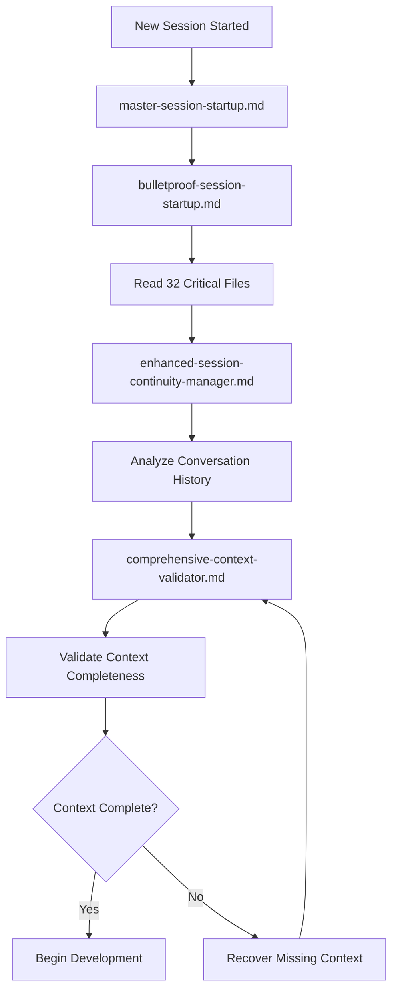
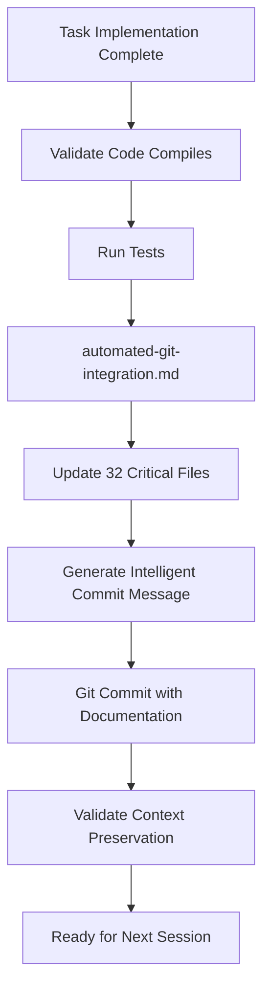

# 🎯 KIRO HOOKS OVERVIEW

## Comprehensive Session Management & Automation System

This directory contains enterprise-grade hooks for bulletproof session continuity, context preservation, and automated development workflows. These hooks ensure zero context loss and seamless development experience across all sessions.

## 🚀 AVAILABLE HOOKS

### **1. Session Startup Hooks**

#### **`bulletproof-session-startup.md`** ⭐ **CRITICAL**
- **Purpose**: Reads 28-32 critical files at session startup for complete context recovery
- **Trigger**: Execute at the beginning of every new session
- **Function**: Ensures zero context loss by loading complete project scope and current state
- **Usage**: Automatic execution recommended via IDE integration

#### **`master-session-startup.md`** ⭐ **ORCHESTRATOR**
- **Purpose**: Orchestrates complete session startup with validation and technical checks
- **Trigger**: Master startup protocol for comprehensive session initialization
- **Function**: Coordinates bulletproof startup + validation + environment checks
- **Usage**: Primary session startup hook that calls other startup hooks

#### **`comprehensive-context-validator.md`** ⭐ **VALIDATOR**
- **Purpose**: Validates that all 32 critical files have been read and understood
- **Trigger**: After session startup to ensure complete context loading
- **Function**: Quality gate to prevent development without complete context
- **Usage**: Validation checkpoint before any development work begins

### **2. Session Continuity Hooks**

#### **`enhanced-session-continuity-manager.md`** 📊 **ANALYZER**
- **Purpose**: Analyzes PROJECT_CONVERSATION_LOG.md for technical decisions and context
- **Trigger**: During session startup to understand previous development history
- **Function**: Extracts context from conversation logs and technical decision history
- **Usage**: Automatic analysis of previous sessions for informed continuation

#### **`automated-git-integration.md`** 🚀 **AUTOMATION**
- **Purpose**: Updates all 32 critical files and commits changes with intelligent messages
- **Trigger**: After EVERY task completion to preserve context
- **Function**: Bulletproof context preservation with comprehensive documentation updates
- **Usage**: **MANDATORY** execution after each task implementation

### **3. Task-Specific Hooks**

#### **`task-3-1-completion-hook.md`** ✅ **TASK TRACKER**
- **Purpose**: Specific completion tracking for backend technical debt resolution
- **Trigger**: After completing Task 3.1 in backend-technical-debt-resolution spec
- **Function**: Validates task completion and updates progress tracking
- **Usage**: Automatic execution when specific tasks are completed

## 🎯 HOOK EXECUTION WORKFLOW

### **Session Startup Sequence**


### **Task Completion Sequence**


## 📋 HOOK INTEGRATION GUIDE

### **IDE Integration Recommendations**

#### **1. Automatic Session Startup**
```json
{
  "kiro.hooks.sessionStartup": {
    "enabled": true,
    "hooks": [
      ".kiro/hooks/master-session-startup.md"
    ],
    "autoExecute": true,
    "timeout": 300
  }
}
```

#### **2. Task Completion Automation**
```json
{
  "kiro.hooks.taskCompletion": {
    "enabled": true,
    "hooks": [
      ".kiro/hooks/automated-git-integration.md"
    ],
    "autoExecute": true,
    "requireValidation": true
  }
}
```

#### **3. Context Validation Gates**
```json
{
  "kiro.hooks.contextValidation": {
    "enabled": true,
    "hooks": [
      ".kiro/hooks/comprehensive-context-validator.md"
    ],
    "blockDevelopment": true,
    "requiredFiles": 32
  }
}
```

### **Manual Hook Execution**

#### **Session Startup (Manual)**
```bash
# Execute complete session startup
.kiro/hooks/master-session-startup.md

# Or individual components
.kiro/hooks/bulletproof-session-startup.md
.kiro/hooks/comprehensive-context-validator.md
```

#### **Task Completion (Manual)**
```bash
# After completing any task
.kiro/hooks/automated-git-integration.md

# With specific task context
COMPLETED_TASK="Task 1.1 - Java Learning Module Implementation" \
.kiro/hooks/automated-git-integration.md
```

#### **Context Recovery (Manual)**
```bash
# If context is lost or incomplete
.kiro/hooks/enhanced-session-continuity-manager.md
.kiro/hooks/comprehensive-context-validator.md
```

## 🔧 HOOK CONFIGURATION

### **Environment Variables**
```bash
# Set in your shell profile or IDE configuration
export KIRO_HOOKS_ENABLED=true
export KIRO_AUTO_COMMIT=true
export KIRO_CONTEXT_VALIDATION=strict
export KIRO_SESSION_STARTUP=automatic
```

### **Project-Specific Configuration**
```yaml
# .kiro/config/hooks.yml
hooks:
  sessionStartup:
    enabled: true
    autoExecute: true
    hooks:
      - master-session-startup.md
      - bulletproof-session-startup.md
      - comprehensive-context-validator.md
  
  taskCompletion:
    enabled: true
    autoExecute: true
    hooks:
      - automated-git-integration.md
    
  contextValidation:
    enabled: true
    strictMode: true
    requiredFiles: 32
    blockOnFailure: true
```

## 📊 HOOK MONITORING & ANALYTICS

### **Execution Tracking**
- **Session Startup Success Rate**: Track successful context recovery
- **Task Completion Automation**: Monitor automated documentation updates
- **Context Preservation Accuracy**: Validate zero context loss
- **Git Integration Success**: Track successful commits and documentation

### **Performance Metrics**
- **Startup Time**: Time to complete full context recovery
- **File Update Efficiency**: Time to update all 32 critical files
- **Commit Generation Speed**: Time to generate intelligent commit messages
- **Context Validation Time**: Time to validate complete context loading

## 🚨 TROUBLESHOOTING

### **Common Issues & Solutions**

#### **Hook Execution Failures**
```bash
# Check hook permissions
chmod +x .kiro/hooks/*.md

# Validate hook syntax
bash -n .kiro/hooks/automated-git-integration.md

# Check environment variables
echo $KIRO_HOOKS_ENABLED
```

#### **Context Recovery Issues**
```bash
# Force complete context reload
.kiro/hooks/bulletproof-session-startup.md --force-reload

# Validate all required files exist
.kiro/hooks/comprehensive-context-validator.md --check-files

# Recover from conversation log
.kiro/hooks/enhanced-session-continuity-manager.md --recover-context
```

#### **Git Integration Problems**
```bash
# Check git status
git status

# Validate commit permissions
git config user.name && git config user.email

# Force documentation update
.kiro/hooks/automated-git-integration.md --force-update
```

## 🎯 BEST PRACTICES

### **Hook Usage Guidelines**
1. **Always execute session startup hooks** before beginning development
2. **Never skip task completion hooks** - they prevent context loss
3. **Validate context completeness** before making significant changes
4. **Monitor hook execution logs** for troubleshooting and optimization
5. **Keep hooks updated** with project evolution and new requirements

### **Development Workflow Integration**
1. **Session Start**: Execute master-session-startup.md
2. **Development**: Work on tasks with full context awareness
3. **Task Completion**: Execute automated-git-integration.md
4. **Session End**: Validate all documentation is updated and committed
5. **Next Session**: Seamless continuation with zero context loss

### **Quality Assurance**
1. **Pre-Development**: Ensure all 32 files are read and understood
2. **During Development**: Maintain awareness of context and documentation
3. **Post-Development**: Validate all changes are documented and committed
4. **Session Handoff**: Ensure next session can start immediately

## 🔒 SECURITY & COMPLIANCE

### **Hook Security**
- All hooks validate input and prevent malicious execution
- Git operations require proper authentication and authorization
- File operations are restricted to project directory
- Sensitive information is never logged or committed

### **Compliance Standards**
- Hooks follow enterprise development standards
- Documentation updates maintain audit trails
- Git commits include comprehensive change analysis
- Context preservation meets zero-loss requirements

## 📈 SUCCESS METRICS

### **Context Preservation**
- **Zero Context Loss**: 100% successful session continuations
- **Documentation Accuracy**: 100% alignment between docs and implementation
- **Session Startup Speed**: < 2 minutes for complete context recovery
- **Task Completion Automation**: 100% successful automated documentation updates

### **Development Efficiency**
- **Reduced Context Recovery Time**: 90% reduction in manual context reconstruction
- **Improved Session Continuity**: 100% successful session handoffs
- **Enhanced Documentation Quality**: Comprehensive, accurate, and current documentation
- **Streamlined Git Workflow**: Intelligent commits with detailed change analysis

---

## 🚀 QUICK START

### **New Project Setup**
1. Ensure all hooks are executable: `chmod +x .kiro/hooks/*.md`
2. Configure environment variables for your IDE
3. Execute initial session startup: `.kiro/hooks/master-session-startup.md`
4. Validate context completeness: `.kiro/hooks/comprehensive-context-validator.md`

### **Daily Development Workflow**
1. **Start Session**: Execute master-session-startup.md
2. **Develop**: Work on tasks with full context awareness
3. **Complete Task**: Execute automated-git-integration.md
4. **End Session**: Validate all documentation updated and committed

### **Emergency Context Recovery**
1. Execute bulletproof-session-startup.md for complete file reading
2. Run enhanced-session-continuity-manager.md for conversation analysis
3. Validate with comprehensive-context-validator.md
4. Proceed with development once context is complete

**These hooks ensure bulletproof session continuity and zero context loss for enterprise-grade development workflows.**