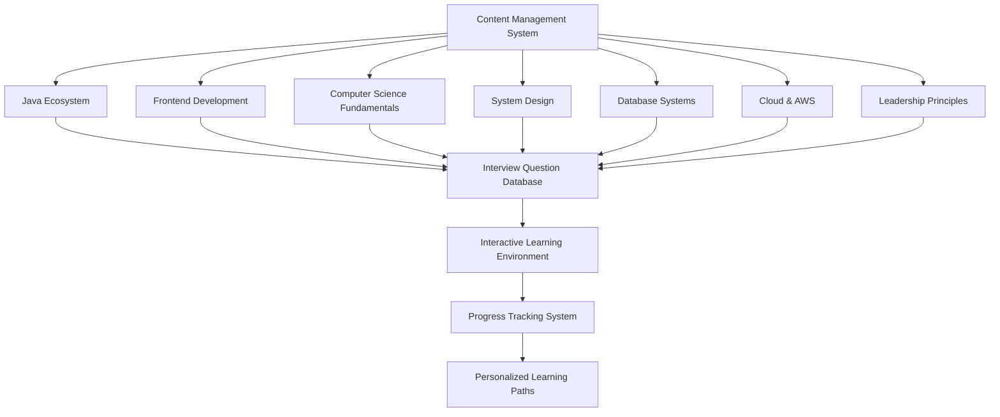
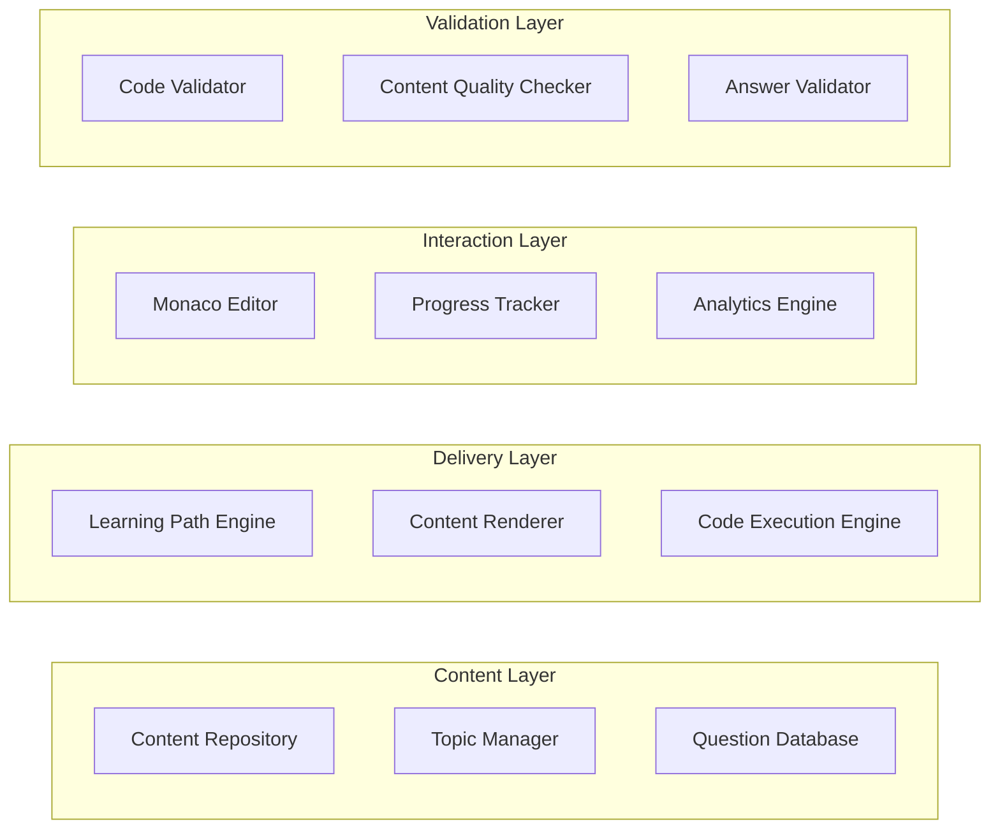

# Core Content Implementation Design

## Overview

The Core Content Implementation System provides a comprehensive framework for creating, organizing, and delivering the world's most complete FAANG senior developer preparation content. The system implements a modular architecture that supports multiple learning domains, interactive code execution, comprehensive progress tracking, and intelligent content delivery based on user needs and learning patterns.

## Architecture

### High-Level Content Architecture



### Component Architecture



## Components and Interfaces

### 1. Content Management System

**Purpose**: Central system for organizing and delivering all learning content across multiple domains.

**Key Interfaces**:
```java
public interface ContentManagementSystem {
    List<LearningModule> getAllModules();
    LearningModule getModuleById(Long moduleId);
    List<Topic> getTopicsByModule(Long moduleId);
    List<InterviewQuestion> getQuestionsByTopic(Long topicId);
    ContentValidationResult validateContent(Long contentId);
}

public class LearningModule {
    private Long id;
    private String name;
    private String description;
    private Category category;
    private int estimatedHours;
    private DifficultyLevel difficultyLevel;
    private List<Topic> topics;
    private List<Prerequisite> prerequisites;
    private CompletionCriteria completionCriteria;
}
```

### 2. Interview Question Database

**Purpose**: Comprehensive repository of 8000+ interview questions with multiple solution approaches.

**Key Interfaces**:
```java
public interface InterviewQuestionDatabase {
    List<InterviewQuestion> getQuestionsByCompany(Company company);
    List<InterviewQuestion> getQuestionsByDifficulty(DifficultyLevel difficulty);
    List<InterviewQuestion> getQuestionsByTopic(String topic);
    List<Solution> getSolutionsForQuestion(Long questionId);
    QuestionStatistics getQuestionStatistics(Long questionId);
}

public class InterviewQuestion {
    private Long id;
    private String title;
    private String description;
    private Company company;
    private String topic;
    private DifficultyLevel difficulty;
    private List<Solution> solutions;
    private ComplexityAnalysis complexityAnalysis;
    private List<String> hints;
    private List<String> followUpQuestions;
    private String realInterviewContext;
}
```

### 3. Learning Path Engine

**Purpose**: Creates personalized learning progressions based on user goals and current skill level.

**Key Interfaces**:
```java
public interface LearningPathEngine {
    LearningPath generatePersonalizedPath(User user, LearningGoal goal);
    List<Topic> getNextRecommendedTopics(User user);
    ProgressAssessment assessCurrentProgress(User user);
    StudyPlan generateStudyPlan(User user, Date targetDate);
}

public class LearningPath {
    private Long id;
    private User user;
    private LearningGoal goal;
    private List<LearningPhase> phases;
    private int totalEstimatedHours;
    private Date estimatedCompletionDate;
    private List<Milestone> milestones;
}
```

### 4. Code Example Validator

**Purpose**: Ensures all code examples compile, execute correctly, and demonstrate concepts effectively.

**Key Interfaces**:
```java
public interface CodeExampleValidator {
    ValidationResult validateJavaCode(String code);
    ValidationResult validateJavaScriptCode(String code);
    ValidationResult validateSQLQuery(String query);
    ExecutionResult executeCode(String code, Language language);
    PerformanceMetrics benchmarkCode(String code, Language language);
}

public class ValidationResult {
    private boolean isValid;
    private List<CompilationError> errors;
    private List<CompilationWarning> warnings;
    private ExecutionResult executionResult;
    private PerformanceMetrics performanceMetrics;
    private List<String> suggestions;
}
```

## Data Models

### Content Hierarchy Model

```java
@Entity
@Table(name = "learning_modules")
public class LearningModule {
    @Id
    @GeneratedValue(strategy = GenerationType.IDENTITY)
    private Long id;
    
    @Column(nullable = false)
    private String name;
    
    @Lob
    private String description;
    
    @Enumerated(EnumType.STRING)
    private Category category;
    
    private int estimatedHours;
    
    @Enumerated(EnumType.STRING)
    private DifficultyLevel difficultyLevel;
    
    @OneToMany(mappedBy = "module", cascade = CascadeType.ALL, fetch = FetchType.LAZY)
    @OrderBy("sortOrder ASC")
    private List<Topic> topics = new ArrayList<>();
    
    @ManyToMany
    @JoinTable(name = "module_prerequisites")
    private List<LearningModule> prerequisites = new ArrayList<>();
    
    @Embedded
    private CompletionCriteria completionCriteria;
}

@Entity
@Table(name = "topics")
public class Topic {
    @Id
    @GeneratedValue(strategy = GenerationType.IDENTITY)
    private Long id;
    
    @Column(nullable = false)
    private String title;
    
    @Lob
    private String content;
    
    @Lob
    private String codeExamples;
    
    @Enumerated(EnumType.STRING)
    private TopicType topicType;
    
    private int sortOrder;
    private int estimatedMinutes;
    
    @ManyToOne(fetch = FetchType.LAZY)
    @JoinColumn(name = "module_id")
    private LearningModule module;
    
    @OneToMany(mappedBy = "topic", cascade = CascadeType.ALL)
    private List<InterviewQuestion> questions = new ArrayList<>();
    
    @ElementCollection
    @CollectionTable(name = "topic_learning_objectives")
    private List<String> learningObjectives = new ArrayList<>();
}
```

### Interview Question Model

```java
@Entity
@Table(name = "interview_questions")
public class InterviewQuestion {
    @Id
    @GeneratedValue(strategy = GenerationType.IDENTITY)
    private Long id;
    
    @Column(nullable = false)
    private String title;
    
    @Lob
    private String description;
    
    @Enumerated(EnumType.STRING)
    private Company company;
    
    @Enumerated(EnumType.STRING)
    private DifficultyLevel difficulty;
    
    @ManyToOne(fetch = FetchType.LAZY)
    @JoinColumn(name = "topic_id")
    private Topic topic;
    
    @OneToMany(mappedBy = "question", cascade = CascadeType.ALL)
    private List<Solution> solutions = new ArrayList<>();
    
    @Embedded
    private ComplexityAnalysis complexityAnalysis;
    
    @ElementCollection
    @CollectionTable(name = "question_hints")
    private List<String> hints = new ArrayList<>();
    
    @ElementCollection
    @CollectionTable(name = "question_follow_ups")
    private List<String> followUpQuestions = new ArrayList<>();
    
    private String realInterviewContext;
    private String source;
    private LocalDateTime createdAt;
    private LocalDateTime lastUpdated;
}

@Entity
@Table(name = "solutions")
public class Solution {
    @Id
    @GeneratedValue(strategy = GenerationType.IDENTITY)
    private Long id;
    
    @Enumerated(EnumType.STRING)
    private SolutionType type; // BRUTE_FORCE, OPTIMIZED, ALTERNATIVE
    
    @Enumerated(EnumType.STRING)
    private Language language;
    
    @Lob
    private String code;
    
    @Lob
    private String explanation;
    
    @ManyToOne(fetch = FetchType.LAZY)
    @JoinColumn(name = "question_id")
    private InterviewQuestion question;
    
    @Embedded
    private ComplexityAnalysis complexityAnalysis;
    
    private boolean isOptimal;
    private int sortOrder;
}
```

## Implementation Strategy

### Phase 1: Java Ecosystem Complete Implementation

#### 1.1 Java Fundamentals Completion
```java
// Complete remaining Java Fundamentals topics
@Service
public class JavaFundamentalsContentService {
    
    public void createGenericsAndTypeSafetyTopic() {
        Topic topic = new Topic();
        topic.setTitle("Generics and Type Safety");
        topic.setContent(generateGenericsContent());
        topic.setCodeExamples(generateGenericsCodeExamples());
        topic.setEstimatedMinutes(120);
        
        // Add 40+ interview questions
        List<InterviewQuestion> questions = generateGenericsQuestions();
        topic.setQuestions(questions);
        
        topicRepository.save(topic);
    }
    
    private String generateGenericsContent() {
        return """
        # Generics and Type Safety
        
        ## Real-World Analogy
        Think of generics like labeled storage containers. Instead of having a generic "box" 
        that could contain anything, you have a "Box<Books>" that can only contain books, 
        or a "Box<Tools>" that can only contain tools. This prevents you from accidentally 
        putting a hammer in your book box!
        
        ## Core Concepts
        
        ### Generic Classes
        ```java
        public class Box<T> {
            private T content;
            
            public void put(T item) {
                this.content = item;
            }
            
            public T get() {
                return content;
            }
        }
        
        // Usage
        Box<String> stringBox = new Box<>();
        stringBox.put("Hello World");
        String value = stringBox.get(); // No casting needed!
        ```
        
        ### Bounded Type Parameters
        ```java
        public class NumberBox<T extends Number> {
            private T number;
            
            public double getDoubleValue() {
                return number.doubleValue(); // Can call Number methods
            }
        }
        ```
        
        ## Interview Questions Practice
        """;
    }
}
```

#### 1.2 Advanced Java Module Implementation
```java
@Service
public class AdvancedJavaContentService {
    
    public void createJVMInternalsModule() {
        LearningModule module = new LearningModule();
        module.setName("JVM Internals and Memory Management");
        module.setDescription("Deep dive into JVM architecture, memory management, and performance optimization");
        module.setCategory(Category.ADVANCED_JAVA);
        module.setEstimatedHours(15);
        
        // Create 8 comprehensive topics
        List<Topic> topics = Arrays.asList(
            createJVMArchitectureTopic(),
            createMemoryManagementTopic(),
            createGarbageCollectionTopic(),
            createClassLoadingTopic(),
            createJITCompilationTopic(),
            createPerformanceTuningTopic(),
            createProfilingTopic(),
            createTroubleshootingTopic()
        );
        
        module.setTopics(topics);
        moduleRepository.save(module);
    }
    
    private Topic createJVMArchitectureTopic() {
        Topic topic = new Topic();
        topic.setTitle("JVM Architecture and Components");
        topic.setContent(generateJVMArchitectureContent());
        topic.setEstimatedMinutes(120);
        
        // Add real FAANG interview questions
        List<InterviewQuestion> questions = generateJVMQuestions();
        topic.setQuestions(questions);
        
        return topic;
    }
}
```

### Phase 2: Frontend Development Excellence

#### 2.1 React Advanced Patterns Implementation
```java
@Service
public class ReactAdvancedContentService {
    
    public void createReactAdvancedModule() {
        LearningModule module = new LearningModule();
        module.setName("React Advanced Patterns and Performance");
        module.setDescription("Master advanced React concepts for senior frontend roles");
        module.setCategory(Category.FRONTEND_DEVELOPMENT);
        module.setEstimatedHours(20);
        
        List<Topic> topics = Arrays.asList(
            createAdvancedHooksTopic(),
            createPerformanceOptimizationTopic(),
            createContextAPITopic(),
            createTestingStrategiesTopic(),
            createNextJSTopic(),
            createSSRTopic()
        );
        
        module.setTopics(topics);
        moduleRepository.save(module);
    }
    
    private Topic createAdvancedHooksTopic() {
        Topic topic = new Topic();
        topic.setTitle("Advanced Hooks and Custom Hook Patterns");
        topic.setContent(generateAdvancedHooksContent());
        topic.setCodeExamples(generateReactCodeExamples());
        
        // Add interactive React components
        topic.setInteractiveExamples(generateInteractiveReactExamples());
        
        return topic;
    }
}
```

### Phase 3: Computer Science Fundamentals with Beginner-Friendly Approach

#### 3.1 Data Structures with Real-World Analogies
```java
@Service
public class DataStructuresContentService {
    
    public void createArraysFundamentalsTopic() {
        Topic topic = new Topic();
        topic.setTitle("Arrays Fundamentals - Numbered Storage Boxes");
        topic.setContent(generateArraysContent());
        
        // Real-world analogy content
        String analogyContent = """
        # Arrays: Like an Apartment Building
        
        Imagine an apartment building where each apartment has a number (index) 
        and can store one family (data). Just like apartments:
        
        - Each apartment has a unique number (0, 1, 2, 3...)
        - You can quickly find any apartment if you know its number
        - All apartments are the same size (same data type)
        - The building has a fixed number of apartments (fixed size)
        
        ## Visual Representation
        ```
        Apartment Building (Array)
        ┌─────┬─────┬─────┬─────┬─────┐
        │  0  │  1  │  2  │  3  │  4  │
        ├─────┼─────┼─────┼─────┼─────┤
        │ 10  │ 25  │ 30  │ 15  │ 40  │
        └─────┴─────┴─────┴─────┴─────┘
        ```
        """;
        
        topic.setContent(topic.getContent() + analogyContent);
        
        // Add 150+ interview questions with multiple approaches
        List<InterviewQuestion> questions = generateArraysQuestions();
        topic.setQuestions(questions);
        
        return topic;
    }
    
    private List<InterviewQuestion> generateArraysQuestions() {
        List<InterviewQuestion> questions = new ArrayList<>();
        
        // Two Sum - Multiple approaches
        InterviewQuestion twoSum = new InterviewQuestion();
        twoSum.setTitle("Two Sum");
        twoSum.setDescription("Given an array of integers and a target sum, return indices of two numbers that add up to target");
        twoSum.setCompany(Company.AMAZON);
        twoSum.setDifficulty(DifficultyLevel.EASY);
        
        // Brute force solution
        Solution bruteForceSolution = new Solution();
        bruteForceSolution.setType(SolutionType.BRUTE_FORCE);
        bruteForceSolution.setLanguage(Language.JAVA);
        bruteForceSolution.setCode("""
            public int[] twoSum(int[] nums, int target) {
                // Brute force: check every pair
                for (int i = 0; i < nums.length; i++) {
                    for (int j = i + 1; j < nums.length; j++) {
                        if (nums[i] + nums[j] == target) {
                            return new int[]{i, j};
                        }
                    }
                }
                return new int[]{};
            }
            """);
        bruteForceSolution.setComplexityAnalysis(new ComplexityAnalysis("O(n²)", "O(1)"));
        
        // Optimized solution
        Solution optimizedSolution = new Solution();
        optimizedSolution.setType(SolutionType.OPTIMIZED);
        optimizedSolution.setLanguage(Language.JAVA);
        optimizedSolution.setCode("""
            public int[] twoSum(int[] nums, int target) {
                // HashMap for O(n) solution
                Map<Integer, Integer> map = new HashMap<>();
                
                for (int i = 0; i < nums.length; i++) {
                    int complement = target - nums[i];
                    if (map.containsKey(complement)) {
                        return new int[]{map.get(complement), i};
                    }
                    map.put(nums[i], i);
                }
                return new int[]{};
            }
            """);
        optimizedSolution.setComplexityAnalysis(new ComplexityAnalysis("O(n)", "O(n)"));
        
        twoSum.setSolutions(Arrays.asList(bruteForceSolution, optimizedSolution));
        questions.add(twoSum);
        
        return questions;
    }
}
```

### Phase 4: System Design with Interactive Tools

#### 4.1 System Design Interactive Framework
```java
@Service
public class SystemDesignContentService {
    
    public void createSystemDesignModule() {
        LearningModule module = new LearningModule();
        module.setName("System Design and Scalable Architecture");
        module.setDescription("Master system design for senior-level interviews");
        module.setCategory(Category.SYSTEM_DESIGN);
        module.setEstimatedHours(25);
        
        List<Topic> topics = Arrays.asList(
            createScalabilityPrinciplesTopic(),
            createLoadBalancingTopic(),
            createCachingStrategiesTopic(),
            createDatabaseDesignTopic(),
            createMicroservicesTopic(),
            createMessageSystemsTopic(),
            createCDNsTopic(),
            createDistributedSystemsTopic()
        );
        
        module.setTopics(topics);
        moduleRepository.save(module);
    }
    
    private Topic createScalabilityPrinciplesTopic() {
        Topic topic = new Topic();
        topic.setTitle("Scalability Principles and Patterns");
        topic.setContent(generateScalabilityContent());
        
        // Add interactive system design tools
        topic.setInteractiveTools(generateSystemDesignTools());
        
        // Add real-world case studies
        topic.setCaseStudies(generateCaseStudies());
        
        return topic;
    }
}
```

## Error Handling

### Content Validation Errors
1. **Code Compilation Errors** → Automated fixing and validation
2. **Content Inconsistencies** → Cross-reference validation
3. **Missing Prerequisites** → Dependency checking
4. **Outdated Information** → Freshness validation

### Learning Path Errors
1. **Invalid Progressions** → Prerequisite validation
2. **Circular Dependencies** → Dependency graph analysis
3. **Unrealistic Timelines** → Time estimation validation

## Testing Strategy

### Content Quality Testing
```java
@Test
public class ContentQualityTest {
    
    @Test
    public void allCodeExamplesShouldCompile() {
        List<Topic> topics = topicRepository.findAll();
        
        for (Topic topic : topics) {
            List<String> codeExamples = extractCodeExamples(topic.getContent());
            
            for (String code : codeExamples) {
                ValidationResult result = codeValidator.validateJavaCode(code);
                assertThat(result.isValid())
                    .withFailMessage("Code example in topic %s failed compilation: %s", 
                                   topic.getTitle(), result.getErrors())
                    .isTrue();
            }
        }
    }
    
    @Test
    public void allInterviewQuestionsShouldHaveMultipleSolutions() {
        List<InterviewQuestion> questions = questionRepository.findAll();
        
        for (InterviewQuestion question : questions) {
            assertThat(question.getSolutions())
                .withFailMessage("Question %s should have multiple solutions", question.getTitle())
                .hasSizeGreaterThanOrEqualTo(2);
                
            // Verify brute force and optimized solutions exist
            boolean hasBruteForce = question.getSolutions().stream()
                .anyMatch(s -> s.getType() == SolutionType.BRUTE_FORCE);
            boolean hasOptimized = question.getSolutions().stream()
                .anyMatch(s -> s.getType() == SolutionType.OPTIMIZED);
                
            assertThat(hasBruteForce && hasOptimized)
                .withFailMessage("Question %s should have both brute force and optimized solutions", 
                               question.getTitle())
                .isTrue();
        }
    }
}
```

## Performance Considerations

### Content Delivery Performance
- Lazy loading for large content modules
- Caching frequently accessed content
- Progressive loading for interactive examples

### Code Execution Performance
- Sandboxed execution environments
- Resource limits and timeouts
- Parallel execution for multiple test cases

## Success Metrics

### Content Completeness Metrics
- **Total Topics**: 200+ comprehensive topics across all domains
- **Interview Questions**: 8000+ questions with multiple solutions
- **Code Examples**: 2000+ validated and executable code examples
- **Coverage Completeness**: 100% coverage of FAANG interview topics

### Learning Effectiveness Metrics
- **Completion Rates**: > 80% topic completion rate
- **Retention Rates**: > 90% knowledge retention after 30 days
- **Interview Success**: > 85% success rate for users completing full curriculum
- **Time to Competency**: < 6 months from beginner to interview-ready