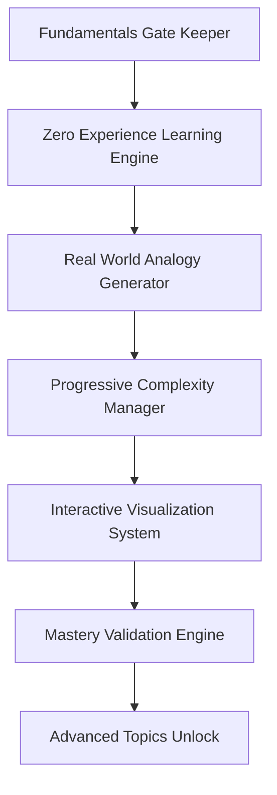
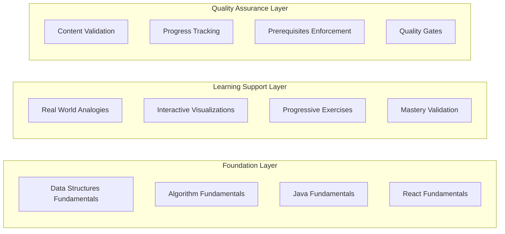

# Fundamentals-First Implementation Design

## Overview

The Fundamentals-First Implementation Design provides a comprehensive architecture for implementing all missing fundamental topics with beginner-friendly, zero-experience support, ensuring no advanced topics are accessible until solid foundations are established.

## Architecture

### High-Level System Architecture



### Component Architecture



## Components and Interfaces

### 1. Fundamentals Gate Keeper

**Purpose**: Ensures no advanced topics are accessible without mastering fundamentals.

**Key Interfaces**:
```java
public interface FundamentalsGateKeeper {
    boolean canAccessAdvancedTopic(String userId, String topicId);
    List<String> getRequiredFundamentals(String advancedTopicId);
    MasteryLevel assessFundamentalMastery(String userId, String fundamentalId);
    void unlockAdvancedContent(String userId, List<String> masteredFundamentals);
}

public class MasteryLevel {
    private double competencyScore; // 0.0 to 1.0
    private int questionsAnswered;
    private int questionsCorrect;
    private LocalDateTime lastAssessment;
    private boolean masteryAchieved; // >= 80% competency
}
```

### 2. Zero Experience Learning Engine

**Purpose**: Creates content accessible to absolute beginners with real-world analogies.

**Key Interfaces**:
```java
public interface ZeroExperienceLearningEngine {
    BeginnerContent generateBeginnerContent(String topicId);
    RealWorldAnalogy createAnalogy(String concept);
    InteractiveVisualization createVisualization(String concept);
    ProgressiveExercise generateExercise(String topicId, DifficultyLevel level);
}

public class BeginnerContent {
    private String topicId;
    private String simpleExplanation;
    private RealWorldAnalogy analogy;
    private InteractiveVisualization visualization;
    private List<ProgressiveExercise> exercises;
    private List<String> keyTakeaways;
}
```

## Implementation Strategy

### Phase 1: Data Structures Fundamentals

#### 1.1 Arrays Fundamentals ("Numbered Storage Boxes")
```java
@Service
public class ArraysFundamentalsService {
    
    public BeginnerContent createArraysContent() {
        BeginnerContent content = new BeginnerContent();
        content.setTopicId("arrays-fundamentals");
        content.setSimpleExplanation("Arrays are like apartment buildings with numbered units");
        content.setAnalogy(createApartmentBuildingAnalogy());
        content.setVisualization(createInteractiveApartmentBuilding());
        content.setExercises(generateArrayExercises());
        return content;
    }
    
    private RealWorldAnalogy createApartmentBuildingAnalogy() {
        return RealWorldAnalogy.builder()
            .concept("Array")
            .realWorldExample("Apartment Building")
            .explanation("Each apartment has a number (index) and can store one family (data)")
            .visualElements(List.of("Building diagram", "Numbered doors", "Families inside"))
            .interactiveElements(List.of("Add family to apartment", "Find family by number"))
            .build();
    }
}
```

#### 1.2 Linked Lists Fundamentals ("Treasure Hunt Chain")
```java
@Service
public class LinkedListsFundamentalsService {
    
    public BeginnerContent createLinkedListsContent() {
        BeginnerContent content = new BeginnerContent();
        content.setTopicId("linked-lists-fundamentals");
        content.setSimpleExplanation("Linked Lists are like treasure hunt clues leading to the next location");
        content.setAnalogy(createTreasureHuntAnalogy());
        content.setVisualization(createInteractiveTreasureHunt());
        return content;
    }
    
    private InteractiveVisualization createInteractiveTreasureHunt() {
        return InteractiveVisualization.builder()
            .type("treasure-hunt-chain")
            .elements(List.of("Treasure locations", "Clue connections", "Path following"))
            .interactions(List.of("Add new location", "Follow clue chain", "Insert location"))
            .animations(List.of("Following clues", "Adding locations", "Removing locations"))
            .build();
    }
}
```

### Phase 2: Algorithm Fundamentals

#### 2.1 Basic Sorting ("Organizing Physical Objects")
```java
@Service
public class SortingFundamentalsService {
    
    public BeginnerContent createSortingContent() {
        BeginnerContent content = new BeginnerContent();
        content.setTopicId("sorting-fundamentals");
        content.setSimpleExplanation("Sorting is like organizing books on a shelf by height");
        content.setAnalogy(createBookShelfAnalogy());
        content.setVisualization(createInteractiveBookSorting());
        return content;
    }
    
    private List<ProgressiveExercise> generateSortingExercises() {
        return List.of(
            createBubbleSortExercise("Sort 5 books by height"),
            createSelectionSortExercise("Find shortest book and move to front"),
            createInsertionSortExercise("Insert new book in correct position")
        );
    }
}
```

### Phase 3: Java Fundamentals Completion

#### 3.1 Generics and Type Safety
```java
@Service
public class GenericsFundamentalsService {
    
    public BeginnerContent createGenericsContent() {
        BeginnerContent content = new BeginnerContent();
        content.setTopicId("generics-fundamentals");
        content.setSimpleExplanation("Generics are like labeled containers that only hold specific types of items");
        content.setAnalogy(createLabeledContainerAnalogy());
        return content;
    }
    
    private RealWorldAnalogy createLabeledContainerAnalogy() {
        return RealWorldAnalogy.builder()
            .concept("Generic Types")
            .realWorldExample("Labeled Storage Containers")
            .explanation("A container labeled 'Books' should only contain books, not toys or clothes")
            .codeExample("List<String> bookTitles = new ArrayList<>(); // Only strings allowed")
            .build();
    }
}
```

## Data Models

### Fundamental Topic Model
```java
@Entity
@Table(name = "fundamental_topics")
public class FundamentalTopic {
    @Id
    @GeneratedValue(strategy = GenerationType.IDENTITY)
    private Long id;
    
    private String topicId;
    private String title;
    private String category; // DATA_STRUCTURES, ALGORITHMS, JAVA, REACT, etc.
    
    @Enumerated(EnumType.STRING)
    private DifficultyLevel difficultyLevel;
    
    @ElementCollection
    private List<String> prerequisites;
    
    @ElementCollection
    private List<String> unlocks; // Advanced topics this fundamental unlocks
    
    private String realWorldAnalogy;
    private String simpleExplanation;
    private int minimumMasteryScore; // Default 80%
    
    @OneToMany(mappedBy = "fundamentalTopic")
    private List<ProgressiveExercise> exercises;
}
```

### User Mastery Tracking Model
```java
@Entity
@Table(name = "user_fundamental_mastery")
public class UserFundamentalMastery {
    @Id
    @GeneratedValue(strategy = GenerationType.IDENTITY)
    private Long id;
    
    private String userId;
    private String fundamentalTopicId;
    
    private double competencyScore; // 0.0 to 1.0
    private int totalQuestions;
    private int correctAnswers;
    private int attempts;
    
    private boolean masteryAchieved;
    private LocalDateTime masteryDate;
    private LocalDateTime lastAttempt;
    
    @ElementCollection
    private List<String> unlockedAdvancedTopics;
}
```

## Error Handling

### Learning Progression Errors
1. **Attempting Advanced Topics Without Prerequisites**
   - Block access with clear explanation
   - Show required fundamentals with progress
   - Provide direct links to missing prerequisites

2. **Mastery Validation Failures**
   - Provide detailed feedback on weak areas
   - Suggest additional practice exercises
   - Offer alternative explanations and analogies

3. **Content Generation Errors**
   - Fallback to simpler explanations
   - Use alternative analogies
   - Provide text-based content if visualizations fail

## Testing Strategy

### Mastery Validation Testing
```java
@Test
void shouldBlockAdvancedTopicsWithoutPrerequisites() {
    // Given
    String userId = "beginner-user";
    String advancedTopic = "dynamic-programming";
    
    // When
    boolean canAccess = fundamentalsGateKeeper.canAccessAdvancedTopic(userId, advancedTopic);
    
    // Then
    assertThat(canAccess).isFalse();
    
    List<String> required = fundamentalsGateKeeper.getRequiredFundamentals(advancedTopic);
    assertThat(required).contains("arrays-fundamentals", "recursion-fundamentals");
}
```

### Content Quality Testing
```java
@Test
void shouldGenerateBeginnerFriendlyContent() {
    // Given
    String topicId = "arrays-fundamentals";
    
    // When
    BeginnerContent content = zeroExperienceLearningEngine.generateBeginnerContent(topicId);
    
    // Then
    assertThat(content.getSimpleExplanation()).isNotEmpty();
    assertThat(content.getAnalogy()).isNotNull();
    assertThat(content.getVisualization()).isNotNull();
    assertThat(content.getExercises()).isNotEmpty();
}
```

## Success Metrics

### Learning Effectiveness Metrics
- **Mastery Achievement Rate**: 80%+ of users achieve mastery in fundamentals
- **Retention Rate**: 90%+ retention of fundamental concepts after 30 days
- **Progression Rate**: 70%+ of users successfully progress to advanced topics
- **Engagement Rate**: 95%+ completion rate for fundamental exercises

### Content Quality Metrics
- **Analogy Effectiveness**: 85%+ users report analogies helpful
- **Visualization Engagement**: 90%+ users interact with visualizations
- **Exercise Completion**: 80%+ completion rate for progressive exercises
- **Mastery Validation Accuracy**: 95%+ accurate assessment of user competency