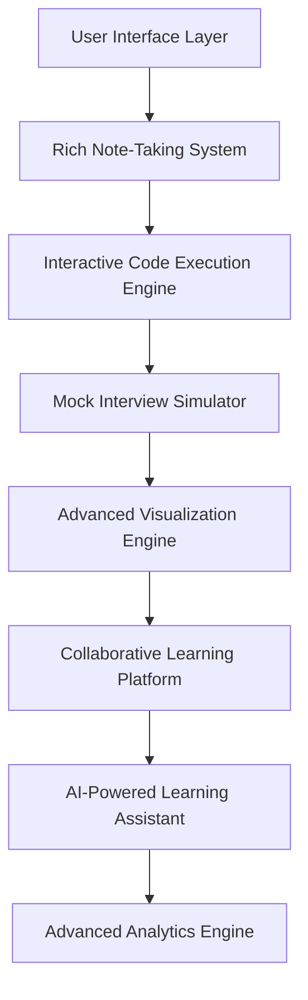
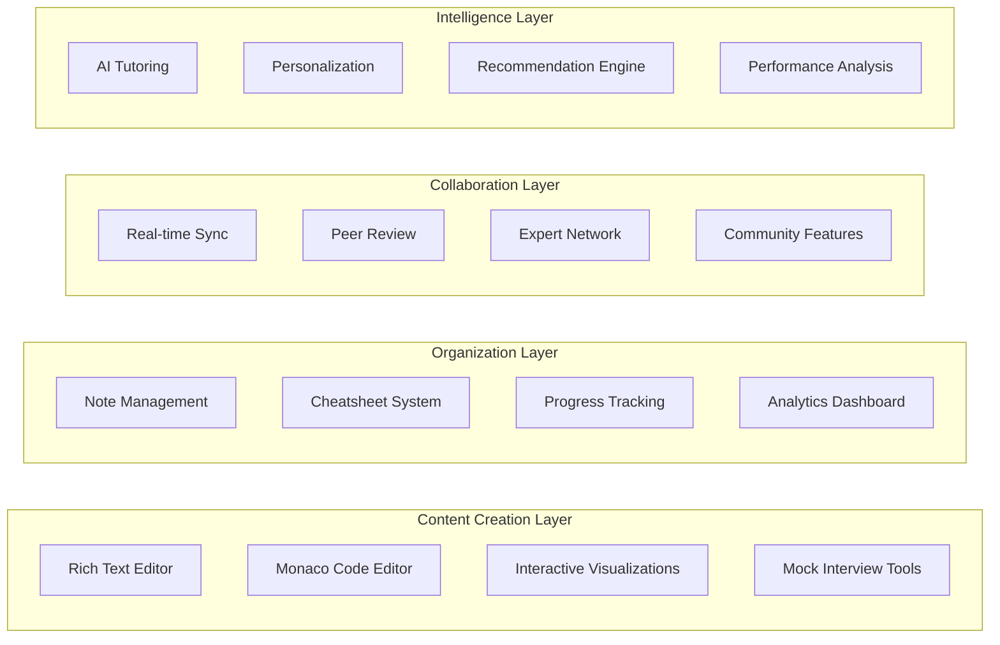

# Advanced Interactive Features Design

## Overview

The Advanced Interactive Features Design provides a comprehensive architecture for implementing all missing advanced interactive features identified in COMPLETE_PROJECT_CONTEXT, including rich note-taking systems, Monaco Editor integration, mock interview simulators, and cutting-edge learning technologies that rival the world's best educational platforms.

## Architecture

### High-Level System Architecture



### Component Architecture



## Components and Interfaces

### 1. Rich Note-Taking System (Dual Architecture)

**Purpose**: Comprehensive note-taking system with embedded and centralized capabilities.

**Key Interfaces**:
```java
public interface RichNoteTakingSystem {
    EmbeddedNote createEmbeddedNote(String topicId, String sectionId);
    CentralizedNote createCentralizedNote(String userId, String title);
    List<Note> searchNotes(String userId, String query);
    KnowledgeGraph generateKnowledgeGraph(String userId);
    ExportResult exportNotes(String userId, ExportFormat format);
}

public class EmbeddedNote {
    private String noteId;
    private String topicId;
    private String sectionId;
    private String userId;
    private RichTextContent content;
    private List<CodeSnippet> codeSnippets;
    private List<CrossReference> crossReferences;
    private LocalDateTime lastModified;
    private boolean autoSaved;
}

public class CentralizedNote {
    private String noteId;
    private String userId;
    private String title;
    private List<String> tags;
    private String category;
    private RichTextContent content;
    private List<String> linkedTopics;
    private List<String> relatedNotes;
    private NoteMetadata metadata;
}
```

### 2. Interactive Code Execution Engine

**Purpose**: VS Code-powered Monaco Editor with multi-language execution capabilities.

**Key Interfaces**:
```java
public interface InteractiveCodeExecutionEngine {
    CodeEditor createMonacoEditor(String language);
    ExecutionResult executeCode(String code, String language, List<TestCase> testCases);
    CodeAnalysis analyzeCode(String code, String language);
    CollaborativeSession createCollaborativeSession(String sessionId);
}

public class CodeEditor {
    private String editorId;
    private String language;
    private MonacoConfiguration configuration;
    private List<String> supportedLanguages;
    private SyntaxHighlighting syntaxHighlighting;
    private AutoCompletion autoCompletion;
    private ErrorDetection errorDetection;
    private CodeFormatting formatting;
}

public class ExecutionResult {
    private boolean success;
    private String output;
    private String errorMessage;
    private long executionTimeMs;
    private long memoryUsageMB;
    private List<TestCaseResult> testResults;
    private PerformanceMetrics performance;
}
```

### 3. Mock Interview Simulator

**Purpose**: Comprehensive interview simulation with company-specific flows and AI feedback.

**Key Interfaces**:
```java
public interface MockInterviewSimulator {
    InterviewSession createInterviewSession(InterviewType type, String company);
    CodingChallenge generateCodingChallenge(DifficultyLevel level, String topic);
    BehavioralQuestion generateBehavioralQuestion(String company, String principle);
    SystemDesignProblem generateSystemDesignProblem(String scenario);
    InterviewFeedback generateFeedback(InterviewSession session);
}

public class InterviewSession {
    private String sessionId;
    private String userId;
    private InterviewType type; // CODING, BEHAVIORAL, SYSTEM_DESIGN
    private String company; // AMAZON, GOOGLE, MICROSOFT, META, APPLE
    private LocalDateTime startTime;
    private Duration duration;
    private List<InterviewQuestion> questions;
    private List<UserResponse> responses;
    private InterviewerPersonality interviewer;
}

public class CodingChallenge {
    private String problemId;
    private String title;
    private String description;
    private DifficultyLevel difficulty;
    private List<String> examples;
    private List<TestCase> testCases;
    private List<String> hints;
    private TimeLimit timeLimit;
    private String company;
}
```

## Implementation Strategy

### Phase 1: Rich Note-Taking System Implementation

#### 1.1 Embedded Note-Taking Engine
```java
@Service
public class EmbeddedNoteTakingService {
    
    public EmbeddedNote createEmbeddedNote(String topicId, String sectionId, String userId) {
        EmbeddedNote note = new EmbeddedNote();
        note.setNoteId(generateNoteId());
        note.setTopicId(topicId);
        note.setSectionId(sectionId);
        note.setUserId(userId);
        note.setContent(new RichTextContent());
        note.setAutoSaved(true);
        
        // Initialize rich text editor with code support
        RichTextEditor editor = createRichTextEditor();
        editor.enableCodeSnippets();
        editor.enableMathFormulas();
        editor.enableCrossReferences();
        
        return embeddedNoteRepository.save(note);
    }
    
    @Scheduled(fixedRate = 5000) // Auto-save every 5 seconds
    public void autoSaveEmbeddedNotes() {
        List<EmbeddedNote> unsavedNotes = findUnsavedNotes();
        unsavedNotes.forEach(this::saveNote);
    }
}
```

#### 1.2 Centralized Note Hub Implementation
```java
@Service
public class CentralizedNoteService {
    
    public List<CentralizedNote> searchNotes(String userId, String query) {
        // Implement fuzzy search across all note content
        SearchCriteria criteria = SearchCriteria.builder()
            .userId(userId)
            .query(query)
            .fuzzyMatching(true)
            .includeContent(true)
            .includeTags(true)
            .includeCodeSnippets(true)
            .build();
            
        return noteSearchEngine.search(criteria);
    }
    
    public KnowledgeGraph generateKnowledgeGraph(String userId) {
        List<CentralizedNote> userNotes = findNotesByUser(userId);
        
        KnowledgeGraph graph = new KnowledgeGraph();
        
        // Create nodes for each note
        userNotes.forEach(note -> {
            GraphNode node = createNodeFromNote(note);
            graph.addNode(node);
        });
        
        // Create edges based on cross-references and topic relationships
        userNotes.forEach(note -> {
            List<String> relatedNotes = findRelatedNotes(note);
            relatedNotes.forEach(relatedId -> {
                graph.addEdge(note.getNoteId(), relatedId);
            });
        });
        
        return graph;
    }
}
```

### Phase 2: Monaco Editor Integration

#### 2.1 Monaco Editor Service Implementation
```java
@Service
public class MonacoEditorService {
    
    public CodeEditor createMonacoEditor(String language) {
        CodeEditor editor = new CodeEditor();
        editor.setEditorId(generateEditorId());
        editor.setLanguage(language);
        
        MonacoConfiguration config = MonacoConfiguration.builder()
            .theme("vs-dark")
            .fontSize(14)
            .tabSize(2)
            .wordWrap(true)
            .minimap(true)
            .lineNumbers(true)
            .autoIndent(true)
            .bracketMatching(true)
            .build();
            
        editor.setConfiguration(config);
        
        // Configure language-specific features
        configureLanguageFeatures(editor, language);
        
        return editor;
    }
    
    private void configureLanguageFeatures(CodeEditor editor, String language) {
        switch (language.toLowerCase()) {
            case "java":
                editor.enableJavaFeatures();
                editor.addImportSuggestions();
                editor.enableSpringBootSupport();
                break;
            case "javascript":
                editor.enableESLint();
                editor.addNodeJSSupport();
                editor.enableReactSupport();
                break;
            case "python":
                editor.enablePylint();
                editor.addDataScienceLibraries();
                break;
            case "sql":
                editor.enableSQLValidation();
                editor.addDatabaseSchemaSupport();
                break;
        }
    }
}
```

#### 2.2 Code Execution Engine Implementation
```java
@Service
public class CodeExecutionService {
    
    public ExecutionResult executeCode(String code, String language, List<TestCase> testCases) {
        ExecutionEnvironment environment = createSecureEnvironment(language);
        
        try {
            // Compile code if necessary
            CompilationResult compilation = compileCode(code, language);
            if (!compilation.isSuccess()) {
                return ExecutionResult.compilationError(compilation.getErrors());
            }
            
            // Execute code with resource limits
            ExecutionContext context = ExecutionContext.builder()
                .timeoutMs(30000) // 30 second timeout
                .memoryLimitMB(512) // 512MB memory limit
                .networkAccess(false) // No network access
                .fileSystemAccess(false) // No file system access
                .build();
                
            ExecutionResult result = environment.execute(code, context);
            
            // Run test cases if provided
            if (testCases != null && !testCases.isEmpty()) {
                List<TestCaseResult> testResults = runTestCases(code, testCases, environment);
                result.setTestResults(testResults);
            }
            
            return result;
            
        } catch (SecurityException e) {
            return ExecutionResult.securityError("Code execution blocked for security reasons");
        } catch (TimeoutException e) {
            return ExecutionResult.timeoutError("Code execution timed out");
        }
    }
}
```

### Phase 3: Mock Interview Simulator Implementation

#### 3.1 Interview Session Manager
```java
@Service
public class InterviewSessionService {
    
    public InterviewSession createInterviewSession(InterviewType type, String company, String userId) {
        InterviewSession session = new InterviewSession();
        session.setSessionId(generateSessionId());
        session.setUserId(userId);
        session.setType(type);
        session.setCompany(company);
        session.setStartTime(LocalDateTime.now());
        
        // Configure company-specific interview flow
        InterviewFlow flow = getInterviewFlow(company, type);
        session.setDuration(flow.getDuration());
        session.setInterviewer(flow.getInterviewerPersonality());
        
        // Generate appropriate questions
        List<InterviewQuestion> questions = generateQuestions(type, company, flow);
        session.setQuestions(questions);
        
        return interviewSessionRepository.save(session);
    }
    
    private List<InterviewQuestion> generateQuestions(InterviewType type, String company, InterviewFlow flow) {
        switch (type) {
            case CODING:
                return codingQuestionService.generateQuestions(company, flow.getDifficulty());
            case BEHAVIORAL:
                return behavioralQuestionService.generateQuestions(company, flow.getLeadershipPrinciples());
            case SYSTEM_DESIGN:
                return systemDesignQuestionService.generateQuestions(company, flow.getComplexity());
            default:
                throw new IllegalArgumentException("Unsupported interview type: " + type);
        }
    }
}
```

#### 3.2 AI-Powered Feedback System
```java
@Service
public class InterviewFeedbackService {
    
    public InterviewFeedback generateFeedback(InterviewSession session) {
        InterviewFeedback feedback = new InterviewFeedback();
        feedback.setSessionId(session.getSessionId());
        feedback.setOverallScore(calculateOverallScore(session));
        
        // Analyze each response
        List<ResponseAnalysis> responseAnalyses = new ArrayList<>();
        for (int i = 0; i < session.getQuestions().size(); i++) {
            InterviewQuestion question = session.getQuestions().get(i);
            UserResponse response = session.getResponses().get(i);
            
            ResponseAnalysis analysis = analyzeResponse(question, response);
            responseAnalyses.add(analysis);
        }
        feedback.setResponseAnalyses(responseAnalyses);
        
        // Generate improvement recommendations
        List<ImprovementRecommendation> recommendations = generateRecommendations(session, responseAnalyses);
        feedback.setRecommendations(recommendations);
        
        // Calculate readiness score for target company
        ReadinessScore readiness = calculateReadinessScore(session.getCompany(), feedback);
        feedback.setReadinessScore(readiness);
        
        return feedback;
    }
    
    private ResponseAnalysis analyzeResponse(InterviewQuestion question, UserResponse response) {
        ResponseAnalysis analysis = new ResponseAnalysis();
        
        switch (question.getType()) {
            case CODING:
                analysis = analyzeCodingResponse((CodingQuestion) question, (CodingResponse) response);
                break;
            case BEHAVIORAL:
                analysis = analyzeBehavioralResponse((BehavioralQuestion) question, (BehavioralResponse) response);
                break;
            case SYSTEM_DESIGN:
                analysis = analyzeSystemDesignResponse((SystemDesignQuestion) question, (SystemDesignResponse) response);
                break;
        }
        
        return analysis;
    }
}
```

## Data Models

### Rich Note Model
```java
@Entity
@Table(name = "rich_notes")
public class RichNote {
    @Id
    @GeneratedValue(strategy = GenerationType.IDENTITY)
    private Long id;
    
    private String noteId;
    private String userId;
    private String title;
    
    @Enumerated(EnumType.STRING)
    private NoteType type; // EMBEDDED, CENTRALIZED
    
    private String topicId; // For embedded notes
    private String sectionId; // For embedded notes
    
    @Lob
    private String content; // Rich text content as JSON
    
    @ElementCollection
    private List<String> tags;
    
    @ElementCollection
    private List<String> linkedNotes;
    
    @ElementCollection
    private List<String> linkedTopics;
    
    private LocalDateTime createdAt;
    private LocalDateTime lastModified;
    private boolean autoSaved;
    
    @OneToMany(mappedBy = "note")
    private List<CodeSnippet> codeSnippets;
    
    @OneToMany(mappedBy = "note")
    private List<CrossReference> crossReferences;
}
```

### Code Execution Model
```java
@Entity
@Table(name = "code_executions")
public class CodeExecution {
    @Id
    @GeneratedValue(strategy = GenerationType.IDENTITY)
    private Long id;
    
    private String executionId;
    private String userId;
    private String sessionId; // For collaborative sessions
    
    @Enumerated(EnumType.STRING)
    private ProgrammingLanguage language;
    
    @Lob
    private String code;
    
    @Lob
    private String output;
    
    private boolean success;
    private String errorMessage;
    private long executionTimeMs;
    private long memoryUsageMB;
    
    @OneToMany(mappedBy = "execution")
    private List<TestCaseResult> testResults;
    
    private LocalDateTime executedAt;
}
```

### Interview Session Model
```java
@Entity
@Table(name = "interview_sessions")
public class InterviewSession {
    @Id
    @GeneratedValue(strategy = GenerationType.IDENTITY)
    private Long id;
    
    private String sessionId;
    private String userId;
    
    @Enumerated(EnumType.STRING)
    private InterviewType type;
    
    @Enumerated(EnumType.STRING)
    private Company company;
    
    private LocalDateTime startTime;
    private LocalDateTime endTime;
    private Duration duration;
    
    @OneToMany(mappedBy = "session")
    private List<InterviewQuestion> questions;
    
    @OneToMany(mappedBy = "session")
    private List<UserResponse> responses;
    
    @OneToOne(mappedBy = "session")
    private InterviewFeedback feedback;
    
    private double overallScore;
    private boolean completed;
}
```

## Error Handling

### Note-Taking System Errors
1. **Auto-save Failures**
   - Retry with exponential backoff
   - Store locally until connection restored
   - Notify user of save status

2. **Sync Conflicts**
   - Use operational transformation
   - Provide conflict resolution UI
   - Maintain version history

### Code Execution Errors
1. **Security Violations**
   - Block execution immediately
   - Log security attempts
   - Provide educational feedback

2. **Resource Exhaustion**
   - Terminate execution gracefully
   - Provide resource usage feedback
   - Suggest optimization techniques

### Interview Simulation Errors
1. **AI Service Failures**
   - Fallback to pre-generated content
   - Graceful degradation of features
   - Manual feedback options

## Testing Strategy

### Integration Testing
```java
@SpringBootTest
class AdvancedInteractiveFeaturesIntegrationTest {
    
    @Test
    void shouldCreateAndExecuteCodeInMonacoEditor() {
        // Given
        String javaCode = "public class Test { public static void main(String[] args) { System.out.println(\"Hello World\"); } }";
        
        // When
        CodeEditor editor = monacoEditorService.createMonacoEditor("java");
        ExecutionResult result = codeExecutionService.executeCode(javaCode, "java", null);
        
        // Then
        assertThat(result.isSuccess()).isTrue();
        assertThat(result.getOutput()).contains("Hello World");
        assertThat(result.getExecutionTimeMs()).isLessThan(5000);
    }
    
    @Test
    void shouldCreateAndManageRichNotes() {
        // Given
        String userId = "test-user";
        String topicId = "arrays-fundamentals";
        
        // When
        EmbeddedNote embeddedNote = richNoteTakingSystem.createEmbeddedNote(topicId, "section-1");
        CentralizedNote centralNote = richNoteTakingSystem.createCentralizedNote(userId, "My Arrays Notes");
        
        // Then
        assertThat(embeddedNote.getTopicId()).isEqualTo(topicId);
        assertThat(centralNote.getTitle()).isEqualTo("My Arrays Notes");
        assertThat(embeddedNote.isAutoSaved()).isTrue();
    }
}
```

## Success Metrics

### User Engagement Metrics
- **Note-Taking Usage**: 80%+ of users create and use notes regularly
- **Code Execution Usage**: 90%+ of users execute code examples
- **Mock Interview Completion**: 70%+ complete full interview simulations
- **Feature Retention**: 85%+ users return to use advanced features

### Learning Effectiveness Metrics
- **Code Execution Success Rate**: 95%+ successful code executions
- **Interview Simulation Accuracy**: 90%+ realistic interview experience
- **Note-Taking Effectiveness**: 80%+ users report improved learning with notes
- **Collaboration Engagement**: 60%+ users participate in collaborative features