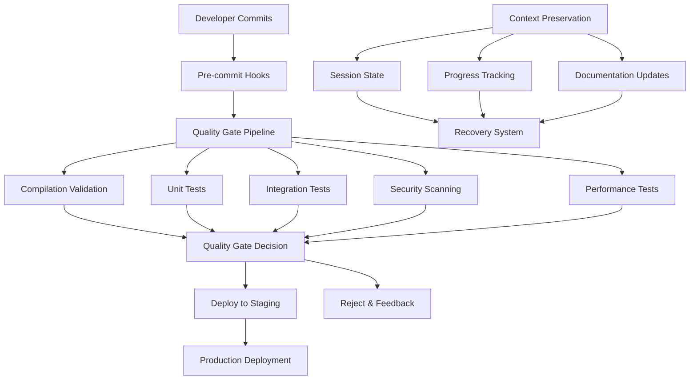

# Amazon-Level Enterprise Project Development Design

## Overview

This design document outlines the technical approach for implementing Amazon-level enterprise development standards, including automated quality gates, comprehensive CI/CD pipeline, technical debt resolution framework, and bulletproof context preservation system.

## Architecture

### Enterprise Development Framework Architecture



### Quality Gates Framework

```java
@Component
public class QualityGateOrchestrator {
    
    @Autowired
    private CompilationValidator compilationValidator;
    
    @Autowired
    private TestExecutor testExecutor;
    
    @Autowired
    private SecurityScanner securityScanner;
    
    @Autowired
    private PerformanceValidator performanceValidator;
    
    public QualityGateResult executeQualityGates(CodeChangeSet changeSet) {
        QualityGateResult result = new QualityGateResult();
        
        // Stage 1: Compilation Validation
        CompilationResult compilation = compilationValidator.validate(changeSet);
        result.addStage("compilation", compilation);
        if (!compilation.isSuccess()) {
            return result.fail("Compilation failed");
        }
        
        // Stage 2: Test Execution
        TestResult tests = testExecutor.executeAll(changeSet);
        result.addStage("tests", tests);
        if (!tests.isSuccess()) {
            return result.fail("Tests failed");
        }
        
        // Stage 3: Security Scanning
        SecurityResult security = securityScanner.scan(changeSet);
        result.addStage("security", security);
        if (!security.isSuccess()) {
            return result.fail("Security issues found");
        }
        
        // Stage 4: Performance Validation
        PerformanceResult performance = performanceValidator.validate(changeSet);
        result.addStage("performance", performance);
        if (!performance.isSuccess()) {
            return result.fail("Performance requirements not met");
        }
        
        return result.success();
    }
}
```

## Components and Interfaces

### 1. Quality Gate Pipeline

#### CompilationValidator
```java
@Service
public class CompilationValidator {
    
    public CompilationResult validate(CodeChangeSet changeSet) {
        try {
            // Execute Maven compilation
            ProcessResult mavenResult = executeMavenCompile();
            
            // Execute npm build for frontend
            ProcessResult npmResult = executeNpmBuild();
            
            return CompilationResult.builder()
                .backendCompilation(mavenResult)
                .frontendCompilation(npmResult)
                .success(mavenResult.isSuccess() && npmResult.isSuccess())
                .build();
                
        } catch (Exception e) {
            return CompilationResult.failure(e.getMessage());
        }
    }
}
```

#### TestExecutor
```java
@Service
public class TestExecutor {
    
    public TestResult executeAll(CodeChangeSet changeSet) {
        TestResult result = new TestResult();
        
        // Unit Tests
        TestSuiteResult unitTests = executeUnitTests();
        result.addSuite("unit", unitTests);
        
        // Integration Tests
        TestSuiteResult integrationTests = executeIntegrationTests();
        result.addSuite("integration", integrationTests);
        
        // End-to-End Tests
        TestSuiteResult e2eTests = executeE2ETests();
        result.addSuite("e2e", e2eTests);
        
        return result;
    }
}
```

### 2. Technical Debt Resolution Framework

#### TechnicalDebtAnalyzer
```java
@Service
public class TechnicalDebtAnalyzer {
    
    public TechnicalDebtReport analyzeTechnicalDebt() {
        TechnicalDebtReport report = new TechnicalDebtReport();
        
        // Code Quality Analysis
        CodeQualityMetrics quality = analyzeCodeQuality();
        report.addMetrics("code_quality", quality);
        
        // Dependency Analysis
        DependencyMetrics dependencies = analyzeDependencies();
        report.addMetrics("dependencies", dependencies);
        
        // Performance Analysis
        PerformanceMetrics performance = analyzePerformance();
        report.addMetrics("performance", performance);
        
        // Security Analysis
        SecurityMetrics security = analyzeSecurity();
        report.addMetrics("security", security);
        
        return report;
    }
    
    public ResolutionPlan createResolutionPlan(TechnicalDebtReport report) {
        return ResolutionPlan.builder()
            .prioritizeByImpact(report.getHighImpactIssues())
            .createSystematicTasks(report.getAllIssues())
            .estimateEffort(report.getComplexityMetrics())
            .build();
    }
}
```

### 3. Context Preservation System

#### ContextPreservationManager
```java
@Service
public class ContextPreservationManager {
    
    @Autowired
    private SessionStateManager sessionStateManager;
    
    @Autowired
    private ProgressTracker progressTracker;
    
    @Autowired
    private DocumentationUpdater documentationUpdater;
    
    public void preserveContext(DevelopmentSession session) {
        // Preserve session state
        SessionState state = sessionStateManager.captureCurrentState();
        sessionStateManager.persistState(state);
        
        // Update progress tracking
        ProgressSnapshot progress = progressTracker.captureProgress();
        progressTracker.updateAllTrackingFiles(progress);
        
        // Update documentation
        DocumentationSnapshot docs = documentationUpdater.captureDocumentation();
        documentationUpdater.updateAllDocuments(docs);
        
        // Create recovery checkpoint
        RecoveryCheckpoint checkpoint = RecoveryCheckpoint.builder()
            .sessionState(state)
            .progress(progress)
            .documentation(docs)
            .timestamp(Instant.now())
            .build();
            
        persistRecoveryCheckpoint(checkpoint);
    }
}
```

## Data Models

### Quality Gate Models
```java
@Entity
@Table(name = "quality_gate_results")
public class QualityGateResult {
    @Id
    private UUID id;
    
    private String commitHash;
    private Instant executionTime;
    private QualityGateStatus status;
    private Map<String, StageResult> stageResults;
    private String failureReason;
    private Duration executionDuration;
}

@Entity
@Table(name = "technical_debt_items")
public class TechnicalDebtItem {
    @Id
    private UUID id;
    
    private String category;
    private String description;
    private TechnicalDebtSeverity severity;
    private Integer impactScore;
    private String resolutionPlan;
    private TechnicalDebtStatus status;
    private Instant createdAt;
    private Instant resolvedAt;
}
```

## Implementation Strategy

### Phase 1: Quality Gates Implementation
1. **Compilation Validation Engine**: Automated Maven and npm build validation
2. **Test Execution Framework**: Comprehensive test suite execution and reporting
3. **Security Scanning Integration**: OWASP dependency check and code analysis
4. **Performance Validation**: Response time and resource usage validation

### Phase 2: Technical Debt Resolution
1. **Debt Detection System**: Automated identification of technical debt
2. **Prioritization Framework**: Impact-based prioritization and resolution planning
3. **Resolution Tracking**: Progress monitoring and completion validation
4. **Prevention Mechanisms**: Quality gates to prevent new technical debt

### Phase 3: Context Preservation
1. **Session State Management**: Complete development context capture
2. **Progress Tracking System**: Multi-file progress synchronization
3. **Documentation Automation**: Automated documentation updates
4. **Recovery System**: Bulletproof context recovery and validation

## Error Handling

### Quality Gate Failures
```java
@Component
public class QualityGateErrorHandler {
    
    public void handleQualityGateFailure(QualityGateResult result) {
        // Log detailed failure information
        logger.error("Quality gate failed: {}", result.getFailureReason());
        
        // Create detailed feedback for developers
        DeveloperFeedback feedback = createDeveloperFeedback(result);
        
        // Block deployment and notify stakeholders
        deploymentBlocker.blockDeployment(result.getCommitHash());
        notificationService.notifyDevelopers(feedback);
        
        // Create resolution tasks
        ResolutionTask task = createResolutionTask(result);
        taskManager.assignTask(task);
    }
}
```

### Context Loss Prevention
```java
@Component
public class ContextLossPreventionHandler {
    
    @EventListener
    public void handleSessionEnd(SessionEndEvent event) {
        try {
            // Preserve complete context
            contextPreservationManager.preserveContext(event.getSession());
            
            // Validate context preservation
            ContextValidationResult validation = validateContextPreservation();
            
            if (!validation.isSuccess()) {
                // Emergency context recovery
                emergencyContextRecovery.initiateRecovery(event.getSession());
            }
            
        } catch (Exception e) {
            // Critical error - implement multiple recovery strategies
            criticalErrorHandler.handleContextLoss(e, event.getSession());
        }
    }
}
```

## Testing Strategy

### Quality Gate Testing
1. **Unit Tests**: Individual quality gate component validation
2. **Integration Tests**: End-to-end quality gate pipeline testing
3. **Performance Tests**: Quality gate execution time validation
4. **Failure Scenario Tests**: Error handling and recovery testing

### Context Preservation Testing
1. **Context Capture Tests**: Complete context preservation validation
2. **Recovery Tests**: Context recovery and restoration testing
3. **Stress Tests**: Context preservation under high load
4. **Failure Recovery Tests**: Context recovery from various failure scenarios

## Success Metrics

### Quality Metrics
- **Compilation Success Rate**: 100% (zero tolerance for compilation failures)
- **Test Pass Rate**: 100% (all tests must pass before deployment)
- **Security Scan Pass Rate**: 100% (zero critical/high vulnerabilities)
- **Performance Compliance**: 100% (all performance requirements met)

### Technical Debt Metrics
- **Technical Debt Reduction**: 20% reduction per sprint
- **New Technical Debt Prevention**: Zero new technical debt introduction
- **Resolution Time**: Average 2 days for high-priority items
- **Quality Improvement**: Continuous improvement in code quality metrics

### Context Preservation Metrics
- **Context Loss Events**: Zero tolerance (100% preservation success)
- **Recovery Success Rate**: 100% successful context recovery
- **Session Continuity**: 100% seamless session transitions
- **Documentation Accuracy**: 100% alignment with actual implementation