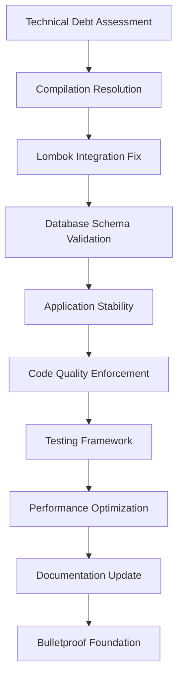
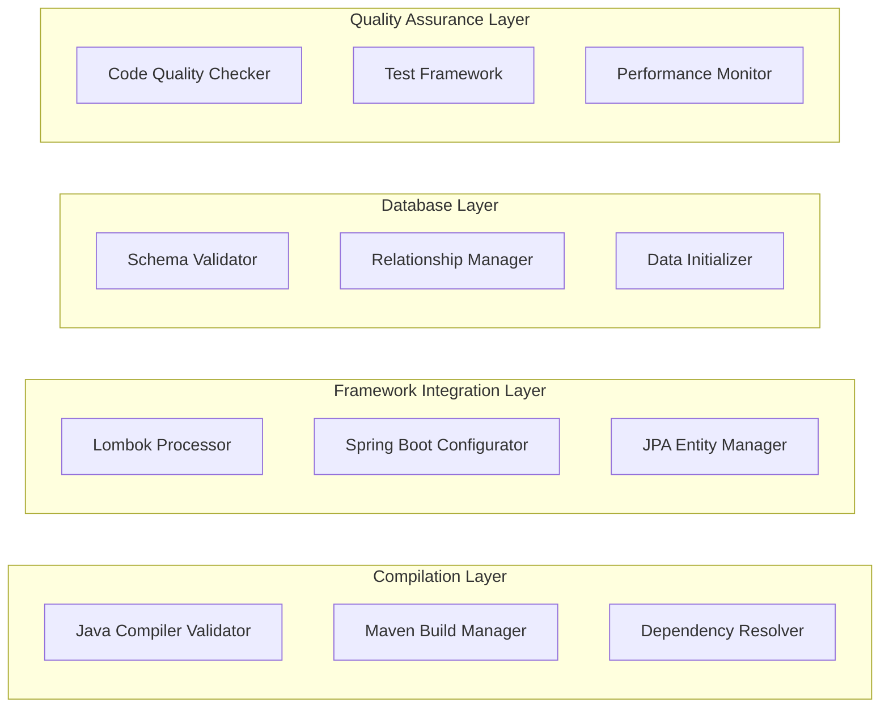

# Backend Technical Debt Resolution Design

## Overview

The Backend Technical Debt Resolution System provides a systematic approach to identifying, prioritizing, and resolving all technical debt items that are preventing smooth development of the comprehensive learning portal. The system focuses on establishing a bulletproof technical foundation through automated validation, comprehensive testing, and robust error handling.

## Architecture

### High-Level System Architecture



### Component Architecture



## Components and Interfaces

### 1. Compilation Validation Engine

**Purpose**: Ensures all Java code compiles successfully with proper error reporting and resolution guidance.

**Key Interfaces**:
```java
public interface CompilationValidationEngine {
    CompilationResult validateAllSources();
    List<CompilationError> identifyCompilationErrors();
    ResolutionPlan generateResolutionPlan(List<CompilationError> errors);
    boolean executeCompilationFix(ResolutionPlan plan);
}

public class CompilationResult {
    private boolean success;
    private int errorCount;
    private int warningCount;
    private List<CompilationError> errors;
    private List<CompilationWarning> warnings;
    private long compilationTimeMs;
}
```

### 2. Lombok Integration Manager

**Purpose**: Resolves all Lombok-related issues and ensures proper annotation processing.

**Key Interfaces**:
```java
public interface LombokIntegrationManager {
    LombokStatus validateLombokIntegration();
    List<LombokIssue> identifyLombokIssues();
    LombokConfiguration optimizeLombokConfiguration();
    boolean applyLombokFixes(List<LombokIssue> issues);
}

public class LombokStatus {
    private boolean annotationProcessingEnabled;
    private String lombokVersion;
    private List<String> supportedAnnotations;
    private List<String> conflictingDependencies;
    private boolean ideIntegrationWorking;
}
```

### 3. Database Schema Validator

**Purpose**: Ensures database schema integrity and proper entity relationships.

**Key Interfaces**:
```java
public interface DatabaseSchemaValidator {
    SchemaValidationResult validateSchema();
    List<EntityRelationshipIssue> validateEntityRelationships();
    DataIntegrityReport validateDataIntegrity();
    boolean repairSchemaIssues(List<SchemaIssue> issues);
}

public class SchemaValidationResult {
    private boolean schemaValid;
    private List<SchemaIssue> issues;
    private Map<String, TableStatus> tableStatuses;
    private List<ConstraintViolation> constraintViolations;
}
```

### 4. Application Stability Manager

**Purpose**: Ensures Spring Boot application starts reliably and maintains stable operation.

**Key Interfaces**:
```java
public interface ApplicationStabilityManager {
    StartupResult validateApplicationStartup();
    HealthStatus monitorApplicationHealth();
    List<StabilityIssue> identifyStabilityIssues();
    boolean applyStabilityFixes(List<StabilityIssue> issues);
}

public class StartupResult {
    private boolean startupSuccessful;
    private long startupTimeMs;
    private List<String> loadedBeans;
    private List<StartupError> errors;
    private Map<String, EndpointStatus> endpointStatuses;
}
```

## Data Models

### Technical Debt Item Model

```java
@Entity
@Table(name = "technical_debt_items")
public class TechnicalDebtItem {
    @Id
    @GeneratedValue(strategy = GenerationType.IDENTITY)
    private Long id;
    
    @Enumerated(EnumType.STRING)
    private DebtType type;
    
    @Enumerated(EnumType.STRING)
    private Priority priority;
    
    private String title;
    private String description;
    private String affectedFiles;
    private String resolutionSteps;
    
    @Enumerated(EnumType.STRING)
    private Status status;
    
    private LocalDateTime createdAt;
    private LocalDateTime resolvedAt;
    private String resolvedBy;
}

public enum DebtType {
    COMPILATION_ERROR,
    LOMBOK_ISSUE,
    DATABASE_SCHEMA,
    APPLICATION_STARTUP,
    CODE_QUALITY,
    PERFORMANCE,
    DOCUMENTATION
}

public enum Priority {
    CRITICAL,    // Blocks development
    HIGH,        // Impacts development efficiency
    MEDIUM,      // Should be fixed soon
    LOW          // Nice to have
}
```

### Resolution Plan Model

```java
public class ResolutionPlan {
    private List<ResolutionStep> steps;
    private long estimatedTimeMinutes;
    private List<String> prerequisites;
    private List<String> risks;
    private String rollbackPlan;
}

public class ResolutionStep {
    private int order;
    private String description;
    private String command;
    private String expectedResult;
    private List<String> validationSteps;
    private boolean automated;
}
```

## Implementation Strategy

### Phase 1: Critical Compilation Issues (Priority: CRITICAL)

#### 1.1 Java Version Compatibility Resolution
```java
// Ensure Java 21 compatibility
public class JavaVersionValidator {
    public ValidationResult validateJavaVersion() {
        String javaVersion = System.getProperty("java.version");
        if (!javaVersion.startsWith("21")) {
            return ValidationResult.failure("Java 21 required, found: " + javaVersion);
        }
        return ValidationResult.success();
    }
}
```

#### 1.2 Lombok Annotation Processing Fix
```xml
<!-- Maven configuration for Lombok with Java 21 -->
<plugin>
    <groupId>org.apache.maven.plugins</groupId>
    <artifactId>maven-compiler-plugin</artifactId>
    <version>3.11.0</version>
    <configuration>
        <source>21</source>
        <target>21</target>
        <annotationProcessorPaths>
            <path>
                <groupId>org.projectlombok</groupId>
                <artifactId>lombok</artifactId>
                <version>1.18.30</version>
            </path>
        </annotationProcessorPaths>
    </configuration>
</plugin>
```

#### 1.3 Missing Field Resolution
```java
// Add missing topicType field to all Topic entities
@Entity
public class Topic {
    // ... existing fields
    
    @Enumerated(EnumType.STRING)
    @Column(name = "topic_type", nullable = false)
    private TopicType topicType = TopicType.LEARNING_CONTENT;
    
    // Lombok will generate getters/setters
}

public enum TopicType {
    LEARNING_CONTENT,
    INTERVIEW_QUESTION,
    CODE_EXAMPLE,
    PRACTICE_EXERCISE
}
```

### Phase 2: Database Schema Integrity (Priority: HIGH)

#### 2.1 Entity Relationship Validation
```java
@Service
public class EntityRelationshipValidator {
    
    public List<RelationshipIssue> validateAllRelationships() {
        List<RelationshipIssue> issues = new ArrayList<>();
        
        // Validate User -> UserProgress relationship
        issues.addAll(validateUserProgressRelationship());
        
        // Validate LearningModule -> Topic relationship
        issues.addAll(validateModuleTopicRelationship());
        
        // Validate Topic -> InterviewQuestion relationship
        issues.addAll(validateTopicQuestionRelationship());
        
        return issues;
    }
    
    private List<RelationshipIssue> validateUserProgressRelationship() {
        // Implementation to check foreign key constraints
        // and relationship integrity
        return Collections.emptyList();
    }
}
```

#### 2.2 Data Initialization Fix
```java
@Component
public class SafeDataInitializer {
    
    @EventListener
    @Order(1)
    public void initializeReferenceData(ContextRefreshedEvent event) {
        // Initialize reference data first (no foreign keys)
        initializeUsers();
        initializeLearningModules();
    }
    
    @EventListener
    @Order(2)
    public void initializeRelationalData(ContextRefreshedEvent event) {
        // Initialize data with foreign key relationships
        initializeTopics();
        initializeInterviewQuestions();
        initializeUserProgress();
    }
}
```

### Phase 3: Application Stability (Priority: HIGH)

#### 3.1 Startup Validation
```java
@Component
public class ApplicationStartupValidator {
    
    @EventListener
    public void validateStartup(ApplicationReadyEvent event) {
        log.info("Validating application startup...");
        
        // Validate database connectivity
        validateDatabaseConnection();
        
        // Validate all endpoints are accessible
        validateEndpoints();
        
        // Validate static content serving
        validateStaticContent();
        
        log.info("Application startup validation completed successfully");
    }
}
```

#### 3.2 Health Monitoring
```java
@Component
public class ApplicationHealthMonitor {
    
    @Scheduled(fixedRate = 60000) // Every minute
    public void monitorHealth() {
        HealthStatus status = checkApplicationHealth();
        
        if (!status.isHealthy()) {
            log.warn("Application health issues detected: {}", status.getIssues());
            // Trigger alerts or self-healing mechanisms
        }
    }
}
```

### Phase 4: Code Quality Enforcement (Priority: MEDIUM)

#### 4.1 Automated Code Quality Checks
```java
@Service
public class CodeQualityEnforcer {
    
    public CodeQualityReport analyzeCodeQuality() {
        CodeQualityReport report = new CodeQualityReport();
        
        // Check method documentation
        report.addSection(checkMethodDocumentation());
        
        // Check exception handling
        report.addSection(checkExceptionHandling());
        
        // Check naming conventions
        report.addSection(checkNamingConventions());
        
        return report;
    }
}
```

## Error Handling

### Error Categories and Resolution Strategies

1. **Compilation Errors**
   - Missing dependencies → Add to pom.xml
   - Version conflicts → Update to compatible versions
   - Syntax errors → Fix code syntax
   - Annotation processing → Configure Lombok properly

2. **Database Errors**
   - Schema creation failures → Fix entity annotations
   - Foreign key violations → Correct data initialization order
   - Connection issues → Validate database configuration

3. **Application Startup Errors**
   - Bean creation failures → Fix dependency injection
   - Port conflicts → Configure different ports
   - Configuration errors → Validate application properties

4. **Runtime Errors**
   - NullPointerExceptions → Add null checks and validation
   - ClassCastExceptions → Fix type casting issues
   - Resource not found → Validate resource paths

## Testing Strategy

### Unit Testing Framework

```java
@ExtendWith(MockitoExtension.class)
class CompilationValidationEngineTest {
    
    @Mock
    private JavaCompiler compiler;
    
    @InjectMocks
    private CompilationValidationEngine engine;
    
    @Test
    void shouldValidateSuccessfulCompilation() {
        // Given
        when(compiler.compile(any())).thenReturn(CompilationResult.success());
        
        // When
        CompilationResult result = engine.validateAllSources();
        
        // Then
        assertThat(result.isSuccess()).isTrue();
        assertThat(result.getErrorCount()).isZero();
    }
}
```

### Integration Testing Framework

```java
@SpringBootTest
@TestPropertySource(locations = "classpath:application-test.properties")
class ApplicationIntegrationTest {
    
    @Autowired
    private TestRestTemplate restTemplate;
    
    @Test
    void shouldStartApplicationSuccessfully() {
        // Test that application starts and serves requests
        ResponseEntity<String> response = restTemplate.getForEntity("/", String.class);
        assertThat(response.getStatusCode()).isEqualTo(HttpStatus.OK);
    }
}
```

## Performance Considerations

### Compilation Performance
- Parallel compilation using multiple threads
- Incremental compilation to avoid recompiling unchanged files
- Caching of compilation results

### Database Performance
- Connection pooling configuration
- Query optimization and indexing
- Lazy loading for large datasets

### Application Performance
- JVM tuning for optimal memory usage
- Caching frequently accessed data
- Asynchronous processing for long-running operations

## Success Metrics

### Technical Debt Resolution Metrics
- **Zero Compilation Errors**: 100% success rate for Maven builds
- **Application Startup Time**: < 30 seconds consistently
- **Database Schema Validation**: 100% success rate for schema creation
- **Code Quality Score**: > 90% compliance with quality standards

### Performance Metrics
- **Build Time**: < 60 seconds for full Maven build
- **Test Execution Time**: < 5 minutes for full test suite
- **Application Response Time**: < 200ms for API endpoints
- **Memory Usage**: < 1GB heap usage under normal load

### Reliability Metrics
- **Application Uptime**: > 99.9% availability
- **Error Rate**: < 0.1% of requests result in errors
- **Recovery Time**: < 5 minutes to recover from failures
- **Data Integrity**: 100% consistency in database operations