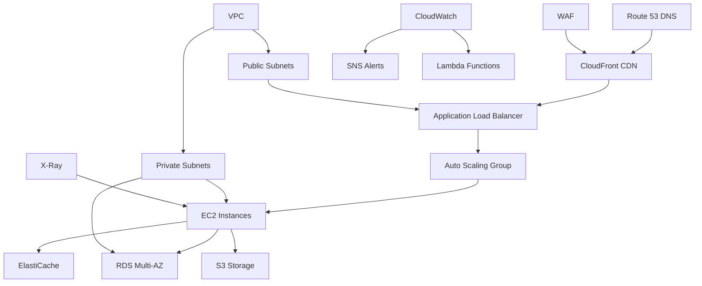

# Enterprise AWS Deployment & Infrastructure Design

## Overview

This design document outlines the technical approach for implementing enterprise-grade AWS deployment and infrastructure, including early deployment strategy, scalable architecture, Infrastructure as Code, security framework, and comprehensive monitoring solutions.

## Architecture

### AWS Infrastructure Architecture



### Infrastructure as Code Architecture

```typescript
// AWS CDK Infrastructure Stack
export class LearningPortalStack extends Stack {
  constructor(scope: Construct, id: string, props?: StackProps) {
    super(scope, id, props);

    // VPC with public and private subnets
    const vpc = new Vpc(this, 'LearningPortalVPC', {
      maxAzs: 3,
      natGateways: 2,
      subnetConfiguration: [
        {
          cidrMask: 24,
          name: 'Public',
          subnetType: SubnetType.PUBLIC,
        },
        {
          cidrMask: 24,
          name: 'Private',
          subnetType: SubnetType.PRIVATE_WITH_NAT,
        },
        {
          cidrMask: 28,
          name: 'Database',
          subnetType: SubnetType.PRIVATE_ISOLATED,
        },
      ],
    });

    // Application Load Balancer
    const alb = new ApplicationLoadBalancer(this, 'LearningPortalALB', {
      vpc,
      internetFacing: true,
      securityGroup: this.createALBSecurityGroup(vpc),
    });

    // Auto Scaling Group
    const autoScalingGroup = new AutoScalingGroup(this, 'LearningPortalASG', {
      vpc,
      instanceType: InstanceType.of(InstanceClass.T3, InstanceSize.MEDIUM),
      machineImage: MachineImage.latestAmazonLinux(),
      minCapacity: 2,
      maxCapacity: 20,
      desiredCapacity: 3,
    });

    // RDS Database
    const database = new DatabaseInstance(this, 'LearningPortalDB', {
      engine: DatabaseInstanceEngine.postgres({
        version: PostgresEngineVersion.VER_14,
      }),
      instanceType: InstanceType.of(InstanceClass.T3, InstanceSize.MICRO),
      vpc,
      multiAz: true,
      storageEncrypted: true,
      backupRetention: Duration.days(7),
      deletionProtection: true,
    });
  }
}
```

## Components and Interfaces

### 1. Deployment Automation

#### DeploymentOrchestrator
```java
@Service
public class DeploymentOrchestrator {
    
    @Autowired
    private AWSDeploymentService awsDeploymentService;
    
    @Autowired
    private InfrastructureValidator infrastructureValidator;
    
    @Autowired
    private HealthCheckService healthCheckService;
    
    public DeploymentResult deployToAWS(DeploymentConfiguration config) {
        try {
            // Pre-deployment validation
            ValidationResult validation = infrastructureValidator.validate(config);
            if (!validation.isSuccess()) {
                return DeploymentResult.failure("Validation failed: " + validation.getErrors());
            }
            
            // Deploy infrastructure
            InfrastructureResult infrastructure = awsDeploymentService.deployInfrastructure(config);
            if (!infrastructure.isSuccess()) {
                return DeploymentResult.failure("Infrastructure deployment failed");
            }
            
            // Deploy application
            ApplicationResult application = awsDeploymentService.deployApplication(config);
            if (!application.isSuccess()) {
                // Rollback infrastructure
                awsDeploymentService.rollbackInfrastructure(infrastructure.getStackId());
                return DeploymentResult.failure("Application deployment failed");
            }
            
            // Health check validation
            HealthCheckResult healthCheck = healthCheckService.validateDeployment(config);
            if (!healthCheck.isSuccess()) {
                // Rollback entire deployment
                awsDeploymentService.rollbackDeployment(infrastructure.getStackId());
                return DeploymentResult.failure("Health check failed");
            }
            
            return DeploymentResult.success(infrastructure.getStackId(), application.getEndpoint());
            
        } catch (Exception e) {
            logger.error("Deployment failed with exception", e);
            return DeploymentResult.failure("Deployment exception: " + e.getMessage());
        }
    }
}
```

#### AWSDeploymentService
```java
@Service
public class AWSDeploymentService {
    
    @Autowired
    private CloudFormationClient cloudFormationClient;
    
    @Autowired
    private EC2Client ec2Client;
    
    @Autowired
    private RDSClient rdsClient;
    
    public InfrastructureResult deployInfrastructure(DeploymentConfiguration config) {
        try {
            // Create CloudFormation stack
            CreateStackRequest stackRequest = CreateStackRequest.builder()
                .stackName(config.getStackName())
                .templateBody(config.getCloudFormationTemplate())
                .parameters(config.getParameters())
                .capabilities(Capability.CAPABILITY_IAM)
                .build();
                
            CreateStackResponse response = cloudFormationClient.createStack(stackRequest);
            
            // Wait for stack creation completion
            StackStatus status = waitForStackCompletion(response.stackId());
            
            if (status == StackStatus.CREATE_COMPLETE) {
                return InfrastructureResult.success(response.stackId());
            } else {
                return InfrastructureResult.failure("Stack creation failed with status: " + status);
            }
            
        } catch (Exception e) {
            logger.error("Infrastructure deployment failed", e);
            return InfrastructureResult.failure("Infrastructure deployment exception: " + e.getMessage());
        }
    }
}
```

### 2. Auto Scaling and Load Balancing

#### AutoScalingManager
```java
@Service
public class AutoScalingManager {
    
    @Autowired
    private AutoScalingClient autoScalingClient;
    
    @Autowired
    private CloudWatchClient cloudWatchClient;
    
    public void configureAutoScaling(AutoScalingConfiguration config) {
        // Create Auto Scaling Group
        CreateAutoScalingGroupRequest asgRequest = CreateAutoScalingGroupRequest.builder()
            .autoScalingGroupName(config.getGroupName())
            .launchTemplate(config.getLaunchTemplate())
            .minSize(config.getMinSize())
            .maxSize(config.getMaxSize())
            .desiredCapacity(config.getDesiredCapacity())
            .vpcZoneIdentifier(String.join(",", config.getSubnetIds()))
            .healthCheckType("ELB")
            .healthCheckGracePeriod(300)
            .build();
            
        autoScalingClient.createAutoScalingGroup(asgRequest);
        
        // Create scaling policies
        createScalingPolicies(config);
        
        // Create CloudWatch alarms
        createCloudWatchAlarms(config);
    }
    
    private void createScalingPolicies(AutoScalingConfiguration config) {
        // Scale up policy
        PutScalingPolicyRequest scaleUpPolicy = PutScalingPolicyRequest.builder()
            .autoScalingGroupName(config.getGroupName())
            .policyName(config.getGroupName() + "-scale-up")
            .policyType("TargetTrackingScaling")
            .targetTrackingConfiguration(TargetTrackingConfiguration.builder()
                .targetValue(70.0)
                .predefinedMetricSpecification(PredefinedMetricSpecification.builder()
                    .predefinedMetricType("ASGAverageCPUUtilization")
                    .build())
                .build())
            .build();
            
        autoScalingClient.putScalingPolicy(scaleUpPolicy);
    }
}
```

### 3. Security and Compliance

#### SecurityManager
```java
@Service
public class SecurityManager {
    
    @Autowired
    private WAFClient wafClient;
    
    @Autowired
    private IAMClient iamClient;
    
    @Autowired
    private KMSClient kmsClient;
    
    public SecurityResult implementSecurityFramework(SecurityConfiguration config) {
        try {
            // Configure WAF
            WAFResult wafResult = configureWAF(config);
            if (!wafResult.isSuccess()) {
                return SecurityResult.failure("WAF configuration failed");
            }
            
            // Configure IAM roles and policies
            IAMResult iamResult = configureIAM(config);
            if (!iamResult.isSuccess()) {
                return SecurityResult.failure("IAM configuration failed");
            }
            
            // Configure KMS encryption
            KMSResult kmsResult = configureKMS(config);
            if (!kmsResult.isSuccess()) {
                return SecurityResult.failure("KMS configuration failed");
            }
            
            return SecurityResult.success();
            
        } catch (Exception e) {
            logger.error("Security framework implementation failed", e);
            return SecurityResult.failure("Security implementation exception: " + e.getMessage());
        }
    }
    
    private WAFResult configureWAF(SecurityConfiguration config) {
        // Create WAF Web ACL
        CreateWebACLRequest webACLRequest = CreateWebACLRequest.builder()
            .name(config.getWebACLName())
            .scope(Scope.CLOUDFRONT)
            .defaultAction(DefaultAction.builder()
                .allow(AllowAction.builder().build())
                .build())
            .rules(createWAFRules(config))
            .build();
            
        CreateWebACLResponse response = wafClient.createWebACL(webACLRequest);
        return WAFResult.success(response.summary().arn());
    }
}
```

### 4. Monitoring and Observability

#### MonitoringManager
```java
@Service
public class MonitoringManager {
    
    @Autowired
    private CloudWatchClient cloudWatchClient;
    
    @Autowired
    private XRayClient xRayClient;
    
    @Autowired
    private SNSClient snsClient;
    
    public MonitoringResult setupMonitoring(MonitoringConfiguration config) {
        try {
            // Create CloudWatch dashboards
            DashboardResult dashboards = createDashboards(config);
            
            // Create CloudWatch alarms
            AlarmResult alarms = createAlarms(config);
            
            // Configure X-Ray tracing
            XRayResult xray = configureXRayTracing(config);
            
            // Setup SNS notifications
            SNSResult notifications = setupNotifications(config);
            
            return MonitoringResult.success(dashboards, alarms, xray, notifications);
            
        } catch (Exception e) {
            logger.error("Monitoring setup failed", e);
            return MonitoringResult.failure("Monitoring setup exception: " + e.getMessage());
        }
    }
    
    private DashboardResult createDashboards(MonitoringConfiguration config) {
        PutDashboardRequest dashboardRequest = PutDashboardRequest.builder()
            .dashboardName(config.getDashboardName())
            .dashboardBody(createDashboardBody(config))
            .build();
            
        PutDashboardResponse response = cloudWatchClient.putDashboard(dashboardRequest);
        return DashboardResult.success(response.dashboardArn());
    }
}
```

## Data Models

### Deployment Models
```java
@Entity
@Table(name = "aws_deployments")
public class AWSDeployment {
    @Id
    private UUID id;
    
    private String stackId;
    private String environment;
    private DeploymentStatus status;
    private String endpoint;
    private Instant deployedAt;
    private String deployedBy;
    private Map<String, String> configuration;
    private String rollbackStackId;
}

@Entity
@Table(name = "infrastructure_metrics")
public class InfrastructureMetrics {
    @Id
    private UUID id;
    
    private String stackId;
    private String metricName;
    private Double value;
    private String unit;
    private Instant timestamp;
    private Map<String, String> dimensions;
}
```

## Implementation Strategy

### Phase 1: Core Infrastructure Setup
1. **VPC and Networking**: Create secure network foundation with public/private subnets
2. **Load Balancing**: Implement Application Load Balancer with health checks
3. **Auto Scaling**: Configure auto scaling groups with dynamic capacity management
4. **Database Setup**: Deploy RDS with Multi-AZ configuration and encryption

### Phase 2: Security and Compliance
1. **WAF Configuration**: Implement web application firewall with security rules
2. **IAM Setup**: Configure roles and policies with least privilege access
3. **Encryption**: Implement KMS encryption for data at rest and in transit
4. **VPC Security**: Configure security groups and NACLs for network security

### Phase 3: Monitoring and Observability
1. **CloudWatch Setup**: Implement comprehensive monitoring with custom metrics
2. **X-Ray Tracing**: Configure distributed tracing for performance analysis
3. **Alerting**: Setup automated alerting with SNS notifications
4. **Dashboards**: Create real-time dashboards for system health monitoring

## Error Handling

### Deployment Failure Recovery
```java
@Component
public class DeploymentFailureHandler {
    
    public void handleDeploymentFailure(DeploymentFailureEvent event) {
        try {
            // Log detailed failure information
            logger.error("Deployment failed: {}", event.getFailureReason());
            
            // Initiate automated rollback
            RollbackResult rollback = initiateRollback(event.getStackId());
            
            // Notify stakeholders
            notificationService.notifyDeploymentFailure(event);
            
            // Create incident ticket
            incidentManager.createIncident(event);
            
        } catch (Exception e) {
            // Critical error - escalate immediately
            criticalErrorHandler.handleCriticalDeploymentFailure(e, event);
        }
    }
}
```

## Testing Strategy

### Infrastructure Testing
1. **Unit Tests**: Individual component validation
2. **Integration Tests**: End-to-end infrastructure testing
3. **Security Tests**: Penetration testing and vulnerability assessment
4. **Performance Tests**: Load testing and capacity validation
5. **Disaster Recovery Tests**: Failover and recovery testing

## Success Metrics

### Deployment Metrics
- **Deployment Success Rate**: 99.5% successful deployments
- **Deployment Time**: < 15 minutes for standard deployments
- **Rollback Time**: < 5 minutes for automated rollbacks
- **Zero Downtime**: 100% zero-downtime deployments

### Infrastructure Metrics
- **Availability**: 99.9% uptime SLA
- **Response Time**: < 200ms for 95% of requests
- **Auto Scaling**: < 2 minutes scale-out time
- **Cost Optimization**: 20% cost reduction through optimization