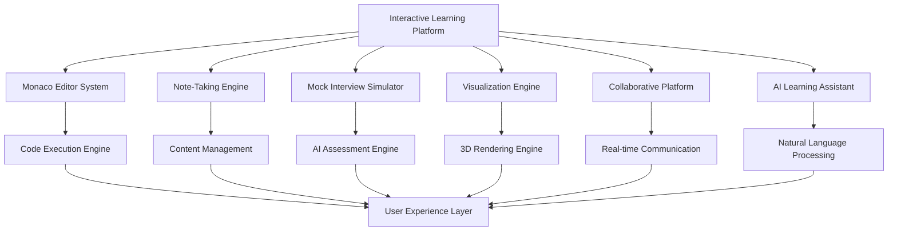
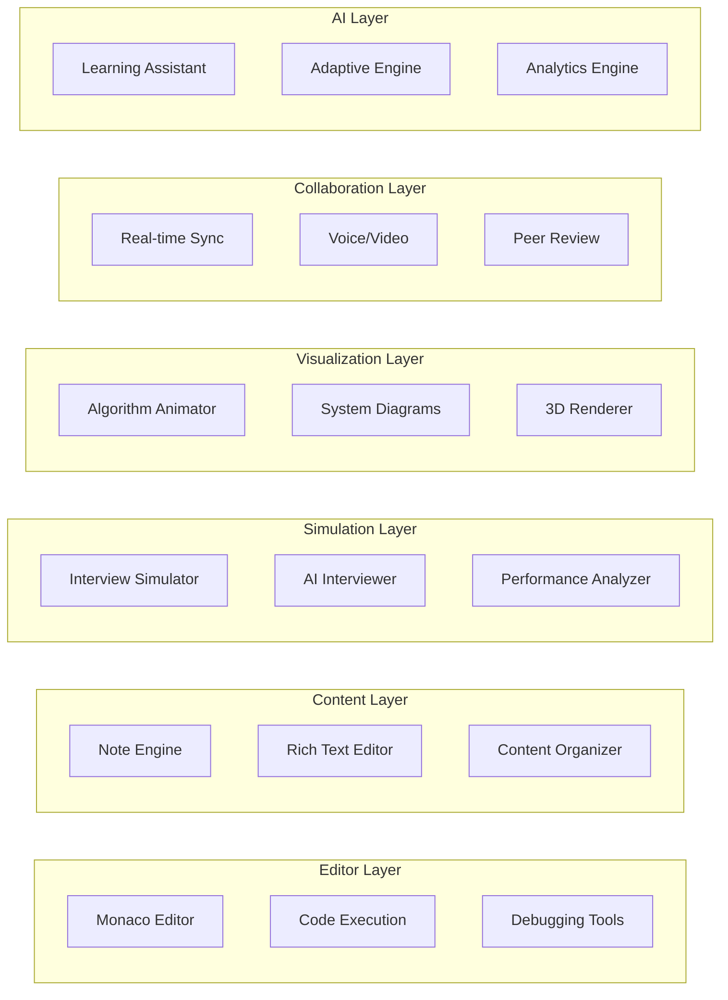

# Interactive Features Implementation Design

## Overview

The Interactive Features Implementation System provides a comprehensive framework for creating immersive, engaging, and highly effective learning experiences through advanced interactive components. The system integrates Monaco Editor for professional code editing, comprehensive note-taking capabilities, AI-powered mock interviews, interactive visualizations, collaborative learning features, and intelligent learning assistance.

## Architecture

### High-Level Interactive System Architecture



### Component Architecture



## Components and Interfaces

### 1. Monaco Editor System

**Purpose**: Professional code editing environment with multi-language support and real-time execution.

**Key Interfaces**:
```typescript
interface MonacoEditorSystem {
  createEditor(containerId: string, language: Language): EditorInstance;
  executeCode(code: string, language: Language): Promise<ExecutionResult>;
  enableDebugging(editorId: string): DebugSession;
  shareCode(editorId: string): ShareableLink;
  enableCollaboration(editorId: string): CollaborationSession;
}

interface EditorInstance {
  setValue(code: string): void;
  getValue(): string;
  setLanguage(language: Language): void;
  addBreakpoint(line: number): void;
  removeBreakpoint(line: number): void;
  onContentChange(callback: (content: string) => void): void;
}

interface ExecutionResult {
  success: boolean;
  output: string;
  errors: CompilationError[];
  executionTime: number;
  memoryUsage: number;
  testResults?: TestResult[];
}
```

### 2. Note-Taking Engine

**Purpose**: Comprehensive dual-architecture note-taking system with embedded and centralized management.

**Key Interfaces**:
```typescript
interface NoteTakingEngine {
  createEmbeddedNote(topicId: string, position: string): EmbeddedNote;
  createStandaloneNote(title: string, content: string): StandaloneNote;
  searchNotes(query: string, filters: SearchFilters): SearchResult[];
  organizeNotes(organizationStrategy: OrganizationStrategy): void;
  exportNotes(noteIds: string[], format: ExportFormat): ExportResult;
}

interface EmbeddedNote {
  id: string;
  topicId: string;
  position: string;
  content: RichTextContent;
  tags: string[];
  createdAt: Date;
  lastModified: Date;
  
  save(): Promise<void>;
  delete(): Promise<void>;
  addTag(tag: string): void;
  linkToTopic(topicId: string): void;
}

interface RichTextContent {
  text: string;
  formatting: TextFormatting[];
  codeSnippets: CodeSnippet[];
  mathFormulas: MathFormula[];
  links: Link[];
  images: Image[];
}
```

### 3. Mock Interview Simulator

**Purpose**: AI-powered interview simulation with company-specific processes and realistic scenarios.

**Key Interfaces**:
```typescript
interface MockInterviewSimulator {
  startInterview(company: Company, interviewType: InterviewType): InterviewSession;
  generateQuestion(difficulty: Difficulty, topic: string): InterviewQuestion;
  evaluateResponse(response: string, question: InterviewQuestion): EvaluationResult;
  generateFeedback(session: InterviewSession): FeedbackReport;
  calculateReadinessScore(userId: string, company: Company): ReadinessScore;
}

interface InterviewSession {
  id: string;
  company: Company;
  interviewType: InterviewType;
  questions: InterviewQuestion[];
  responses: InterviewResponse[];
  startTime: Date;
  duration: number;
  
  askQuestion(question: InterviewQuestion): void;
  recordResponse(response: InterviewResponse): void;
  endSession(): FeedbackReport;
}

interface InterviewQuestion {
  id: string;
  type: QuestionType; // CODING, SYSTEM_DESIGN, BEHAVIORAL
  difficulty: Difficulty;
  topic: string;
  content: string;
  expectedApproach: string[];
  evaluationCriteria: EvaluationCriteria;
  timeLimit: number;
}
```

### 4. Interactive Visualization Engine

**Purpose**: Dynamic visualizations and animations for algorithms, data structures, and system architectures.

**Key Interfaces**:
```typescript
interface InteractiveVisualizationEngine {
  createAlgorithmVisualization(algorithm: Algorithm, data: any[]): Visualization;
  createDataStructureVisualization(structure: DataStructure): Visualization;
  createSystemArchitectureDiagram(components: Component[]): SystemDiagram;
  animate(visualization: Visualization, steps: AnimationStep[]): Promise<void>;
  enableInteraction(visualization: Visualization): InteractiveControls;
}

interface Visualization {
  id: string;
  type: VisualizationType;
  canvas: HTMLCanvasElement;
  controls: VisualizationControls;
  
  play(): void;
  pause(): void;
  reset(): void;
  step(): void;
  setSpeed(speed: number): void;
}

interface AnimationStep {
  id: string;
  description: string;
  duration: number;
  changes: VisualChange[];
  highlights: ElementHighlight[];
}
```

### 5. Collaborative Learning Platform

**Purpose**: Real-time collaboration features for peer learning and code review.

**Key Interfaces**:
```typescript
interface CollaborativeLearningPlatform {
  createStudyRoom(name: string, capacity: number): StudyRoom;
  joinStudyRoom(roomId: string, userId: string): Promise<StudyRoomSession>;
  startCodeReview(codeId: string, reviewers: string[]): CodeReviewSession;
  enableVoiceChat(roomId: string): VoiceChatSession;
  createDiscussionThread(topicId: string, title: string): DiscussionThread;
}

interface StudyRoom {
  id: string;
  name: string;
  participants: Participant[];
  sharedWhiteboard: Whiteboard;
  sharedCodeEditor: CollaborativeEditor;
  voiceChat: VoiceChatSession;
  
  addParticipant(user: User): void;
  removeParticipant(userId: string): void;
  shareScreen(userId: string): void;
  endSession(): void;
}

interface CollaborativeEditor {
  id: string;
  content: string;
  cursors: Map<string, CursorPosition>;
  
  onContentChange(callback: (change: ContentChange) => void): void;
  onCursorMove(callback: (userId: string, position: CursorPosition) => void): void;
  broadcastChange(change: ContentChange): void;
}
```

### 6. AI Learning Assistant

**Purpose**: Intelligent tutoring system with Socratic method and adaptive explanations.

**Key Interfaces**:
```typescript
interface AILearningAssistant {
  askSocraticQuestion(context: LearningContext): Promise<SocraticQuestion>;
  generateAdaptiveExplanation(concept: string, userLevel: SkillLevel): Promise<Explanation>;
  provideHint(problem: Problem, attemptHistory: Attempt[]): Promise<Hint>;
  analyzeError(code: string, error: Error): Promise<ErrorAnalysis>;
  recommendLearningPath(userId: string, goals: LearningGoal[]): Promise<LearningPath>;
}

interface SocraticQuestion {
  id: string;
  question: string;
  intent: QuestionIntent; // GUIDE_DISCOVERY, CHECK_UNDERSTANDING, DEEPEN_THINKING
  expectedResponseTypes: ResponseType[];
  followUpQuestions: string[];
}

interface Explanation {
  id: string;
  concept: string;
  level: SkillLevel;
  content: ExplanationContent;
  examples: Example[];
  analogies: Analogy[];
  interactiveElements: InteractiveElement[];
}
```

## Data Models

### Interactive Session Model

```typescript
interface InteractiveSession {
  id: string;
  userId: string;
  sessionType: SessionType; // CODING, INTERVIEW, COLLABORATION, STUDY
  startTime: Date;
  endTime?: Date;
  activities: Activity[];
  performance: PerformanceMetrics;
  achievements: Achievement[];
}

interface Activity {
  id: string;
  type: ActivityType;
  timestamp: Date;
  duration: number;
  data: ActivityData;
  result: ActivityResult;
}

interface PerformanceMetrics {
  codeExecutionCount: number;
  successfulExecutions: number;
  averageExecutionTime: number;
  notesCreated: number;
  questionsAttempted: number;
  correctAnswers: number;
  collaborationTime: number;
  helpRequestsCount: number;
}
```

### Note System Model

```typescript
interface Note {
  id: string;
  userId: string;
  type: NoteType; // EMBEDDED, STANDALONE
  title: string;
  content: RichTextContent;
  tags: string[];
  category: string;
  topicId?: string; // For embedded notes
  position?: string; // For embedded notes
  createdAt: Date;
  lastModified: Date;
  isPublic: boolean;
  collaborators: string[];
}

interface NoteCollection {
  id: string;
  name: string;
  description: string;
  notes: string[]; // Note IDs
  owner: string;
  isShared: boolean;
  permissions: CollectionPermissions;
}
```

### Visualization Model

```typescript
interface VisualizationDefinition {
  id: string;
  name: string;
  type: VisualizationType;
  algorithm?: string;
  dataStructure?: string;
  initialData: any[];
  steps: VisualizationStep[];
  interactionPoints: InteractionPoint[];
  educationalNotes: EducationalNote[];
}

interface VisualizationStep {
  id: string;
  order: number;
  description: string;
  code?: string;
  visualChanges: VisualChange[];
  highlights: string[];
  explanation: string;
}
```

## Implementation Strategy

### Phase 1: Monaco Editor Integration

#### 1.1 Basic Editor Setup
```typescript
// Monaco Editor Integration
class MonacoEditorService {
  private editors: Map<string, monaco.editor.IStandaloneCodeEditor> = new Map();
  
  async createEditor(containerId: string, language: string): Promise<string> {
    const container = document.getElementById(containerId);
    if (!container) throw new Error(`Container ${containerId} not found`);
    
    const editor = monaco.editor.create(container, {
      value: '',
      language: language,
      theme: 'vs-dark',
      automaticLayout: true,
      minimap: { enabled: false },
      scrollBeyondLastLine: false,
      fontSize: 14,
      lineNumbers: 'on',
      roundedSelection: false,
      scrollbar: {
        vertical: 'visible',
        horizontal: 'visible'
      }
    });
    
    const editorId = this.generateEditorId();
    this.editors.set(editorId, editor);
    
    return editorId;
  }
  
  async executeCode(editorId: string, language: string): Promise<ExecutionResult> {
    const editor = this.editors.get(editorId);
    if (!editor) throw new Error(`Editor ${editorId} not found`);
    
    const code = editor.getValue();
    
    // Send code to secure execution environment
    const response = await fetch('/api/code/execute', {
      method: 'POST',
      headers: { 'Content-Type': 'application/json' },
      body: JSON.stringify({ code, language })
    });
    
    return await response.json();
  }
}
```

#### 1.2 Code Execution Backend
```java
@RestController
@RequestMapping("/api/code")
public class CodeExecutionController {
    
    @Autowired
    private CodeExecutionService executionService;
    
    @PostMapping("/execute")
    public ResponseEntity<ExecutionResult> executeCode(@RequestBody CodeExecutionRequest request) {
        try {
            ExecutionResult result = executionService.executeCode(
                request.getCode(), 
                request.getLanguage()
            );
            return ResponseEntity.ok(result);
        } catch (Exception e) {
            return ResponseEntity.badRequest()
                .body(ExecutionResult.error(e.getMessage()));
        }
    }
}

@Service
public class CodeExecutionService {
    
    public ExecutionResult executeCode(String code, String language) {
        // Create secure sandbox environment
        DockerContainer container = createSandboxContainer(language);
        
        try {
            // Write code to temporary file
            String fileName = writeCodeToFile(code, language);
            
            // Execute code with timeout and resource limits
            ProcessResult result = container.execute(
                getExecutionCommand(language, fileName),
                Duration.ofSeconds(30), // 30 second timeout
                1024 * 1024 * 100 // 100MB memory limit
            );
            
            return ExecutionResult.builder()
                .success(result.getExitCode() == 0)
                .output(result.getStdout())
                .errors(parseErrors(result.getStderr()))
                .executionTime(result.getExecutionTime())
                .memoryUsage(result.getMemoryUsage())
                .build();
                
        } finally {
            container.cleanup();
        }
    }
}
```

### Phase 2: Note-Taking System Implementation

#### 2.1 Embedded Notes Component
```typescript
// React component for embedded notes
interface EmbeddedNoteProps {
  topicId: string;
  position: string;
  initialContent?: string;
}

const EmbeddedNote: React.FC<EmbeddedNoteProps> = ({ topicId, position, initialContent }) => {
  const [content, setContent] = useState(initialContent || '');
  const [isEditing, setIsEditing] = useState(false);
  const [note, setNote] = useState<Note | null>(null);
  
  useEffect(() => {
    loadExistingNote();
  }, [topicId, position]);
  
  const loadExistingNote = async () => {
    try {
      const existingNote = await noteService.getEmbeddedNote(topicId, position);
      if (existingNote) {
        setNote(existingNote);
        setContent(existingNote.content.text);
      }
    } catch (error) {
      console.log('No existing note found');
    }
  };
  
  const saveNote = async () => {
    try {
      if (note) {
        await noteService.updateNote(note.id, { content: { text: content } });
      } else {
        const newNote = await noteService.createEmbeddedNote({
          topicId,
          position,
          content: { text: content }
        });
        setNote(newNote);
      }
      setIsEditing(false);
    } catch (error) {
      console.error('Failed to save note:', error);
    }
  };
  
  return (
    <div className="embedded-note">
      {!isEditing ? (
        <div className="note-display" onClick={() => setIsEditing(true)}>
          {content || 'Click to add a note...'}
        </div>
      ) : (
        <div className="note-editor">
          <RichTextEditor
            value={content}
            onChange={setContent}
            placeholder="Enter your notes here..."
          />
          <div className="note-actions">
            <button onClick={saveNote}>Save</button>
            <button onClick={() => setIsEditing(false)}>Cancel</button>
          </div>
        </div>
      )}
    </div>
  );
};
```

#### 2.2 Rich Text Editor Implementation
```typescript
// Rich text editor with code snippet support
const RichTextEditor: React.FC<RichTextEditorProps> = ({ value, onChange, placeholder }) => {
  const [editor, setEditor] = useState<any>(null);
  
  useEffect(() => {
    // Initialize Quill editor with custom modules
    const quill = new Quill('#editor-container', {
      theme: 'snow',
      modules: {
        toolbar: [
          ['bold', 'italic', 'underline', 'strike'],
          ['blockquote', 'code-block'],
          [{ 'header': 1 }, { 'header': 2 }],
          [{ 'list': 'ordered'}, { 'list': 'bullet' }],
          ['link', 'image'],
          ['clean']
        ],
        syntax: true // Enable syntax highlighting for code blocks
      }
    });
    
    quill.on('text-change', () => {
      onChange(quill.root.innerHTML);
    });
    
    setEditor(quill);
  }, []);
  
  useEffect(() => {
    if (editor && value !== editor.root.innerHTML) {
      editor.root.innerHTML = value;
    }
  }, [value, editor]);
  
  return <div id="editor-container" />;
};
```

### Phase 3: Mock Interview Simulator

#### 3.1 Interview Session Management
```java
@Service
public class MockInterviewService {
    
    @Autowired
    private AIInterviewerService aiInterviewer;
    
    @Autowired
    private QuestionGeneratorService questionGenerator;
    
    public InterviewSession startInterview(String userId, Company company, InterviewType type) {
        InterviewSession session = InterviewSession.builder()
            .id(UUID.randomUUID().toString())
            .userId(userId)
            .company(company)
            .interviewType(type)
            .startTime(LocalDateTime.now())
            .status(InterviewStatus.IN_PROGRESS)
            .build();
            
        // Generate first question based on company and type
        InterviewQuestion firstQuestion = questionGenerator.generateQuestion(
            company, type, DifficultyLevel.EASY
        );
        
        session.addQuestion(firstQuestion);
        
        return interviewSessionRepository.save(session);
    }
    
    public EvaluationResult evaluateResponse(String sessionId, String response) {
        InterviewSession session = getSession(sessionId);
        InterviewQuestion currentQuestion = session.getCurrentQuestion();
        
        // Use AI to evaluate the response
        EvaluationResult evaluation = aiInterviewer.evaluateResponse(
            currentQuestion, response
        );
        
        // Record the response and evaluation
        InterviewResponse interviewResponse = InterviewResponse.builder()
            .questionId(currentQuestion.getId())
            .response(response)
            .evaluation(evaluation)
            .timestamp(LocalDateTime.now())
            .build();
            
        session.addResponse(interviewResponse);
        
        // Generate next question based on performance
        if (session.getResponses().size() < session.getMaxQuestions()) {
            InterviewQuestion nextQuestion = questionGenerator.generateAdaptiveQuestion(
                session.getCompany(),
                session.getInterviewType(),
                evaluation.getDifficultyAdjustment()
            );
            session.addQuestion(nextQuestion);
        }
        
        interviewSessionRepository.save(session);
        return evaluation;
    }
}
```

### Phase 4: Interactive Visualizations

#### 4.1 Algorithm Visualization Engine
```typescript
// Algorithm visualization system
class AlgorithmVisualizer {
  private canvas: HTMLCanvasElement;
  private ctx: CanvasRenderingContext2D;
  private animationFrameId: number | null = null;
  
  constructor(canvasId: string) {
    this.canvas = document.getElementById(canvasId) as HTMLCanvasElement;
    this.ctx = this.canvas.getContext('2d')!;
  }
  
  visualizeSorting(array: number[], algorithm: SortingAlgorithm): Promise<void> {
    return new Promise((resolve) => {
      const steps = this.generateSortingSteps(array, algorithm);
      let currentStep = 0;
      
      const animate = () => {
        if (currentStep >= steps.length) {
          resolve();
          return;
        }
        
        this.drawArray(steps[currentStep]);
        currentStep++;
        
        this.animationFrameId = requestAnimationFrame(() => {
          setTimeout(animate, 500); // 500ms delay between steps
        });
      };
      
      animate();
    });
  }
  
  private generateSortingSteps(array: number[], algorithm: SortingAlgorithm): VisualizationStep[] {
    const steps: VisualizationStep[] = [];
    const arr = [...array];
    
    switch (algorithm) {
      case SortingAlgorithm.BUBBLE_SORT:
        return this.generateBubbleSortSteps(arr);
      case SortingAlgorithm.QUICK_SORT:
        return this.generateQuickSortSteps(arr);
      // ... other algorithms
    }
    
    return steps;
  }
  
  private drawArray(step: VisualizationStep): void {
    this.ctx.clearRect(0, 0, this.canvas.width, this.canvas.height);
    
    const barWidth = this.canvas.width / step.array.length;
    const maxHeight = this.canvas.height - 50;
    const maxValue = Math.max(...step.array);
    
    step.array.forEach((value, index) => {
      const barHeight = (value / maxValue) * maxHeight;
      const x = index * barWidth;
      const y = this.canvas.height - barHeight;
      
      // Color based on step highlights
      if (step.comparing && step.comparing.includes(index)) {
        this.ctx.fillStyle = '#ff6b6b'; // Red for comparing
      } else if (step.swapping && step.swapping.includes(index)) {
        this.ctx.fillStyle = '#4ecdc4'; // Teal for swapping
      } else if (step.sorted && step.sorted.includes(index)) {
        this.ctx.fillStyle = '#45b7d1'; // Blue for sorted
      } else {
        this.ctx.fillStyle = '#96ceb4'; // Green for unsorted
      }
      
      this.ctx.fillRect(x, y, barWidth - 2, barHeight);
      
      // Draw value labels
      this.ctx.fillStyle = '#333';
      this.ctx.font = '12px Arial';
      this.ctx.textAlign = 'center';
      this.ctx.fillText(
        value.toString(),
        x + barWidth / 2,
        this.canvas.height - 10
      );
    });
    
    // Draw step description
    this.ctx.fillStyle = '#333';
    this.ctx.font = '16px Arial';
    this.ctx.textAlign = 'left';
    this.ctx.fillText(step.description, 10, 25);
  }
}
```

## Error Handling

### Interactive Feature Errors
1. **Code Execution Timeouts** → Graceful termination with explanation
2. **Collaboration Connection Issues** → Automatic reconnection with state preservation
3. **Visualization Rendering Errors** → Fallback to static diagrams
4. **AI Service Unavailability** → Cached responses and degraded functionality

### User Experience Errors
1. **Note Saving Failures** → Local storage backup with sync retry
2. **Interview Session Interruptions** → Session state preservation and resume capability
3. **Mobile Responsiveness Issues** → Progressive enhancement and feature detection

## Testing Strategy

### Interactive Component Testing
```typescript
// Test suite for Monaco Editor integration
describe('MonacoEditorService', () => {
  let editorService: MonacoEditorService;
  let mockContainer: HTMLElement;
  
  beforeEach(() => {
    editorService = new MonacoEditorService();
    mockContainer = document.createElement('div');
    mockContainer.id = 'test-editor';
    document.body.appendChild(mockContainer);
  });
  
  test('should create editor successfully', async () => {
    const editorId = await editorService.createEditor('test-editor', 'java');
    expect(editorId).toBeDefined();
    expect(editorService.getEditor(editorId)).toBeTruthy();
  });
  
  test('should execute Java code correctly', async () => {
    const editorId = await editorService.createEditor('test-editor', 'java');
    const editor = editorService.getEditor(editorId);
    
    editor.setValue(`
      public class Test {
        public static void main(String[] args) {
          System.out.println("Hello World");
        }
      }
    `);
    
    const result = await editorService.executeCode(editorId, 'java');
    
    expect(result.success).toBe(true);
    expect(result.output).toContain('Hello World');
  });
});
```

### Mock Interview Testing
```java
@SpringBootTest
class MockInterviewServiceTest {
    
    @Autowired
    private MockInterviewService interviewService;
    
    @Test
    void shouldStartInterviewSuccessfully() {
        InterviewSession session = interviewService.startInterview(
            "user123", Company.AMAZON, InterviewType.CODING
        );
        
        assertThat(session).isNotNull();
        assertThat(session.getCompany()).isEqualTo(Company.AMAZON);
        assertThat(session.getQuestions()).hasSize(1);
        assertThat(session.getStatus()).isEqualTo(InterviewStatus.IN_PROGRESS);
    }
    
    @Test
    void shouldEvaluateResponseAndGenerateNextQuestion() {
        InterviewSession session = interviewService.startInterview(
            "user123", Company.GOOGLE, InterviewType.CODING
        );
        
        EvaluationResult result = interviewService.evaluateResponse(
            session.getId(), "public int[] twoSum(int[] nums, int target) { ... }"
        );
        
        assertThat(result).isNotNull();
        assertThat(result.getScore()).isGreaterThan(0);
        
        InterviewSession updatedSession = interviewService.getSession(session.getId());
        assertThat(updatedSession.getQuestions()).hasSizeGreaterThan(1);
    }
}
```

## Performance Considerations

### Code Execution Performance
- Containerized execution environments with resource limits
- Connection pooling for execution services
- Caching of compilation results for identical code

### Visualization Performance
- Hardware-accelerated canvas rendering
- Efficient animation frame management
- Progressive loading for complex visualizations

### Collaboration Performance
- WebSocket connection optimization
- Efficient diff algorithms for real-time synchronization
- Bandwidth optimization for mobile users

## Success Metrics

### Interactive Feature Adoption
- **Monaco Editor Usage**: > 90% of users actively use code editor
- **Note-Taking Engagement**: > 70% of users create and maintain notes
- **Mock Interview Completion**: > 60% of users complete full mock interviews
- **Collaboration Participation**: > 40% of users engage in collaborative features

### Learning Effectiveness
- **Code Execution Success Rate**: > 85% of code executions complete successfully
- **Interview Performance Improvement**: > 30% improvement in mock interview scores
- **Knowledge Retention**: > 80% retention rate for concepts practiced with interactive features
- **User Satisfaction**: > 4.5/5 rating for interactive learning experience