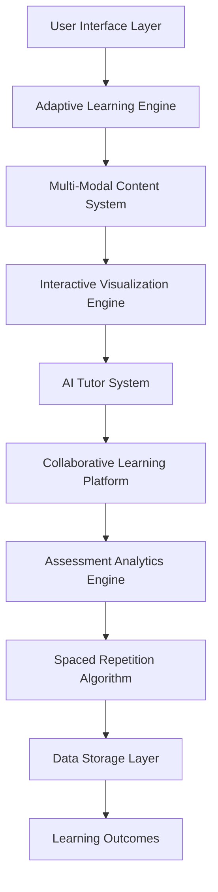
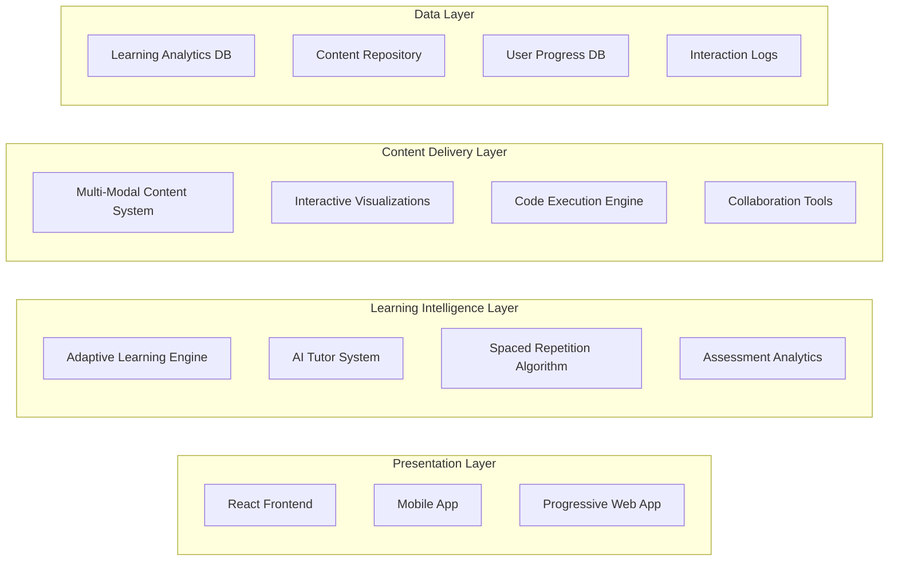

# Interactive Learning Platform Design

## Overview

The Interactive Learning Platform Design provides a comprehensive architecture for creating the world's most advanced and effective learning environment, incorporating cutting-edge learning technologies, AI-powered personalization, and multi-modal content delivery to optimize learning outcomes for FAANG senior developer preparation.

## Architecture

### High-Level System Architecture



### Component Architecture



## Components and Interfaces

### 1. Adaptive Learning Engine

**Purpose**: Personalizes learning experiences based on individual user patterns, preferences, and performance.

**Key Interfaces**:
```java
public interface AdaptiveLearningEngine {
    LearningProfile createLearningProfile(User user);
    PersonalizedContent adaptContent(LearningProfile profile, Content content);
    LearningPath generatePersonalizedPath(LearningProfile profile, LearningGoals goals);
    void updateProfile(LearningProfile profile, LearningInteraction interaction);
}

public class LearningProfile {
    private String userId;
    private LearningStyle preferredStyle;
    private Map<String, Double> topicMastery;
    private LearningPace pace;
    private List<String> strengths;
    private List<String> weaknesses;
    private LocalDateTime lastUpdated;
}

public enum LearningStyle {
    VISUAL,
    AUDITORY,
    KINESTHETIC,
    READING_WRITING,
    MULTIMODAL
}
```

### 2. Multi-Modal Content System

**Purpose**: Delivers content in multiple formats optimized for different learning styles and preferences.

**Key Interfaces**:
```java
public interface MultiModalContentSystem {
    MultiModalContent generateContent(Topic topic, LearningStyle style);
    VisualContent createVisualContent(Topic topic);
    AudioContent createAudioContent(Topic topic);
    InteractiveContent createInteractiveContent(Topic topic);
    TextualContent createTextualContent(Topic topic);
}

public class MultiModalContent {
    private String topicId;
    private VisualContent visual;
    private AudioContent audio;
    private InteractiveContent interactive;
    private TextualContent textual;
    private Map<LearningStyle, Double> effectiveness;
}

public class VisualContent {
    private List<Diagram> diagrams;
    private List<Animation> animations;
    private List<Infographic> infographics;
    private List<MindMap> mindMaps;
}
```

### 3. Interactive Visualization Engine

**Purpose**: Creates dynamic, interactive visualizations for algorithms, data structures, and system architectures.

**Key Interfaces**:
```java
public interface InteractiveVisualizationEngine {
    AlgorithmVisualization createAlgorithmVisualization(Algorithm algorithm);
    DataStructureVisualization createDataStructureVisualization(DataStructure structure);
    SystemArchitectureVisualization createSystemVisualization(SystemDesign design);
    VRVisualization createVRVisualization(ComplexConcept concept);
}

public class AlgorithmVisualization {
    private String algorithmId;
    private List<VisualizationStep> steps;
    private InteractiveControls controls;
    private VariableTracker variableTracker;
    private ComplexityAnalyzer complexityAnalyzer;
}

public class VisualizationStep {
    private int stepNumber;
    private String description;
    private VisualState visualState;
    private CodeHighlight codeHighlight;
    private Duration duration;
}
```

### 4. AI Tutor System

**Purpose**: Provides intelligent tutoring using Socratic method and adaptive explanations.

**Key Interfaces**:
```java
public interface AITutorSystem {
    SocraticQuestion generateSocraticQuestion(UserResponse response, LearningContext context);
    AdaptiveExplanation generateExplanation(Concept concept, UserUnderstanding understanding);
    ProgressiveHint generateHint(Problem problem, UserAttempt attempt);
    LearningRecommendation generateRecommendation(LearningProfile profile);
}

public class SocraticQuestion {
    private String question;
    private QuestionType type;
    private String expectedThinking;
    private List<String> followUpQuestions;
    private ConceptConnection conceptConnection;
}

public enum QuestionType {
    CLARIFICATION,
    ASSUMPTION_PROBING,
    EVIDENCE_REASONING,
    PERSPECTIVE_VIEWPOINT,
    IMPLICATION_CONSEQUENCE,
    META_QUESTION
}
```

### 5. Spaced Repetition Algorithm

**Purpose**: Optimizes review scheduling based on forgetting curve research and individual retention patterns.

**Key Interfaces**:
```java
public interface SpacedRepetitionAlgorithm {
    ReviewSchedule calculateOptimalSchedule(LearningItem item, UserPerformance performance);
    ReviewSession generateReviewSession(User user, LocalDateTime sessionTime);
    void updateRetentionModel(LearningItem item, ReviewResult result);
    ForgettingCurve calculateForgettingCurve(User user, Concept concept);
}

public class ReviewSchedule {
    private String itemId;
    private LocalDateTime nextReview;
    private Duration interval;
    private double easeFactor;
    private int repetitionCount;
    private double retentionProbability;
}

public class ForgettingCurve {
    private double initialStrength;
    private double decayRate;
    private List<DataPoint> retentionData;
    private LocalDateTime lastUpdate;
}
```

## Data Models

### Learning Analytics Model

```java
@Entity
@Table(name = "learning_analytics")
public class LearningAnalytics {
    @Id
    @GeneratedValue(strategy = GenerationType.IDENTITY)
    private Long id;
    
    private String userId;
    private String sessionId;
    private String topicId;
    private String activityType;
    
    @Enumerated(EnumType.STRING)
    private LearningModality modality;
    
    private LocalDateTime startTime;
    private LocalDateTime endTime;
    private Duration timeSpent;
    
    private Double engagementScore;
    private Double comprehensionScore;
    private Double retentionScore;
    
    @ElementCollection
    private Map<String, Object> interactionData;
    
    private LocalDateTime createdAt;
}

public enum LearningModality {
    VISUAL_DIAGRAM,
    VISUAL_ANIMATION,
    AUDIO_EXPLANATION,
    INTERACTIVE_EXERCISE,
    TEXT_READING,
    CODE_PRACTICE,
    COLLABORATIVE_SESSION
}
```

### Adaptive Content Model

```java
@Entity
@Table(name = "adaptive_content")
public class AdaptiveContent {
    @Id
    @GeneratedValue(strategy = GenerationType.IDENTITY)
    private Long id;
    
    private String baseContentId;
    private String userId;
    
    @Enumerated(EnumType.STRING)
    private LearningStyle optimizedFor;
    
    @Enumerated(EnumType.STRING)
    private DifficultyLevel difficultyLevel;
    
    @Lob
    private String adaptedContent;
    
    @ElementCollection
    private List<String> additionalExamples;
    
    @ElementCollection
    private List<String> simplifiedExplanations;
    
    private Double effectivenessScore;
    private LocalDateTime createdAt;
    private LocalDateTime lastUsed;
}

public enum DifficultyLevel {
    BEGINNER,
    INTERMEDIATE,
    ADVANCED,
    EXPERT
}
```

## Implementation Strategy

### Phase 1: Core Adaptive Learning Infrastructure

#### 1.1 Learning Profile System
```java
@Service
public class LearningProfileService {
    
    public LearningProfile createInitialProfile(User user) {
        LearningProfile profile = new LearningProfile();
        profile.setUserId(user.getId());
        profile.setPreferredStyle(detectInitialLearningStyle(user));
        profile.setPace(LearningPace.MODERATE);
        profile.setTopicMastery(new HashMap<>());
        return profileRepository.save(profile);
    }
    
    public void updateProfileFromInteraction(String userId, LearningInteraction interaction) {
        LearningProfile profile = getProfile(userId);
        
        // Update mastery levels
        updateTopicMastery(profile, interaction);
        
        // Adjust learning style preferences
        adjustLearningStylePreferences(profile, interaction);
        
        // Update pace based on performance
        adjustLearningPace(profile, interaction);
        
        profileRepository.save(profile);
    }
}
```

#### 1.2 Multi-Modal Content Generation
```java
@Service
public class MultiModalContentService {
    
    public MultiModalContent generateAdaptiveContent(String topicId, LearningProfile profile) {
        Topic topic = topicService.findById(topicId);
        MultiModalContent content = new MultiModalContent();
        
        // Generate content for each modality
        content.setVisual(generateVisualContent(topic, profile));
        content.setAudio(generateAudioContent(topic, profile));
        content.setInteractive(generateInteractiveContent(topic, profile));
        content.setTextual(generateTextualContent(topic, profile));
        
        // Prioritize based on learning style
        prioritizeContentByStyle(content, profile.getPreferredStyle());
        
        return content;
    }
}
```

### Phase 2: Interactive Visualization System

#### 2.1 Algorithm Visualization Engine
```java
@Service
public class AlgorithmVisualizationService {
    
    public AlgorithmVisualization createVisualization(String algorithmId) {
        Algorithm algorithm = algorithmService.findById(algorithmId);
        
        AlgorithmVisualization visualization = new AlgorithmVisualization();
        visualization.setAlgorithmId(algorithmId);
        visualization.setSteps(generateVisualizationSteps(algorithm));
        visualization.setControls(createInteractiveControls());
        visualization.setVariableTracker(createVariableTracker(algorithm));
        
        return visualization;
    }
    
    private List<VisualizationStep> generateVisualizationSteps(Algorithm algorithm) {
        List<VisualizationStep> steps = new ArrayList<>();
        
        for (AlgorithmStep step : algorithm.getSteps()) {
            VisualizationStep vizStep = new VisualizationStep();
            vizStep.setStepNumber(step.getOrder());
            vizStep.setDescription(step.getDescription());
            vizStep.setVisualState(generateVisualState(step));
            vizStep.setCodeHighlight(generateCodeHighlight(step));
            steps.add(vizStep);
        }
        
        return steps;
    }
}
```

### Phase 3: AI Tutor Integration

#### 3.1 Socratic Question Generation
```java
@Service
public class SocraticTutorService {
    
    @Autowired
    private AILanguageModel languageModel;
    
    public SocraticQuestion generateQuestion(UserResponse response, LearningContext context) {
        // Analyze user response for understanding level
        UnderstandingLevel level = analyzeUnderstanding(response);
        
        // Identify misconceptions or gaps
        List<Misconception> misconceptions = identifyMisconceptions(response, context);
        
        // Generate appropriate Socratic question
        String questionPrompt = buildQuestionPrompt(level, misconceptions, context);
        String question = languageModel.generateQuestion(questionPrompt);
        
        return new SocraticQuestion(question, QuestionType.CLARIFICATION, 
                                  generateExpectedThinking(context), 
                                  generateFollowUps(context));
    }
    
    private UnderstandingLevel analyzeUnderstanding(UserResponse response) {
        // Use NLP to analyze response quality and understanding indicators
        return nlpService.analyzeUnderstanding(response.getText());
    }
}
```

### Phase 4: Collaborative Learning Platform

#### 4.1 Virtual Study Rooms
```java
@Service
public class VirtualStudyRoomService {
    
    public StudyRoom createStudyRoom(StudyRoomRequest request) {
        StudyRoom room = new StudyRoom();
        room.setName(request.getName());
        room.setTopic(request.getTopic());
        room.setMaxParticipants(request.getMaxParticipants());
        room.setCreatedBy(request.getCreatorId());
        room.setStatus(RoomStatus.ACTIVE);
        
        // Initialize shared resources
        room.setSharedWhiteboard(createSharedWhiteboard());
        room.setSharedCodeEditor(createSharedCodeEditor());
        room.setCommunicationChannel(createCommunicationChannel());
        
        return studyRoomRepository.save(room);
    }
    
    public void joinStudyRoom(String roomId, String userId) {
        StudyRoom room = findById(roomId);
        User user = userService.findById(userId);
        
        if (room.getParticipants().size() < room.getMaxParticipants()) {
            room.addParticipant(user);
            
            // Notify other participants
            notificationService.notifyRoomParticipants(room, 
                user.getName() + " joined the study room");
            
            // Sync user with current room state
            syncUserWithRoomState(user, room);
        }
    }
}
```

## Error Handling

### Learning System Error Categories

1. **Content Generation Errors**
   - Missing content templates → Use fallback templates
   - AI service unavailable → Use cached responses
   - Visualization rendering failures → Provide static alternatives

2. **Personalization Errors**
   - Insufficient user data → Use default profiles
   - Model prediction failures → Fall back to rule-based systems
   - Profile corruption → Rebuild from interaction history

3. **Collaboration Errors**
   - Connection failures → Implement offline mode with sync
   - Synchronization conflicts → Use operational transformation
   - Resource contention → Implement fair queuing

4. **Assessment Errors**
   - Scoring algorithm failures → Use backup scoring methods
   - Analytics service downtime → Queue data for later processing
   - Progress calculation errors → Recalculate from raw data

## Testing Strategy

### Learning Effectiveness Testing

```java
@ExtendWith(MockitoExtension.class)
class AdaptiveLearningEngineTest {
    
    @Mock
    private LearningProfileRepository profileRepository;
    
    @InjectMocks
    private AdaptiveLearningEngine engine;
    
    @Test
    void shouldAdaptContentBasedOnLearningStyle() {
        // Given
        LearningProfile visualLearner = createVisualLearnerProfile();
        Topic algorithmTopic = createAlgorithmTopic();
        
        // When
        PersonalizedContent content = engine.adaptContent(visualLearner, algorithmTopic);
        
        // Then
        assertThat(content.getVisualElements()).isNotEmpty();
        assertThat(content.getInteractiveVisualizations()).isNotEmpty();
        assertThat(content.getPrioritizedModality()).isEqualTo(LearningModality.VISUAL);
    }
    
    @Test
    void shouldUpdateProfileBasedOnPerformance() {
        // Given
        LearningProfile profile = createInitialProfile();
        LearningInteraction strongPerformance = createStrongPerformanceInteraction();
        
        // When
        engine.updateProfile(profile, strongPerformance);
        
        // Then
        assertThat(profile.getTopicMastery().get(strongPerformance.getTopicId()))
            .isGreaterThan(0.8);
        assertThat(profile.getPace()).isEqualTo(LearningPace.ACCELERATED);
    }
}
```

### User Experience Testing

```java
@SpringBootTest
@AutoConfigureTestDatabase
class InteractiveLearningIntegrationTest {
    
    @Autowired
    private TestRestTemplate restTemplate;
    
    @Test
    void shouldProvideSeamlessLearningExperience() {
        // Test complete learning workflow
        String userId = createTestUser();
        
        // Start learning session
        ResponseEntity<LearningSession> sessionResponse = 
            restTemplate.postForEntity("/api/learning/start", 
                new StartSessionRequest(userId, "algorithms"), 
                LearningSession.class);
        
        assertThat(sessionResponse.getStatusCode()).isEqualTo(HttpStatus.OK);
        
        // Interact with content
        LearningSession session = sessionResponse.getBody();
        ResponseEntity<PersonalizedContent> contentResponse = 
            restTemplate.getForEntity("/api/learning/content/" + session.getId(), 
                PersonalizedContent.class);
        
        assertThat(contentResponse.getStatusCode()).isEqualTo(HttpStatus.OK);
        assertThat(contentResponse.getBody().getMultiModalContent()).isNotNull();
    }
}
```

## Performance Considerations

### Adaptive Learning Performance
- Profile updates processed asynchronously to avoid blocking user interactions
- Content generation cached with TTL based on profile stability
- Machine learning models optimized for real-time inference

### Visualization Performance
- Hardware-accelerated rendering using WebGL for complex visualizations
- Progressive loading for large datasets and complex algorithms
- Adaptive quality based on device capabilities and network conditions

### Collaboration Performance
- WebSocket connections with connection pooling and load balancing
- Operational transformation for conflict-free collaborative editing
- Efficient synchronization protocols to minimize bandwidth usage

## Success Metrics

### Learning Effectiveness Metrics
- **Knowledge Retention**: 90%+ retention rate after 30 days
- **Learning Velocity**: 50% faster mastery compared to traditional methods
- **Engagement**: 95%+ completion rate for started learning paths
- **Personalization Accuracy**: 85%+ user satisfaction with adapted content

### System Performance Metrics
- **Response Time**: <100ms for content adaptation
- **Visualization Rendering**: <2 seconds for complex algorithm animations
- **Collaboration Latency**: <50ms for real-time synchronization
- **Availability**: 99.9% uptime for all learning services

### User Experience Metrics
- **User Satisfaction**: 4.8/5.0 average rating
- **Learning Goal Achievement**: 80%+ users achieve stated learning goals
- **Platform Stickiness**: 70%+ daily active users return within 7 days
- **Accessibility Compliance**: 100% WCAG 2.1 AA compliance