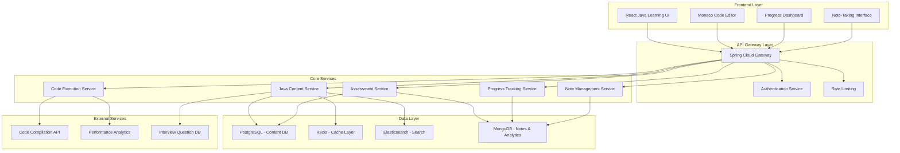

# Java Complete Ecosystem Design

## Overview

This design document outlines the technical architecture and implementation approach for the comprehensive Java learning ecosystem. The system follows enterprise-grade patterns including Domain-Driven Design (DDD), microservices architecture, and event-driven patterns to deliver a scalable, maintainable, and high-performance learning platform.

## Architecture

### System Architecture Overview



### Domain Model Design

#### Core Domain Entities

```java
// Java Learning Domain
@Entity
@Table(name = "java_learning_modules")
public class JavaLearningModule {
    @Id
    private UUID id;
    
    @Enumerated(EnumType.STRING)
    private JavaTopicCategory category; // FUNDAMENTALS, OOP, COLLECTIONS, CONCURRENCY, etc.
    
    private String title;
    private String description;
    private DifficultyLevel difficulty;
    private Integer estimatedHours;
    private Integer orderIndex;
    
    @OneToMany(mappedBy = "module", cascade = CascadeType.ALL)
    private List<JavaTopic> topics;
    
    @OneToMany(mappedBy = "module")
    private List<JavaInterviewQuestion> interviewQuestions;
    
    // Domain methods
    public boolean isPrerequisiteMet(UserProgress userProgress) { /* business logic */ }
    public List<JavaTopic> getTopicsForLevel(ExperienceLevel level) { /* domain logic */ }
    public InterviewReadinessScore calculateReadinessScore(UserSkills skills) { /* assessment logic */ }
}

@Entity
@Table(name = "java_topics")
public class JavaTopic {
    @Id
    private UUID id;
    
    @ManyToOne(fetch = FetchType.LAZY)
    @JoinColumn(name = "module_id")
    private JavaLearningModule module;
    
    private String title;
    private String content; // Rich content with examples and explanations
    private String realWorldAnalogy; // Beginner-friendly explanations
    private Integer orderIndex;
    
    @OneToMany(mappedBy = "topic", cascade = CascadeType.ALL)
    private List<CodeExample> codeExamples;
    
    @OneToMany(mappedBy = "topic")
    private List<JavaInterviewQuestion> embeddedQuestions;
    
    @OneToMany(mappedBy = "topic")
    private List<UserNote> userNotes;
    
    // Domain methods
    public boolean hasPrerequisites() { /* business logic */ }
    public List<CodeExample> getInteractiveExamples() { /* domain logic */ }
    public void addEmbeddedQuestion(JavaInterviewQuestion question) { /* business logic */ }
}

@Entity
@Table(name = "java_interview_questions")
public class JavaInterviewQuestion {
    @Id
    private UUID id;
    
    @ManyToOne(fetch = FetchType.LAZY)
    @JoinColumn(name = "topic_id")
    private JavaTopic topic;
    
    @ManyToOne(fetch = FetchType.LAZY)
    @JoinColumn(name = "module_id")
    private JavaLearningModule module;
    
    private String title;
    private String description;
    private String problemStatement;
    
    @Enumerated(EnumType.STRING)
    private DifficultyLevel difficulty;
    
    @ElementCollection
    @Enumerated(EnumType.STRING)
    private Set<Company> askedByCompanies; // AMAZON, GOOGLE, META, MICROSOFT, APPLE
    
    @OneToMany(mappedBy = "question", cascade = CascadeType.ALL)
    private List<SolutionApproach> solutions; // Multiple approaches from brute force to optimal
    
    @Embedded
    private ComplexityAnalysis complexityAnalysis;
    
    private String commonPitfalls;
    private String followUpQuestions;
    private Integer frequencyScore; // How often this question appears in interviews
    
    // Domain methods
    public SolutionApproach getOptimalSolution() { /* domain logic */ }
    public boolean isRelevantForCompany(Company company) { /* business logic */ }
    public List<String> getRelatedTopics() { /* domain logic */ }
}

@Entity
@Table(name = "solution_approaches")
public class SolutionApproach {
    @Id
    private UUID id;
    
    @ManyToOne(fetch = FetchType.LAZY)
    @JoinColumn(name = "question_id")
    private JavaInterviewQuestion question;
    
    @Enumerated(EnumType.STRING)
    private SolutionType type; // BRUTE_FORCE, OPTIMIZED, OPTIMAL
    
    private String approach;
    private String javaCode;
    private String explanation;
    private String timeComplexity;
    private String spaceComplexity;
    private Integer optimizationLevel; // 1-5 scale
    
    // Domain methods
    public boolean isBetterThan(SolutionApproach other) { /* comparison logic */ }
    public String getComplexityExplanation() { /* educational content */ }
}

@Entity
@Table(name = "code_examples")
public class CodeExample {
    @Id
    private UUID id;
    
    @ManyToOne(fetch = FetchType.LAZY)
    @JoinColumn(name = "topic_id")
    private JavaTopic topic;
    
    private String title;
    private String description;
    private String javaCode;
    private String expectedOutput;
    private String explanation;
    private boolean isInteractive;
    private boolean isRunnable;
    
    @ElementCollection
    private List<String> keyLearningPoints;
    
    // Domain methods
    public boolean canExecute() { /* validation logic */ }
    public ExecutionResult execute() { /* code execution logic */ }
}
```

#### Progress Tracking Domain

```java
@Entity
@Table(name = "java_user_progress")
public class JavaUserProgress {
    @Id
    private UUID id;
    
    @ManyToOne(fetch = FetchType.LAZY)
    @JoinColumn(name = "user_id")
    private User user;
    
    @ManyToOne(fetch = FetchType.LAZY)
    @JoinColumn(name = "topic_id")
    private JavaTopic topic;
    
    @Enumerated(EnumType.STRING)
    private ProgressStatus status; // NOT_STARTED, IN_PROGRESS, COMPLETED, MASTERED
    
    private LocalDateTime startedAt;
    private LocalDateTime completedAt;
    private Integer timeSpentMinutes;
    private Double comprehensionScore; // 0.0 to 1.0
    private Integer practiceQuestionsCompleted;
    private Integer practiceQuestionsCorrect;
    
    @Embedded
    private SpacedRepetitionData spacedRepetition;
    
    // Domain methods
    public boolean isReadyForAdvancement() { /* mastery logic */ }
    public LocalDateTime getNextReviewDate() { /* spaced repetition logic */ }
    public Double calculateMasteryLevel() { /* assessment logic */ }
}

@Embeddable
public class SpacedRepetitionData {
    private Integer repetitionCount;
    private Double easeFactor;
    private Integer intervalDays;
    private LocalDateTime nextReviewDate;
    private LocalDateTime lastReviewDate;
    
    // Spaced repetition algorithm implementation
    public void updateAfterReview(ReviewQuality quality) { /* SM-2 algorithm */ }
}
```

### Service Layer Architecture

#### Java Content Service

```java
@Service
@Transactional
public class JavaContentService {
    
    private final JavaModuleRepository moduleRepository;
    private final JavaTopicRepository topicRepository;
    private final JavaQuestionRepository questionRepository;
    private final CacheManager cacheManager;
    private final SearchService searchService;
    
    @Cacheable(value = "java-modules", key = "#category")
    public List<JavaLearningModule> getModulesByCategory(JavaTopicCategory category) {
        return moduleRepository.findByCategoryOrderByOrderIndex(category);
    }
    
    @Cacheable(value = "java-topics", key = "#moduleId + '_' + #userLevel")
    public List<JavaTopic> getTopicsForModule(UUID moduleId, ExperienceLevel userLevel) {
        JavaLearningModule module = moduleRepository.findById(moduleId)
            .orElseThrow(() -> new ModuleNotFoundException(moduleId));
        
        return module.getTopicsForLevel(userLevel);
    }
    
    public JavaTopic getTopicWithEmbeddedQuestions(UUID topicId, Company targetCompany) {
        JavaTopic topic = topicRepository.findByIdWithQuestions(topicId)
            .orElseThrow(() -> new TopicNotFoundException(topicId));
        
        // Filter questions by target company if specified
        if (targetCompany != null) {
            List<JavaInterviewQuestion> filteredQuestions = topic.getEmbeddedQuestions()
                .stream()
                .filter(q -> q.isRelevantForCompany(targetCompany))
                .collect(Collectors.toList());
            topic.setEmbeddedQuestions(filteredQuestions);
        }
        
        return topic;
    }
    
    public List<JavaInterviewQuestion> getInterviewQuestionsByDifficulty(
            DifficultyLevel difficulty, Company company, int limit) {
        
        Specification<JavaInterviewQuestion> spec = Specification
            .where(JavaQuestionSpecs.hasDifficulty(difficulty))
            .and(JavaQuestionSpecs.isAskedByCompany(company));
            
        Pageable pageable = PageRequest.of(0, limit, 
            Sort.by("frequencyScore").descending());
            
        return questionRepository.findAll(spec, pageable).getContent();
    }
    
    @EventListener
    public void handleTopicCompleted(TopicCompletedEvent event) {
        // Update search index
        searchService.indexTopic(event.getTopicId());
        
        // Trigger next topic recommendations
        recommendationService.updateRecommendations(event.getUserId());
        
        // Update spaced repetition schedule
        spacedRepetitionService.scheduleReview(event.getUserId(), event.getTopicId());
    }
}
```

#### Code Execution Service

```java
@Service
public class JavaCodeExecutionService {
    
    private final CodeCompilerClient compilerClient;
    private final SecurityValidator securityValidator;
    private final PerformanceAnalyzer performanceAnalyzer;
    private final ExecutionResultRepository resultRepository;
    
    public CodeExecutionResult executeJavaCode(CodeExecutionRequest request) {
        // Security validation
        SecurityValidationResult securityResult = securityValidator.validate(request.getCode());
        if (!securityResult.isValid()) {
            throw new SecurityViolationException(securityResult.getViolations());
        }
        
        // Compile and execute
        CompilationResult compilation = compilerClient.compile(request.getCode());
        if (!compilation.isSuccessful()) {
            return CodeExecutionResult.compilationFailed(compilation.getErrors());
        }
        
        ExecutionResult execution = compilerClient.execute(
            compilation.getCompiledCode(), 
            request.getInput(),
            ExecutionLimits.builder()
                .timeoutSeconds(30)
                .memoryLimitMB(256)
                .build()
        );
        
        // Performance analysis
        PerformanceMetrics metrics = performanceAnalyzer.analyze(execution);
        
        CodeExecutionResult result = CodeExecutionResult.builder()
            .output(execution.getOutput())
            .executionTime(execution.getExecutionTimeMs())
            .memoryUsage(execution.getMemoryUsageMB())
            .performanceMetrics(metrics)
            .suggestions(generateOptimizationSuggestions(metrics))
            .build();
        
        // Store result for analytics
        resultRepository.save(ExecutionRecord.from(request, result));
        
        return result;
    }
    
    public List<OptimizationSuggestion> generateOptimizationSuggestions(PerformanceMetrics metrics) {
        List<OptimizationSuggestion> suggestions = new ArrayList<>();
        
        if (metrics.getTimeComplexity().isWorseThan(TimeComplexity.O_N_LOG_N)) {
            suggestions.add(OptimizationSuggestion.builder()
                .type(SuggestionType.ALGORITHM_OPTIMIZATION)
                .description("Consider using a more efficient algorithm to reduce time complexity")
                .example("Use HashMap for O(1) lookups instead of nested loops")
                .build());
        }
        
        if (metrics.getMemoryUsage() > 100) {
            suggestions.add(OptimizationSuggestion.builder()
                .type(SuggestionType.MEMORY_OPTIMIZATION)
                .description("High memory usage detected. Consider optimizing data structures")
                .example("Use primitive collections or streaming for large datasets")
                .build());
        }
        
        return suggestions;
    }
}
```

### Data Architecture

#### Database Schema Design

```sql
-- Java Learning Modules
CREATE TABLE java_learning_modules (
    id UUID PRIMARY KEY DEFAULT gen_random_uuid(),
    category VARCHAR(50) NOT NULL,
    title VARCHAR(255) NOT NULL,
    description TEXT,
    difficulty VARCHAR(20) NOT NULL,
    estimated_hours INTEGER,
    order_index INTEGER NOT NULL,
    created_at TIMESTAMP DEFAULT CURRENT_TIMESTAMP,
    updated_at TIMESTAMP DEFAULT CURRENT_TIMESTAMP,
    
    CONSTRAINT uk_java_modules_category_order UNIQUE (category, order_index)
);

-- Java Topics
CREATE TABLE java_topics (
    id UUID PRIMARY KEY DEFAULT gen_random_uuid(),
    module_id UUID NOT NULL REFERENCES java_learning_modules(id),
    title VARCHAR(255) NOT NULL,
    content TEXT NOT NULL,
    real_world_analogy TEXT,
    order_index INTEGER NOT NULL,
    created_at TIMESTAMP DEFAULT CURRENT_TIMESTAMP,
    updated_at TIMESTAMP DEFAULT CURRENT_TIMESTAMP,
    
    CONSTRAINT uk_java_topics_module_order UNIQUE (module_id, order_index)
);

-- Java Interview Questions
CREATE TABLE java_interview_questions (
    id UUID PRIMARY KEY DEFAULT gen_random_uuid(),
    topic_id UUID REFERENCES java_topics(id),
    module_id UUID REFERENCES java_learning_modules(id),
    title VARCHAR(255) NOT NULL,
    description TEXT,
    problem_statement TEXT NOT NULL,
    difficulty VARCHAR(20) NOT NULL,
    common_pitfalls TEXT,
    follow_up_questions TEXT,
    frequency_score INTEGER DEFAULT 0,
    time_complexity VARCHAR(50),
    space_complexity VARCHAR(50),
    created_at TIMESTAMP DEFAULT CURRENT_TIMESTAMP,
    updated_at TIMESTAMP DEFAULT CURRENT_TIMESTAMP
);

-- Company associations for questions
CREATE TABLE question_companies (
    question_id UUID REFERENCES java_interview_questions(id),
    company VARCHAR(50) NOT NULL,
    
    PRIMARY KEY (question_id, company)
);

-- Solution approaches
CREATE TABLE solution_approaches (
    id UUID PRIMARY KEY DEFAULT gen_random_uuid(),
    question_id UUID NOT NULL REFERENCES java_interview_questions(id),
    solution_type VARCHAR(20) NOT NULL,
    approach TEXT NOT NULL,
    java_code TEXT NOT NULL,
    explanation TEXT,
    time_complexity VARCHAR(50),
    space_complexity VARCHAR(50),
    optimization_level INTEGER DEFAULT 1,
    created_at TIMESTAMP DEFAULT CURRENT_TIMESTAMP
);

-- Code examples
CREATE TABLE code_examples (
    id UUID PRIMARY KEY DEFAULT gen_random_uuid(),
    topic_id UUID NOT NULL REFERENCES java_topics(id),
    title VARCHAR(255) NOT NULL,
    description TEXT,
    java_code TEXT NOT NULL,
    expected_output TEXT,
    explanation TEXT,
    is_interactive BOOLEAN DEFAULT false,
    is_runnable BOOLEAN DEFAULT true,
    created_at TIMESTAMP DEFAULT CURRENT_TIMESTAMP
);

-- User progress tracking
CREATE TABLE java_user_progress (
    id UUID PRIMARY KEY DEFAULT gen_random_uuid(),
    user_id UUID NOT NULL,
    topic_id UUID NOT NULL REFERENCES java_topics(id),
    status VARCHAR(20) NOT NULL DEFAULT 'NOT_STARTED',
    started_at TIMESTAMP,
    completed_at TIMESTAMP,
    time_spent_minutes INTEGER DEFAULT 0,
    comprehension_score DECIMAL(3,2),
    practice_questions_completed INTEGER DEFAULT 0,
    practice_questions_correct INTEGER DEFAULT 0,
    
    -- Spaced repetition data
    repetition_count INTEGER DEFAULT 0,
    ease_factor DECIMAL(3,2) DEFAULT 2.5,
    interval_days INTEGER DEFAULT 1,
    next_review_date TIMESTAMP,
    last_review_date TIMESTAMP,
    
    created_at TIMESTAMP DEFAULT CURRENT_TIMESTAMP,
    updated_at TIMESTAMP DEFAULT CURRENT_TIMESTAMP,
    
    CONSTRAINT uk_java_progress_user_topic UNIQUE (user_id, topic_id)
);

-- Indexes for performance
CREATE INDEX idx_java_topics_module_order ON java_topics(module_id, order_index);
CREATE INDEX idx_java_questions_topic ON java_interview_questions(topic_id);
CREATE INDEX idx_java_questions_difficulty ON java_interview_questions(difficulty);
CREATE INDEX idx_java_questions_frequency ON java_interview_questions(frequency_score DESC);
CREATE INDEX idx_java_progress_user ON java_user_progress(user_id);
CREATE INDEX idx_java_progress_next_review ON java_user_progress(next_review_date) WHERE next_review_date IS NOT NULL;
```

#### Caching Strategy

```java
@Configuration
@EnableCaching
public class JavaLearningCacheConfig {
    
    @Bean
    public CacheManager javaCacheManager() {
        RedisCacheManager.Builder builder = RedisCacheManager
            .RedisCacheManagerBuilder
            .fromConnectionFactory(redisConnectionFactory())
            .cacheDefaults(defaultCacheConfiguration());
            
        // Configure specific cache settings
        Map<String, RedisCacheConfiguration> cacheConfigurations = Map.of(
            "java-modules", cacheConfiguration(Duration.ofHours(6)),
            "java-topics", cacheConfiguration(Duration.ofHours(2)),
            "java-questions", cacheConfiguration(Duration.ofMinutes(30)),
            "user-progress", cacheConfiguration(Duration.ofMinutes(15))
        );
        
        return builder.withInitialCacheConfigurations(cacheConfigurations).build();
    }
    
    private RedisCacheConfiguration cacheConfiguration(Duration ttl) {
        return RedisCacheConfiguration.defaultCacheConfig()
            .entryTtl(ttl)
            .serializeKeysWith(RedisSerializationContext.SerializationPair
                .fromSerializer(new StringRedisSerializer()))
            .serializeValuesWith(RedisSerializationContext.SerializationPair
                .fromSerializer(new GenericJackson2JsonRedisSerializer()));
    }
}
```

### API Design

#### RESTful Endpoints

```java
@RestController
@RequestMapping("/api/v1/java")
@Validated
public class JavaLearningController {
    
    private final JavaContentService contentService;
    private final JavaProgressService progressService;
    private final JavaAssessmentService assessmentService;
    
    @GetMapping("/modules")
    public ResponseEntity<List<JavaModuleDto>> getModules(
            @RequestParam(required = false) JavaTopicCategory category,
            @RequestParam(defaultValue = "BEGINNER") ExperienceLevel level) {
        
        List<JavaLearningModule> modules = contentService.getModules(category, level);
        List<JavaModuleDto> dtos = modules.stream()
            .map(JavaModuleMapper::toDto)
            .collect(Collectors.toList());
            
        return ResponseEntity.ok(dtos);
    }
    
    @GetMapping("/modules/{moduleId}/topics")
    public ResponseEntity<List<JavaTopicDto>> getTopics(
            @PathVariable UUID moduleId,
            @RequestParam(defaultValue = "BEGINNER") ExperienceLevel level,
            @RequestParam(required = false) Company targetCompany) {
        
        List<JavaTopic> topics = contentService.getTopicsForModule(moduleId, level);
        List<JavaTopicDto> dtos = topics.stream()
            .map(topic -> JavaTopicMapper.toDto(topic, targetCompany))
            .collect(Collectors.toList());
            
        return ResponseEntity.ok(dtos);
    }
    
    @GetMapping("/topics/{topicId}")
    public ResponseEntity<JavaTopicDetailDto> getTopicDetail(
            @PathVariable UUID topicId,
            @RequestParam(required = false) Company targetCompany,
            @AuthenticationPrincipal UserPrincipal user) {
        
        JavaTopic topic = contentService.getTopicWithEmbeddedQuestions(topicId, targetCompany);
        JavaUserProgress progress = progressService.getUserProgress(user.getId(), topicId);
        
        JavaTopicDetailDto dto = JavaTopicMapper.toDetailDto(topic, progress);
        return ResponseEntity.ok(dto);
    }
    
    @GetMapping("/interview-questions")
    public ResponseEntity<Page<JavaInterviewQuestionDto>> getInterviewQuestions(
            @RequestParam(required = false) DifficultyLevel difficulty,
            @RequestParam(required = false) Company company,
            @RequestParam(required = false) UUID topicId,
            @PageableDefault(size = 20, sort = "frequencyScore", direction = Sort.Direction.DESC) Pageable pageable) {
        
        Page<JavaInterviewQuestion> questions = contentService.getInterviewQuestions(
            difficulty, company, topicId, pageable);
        Page<JavaInterviewQuestionDto> dtos = questions.map(JavaQuestionMapper::toDto);
        
        return ResponseEntity.ok(dtos);
    }
    
    @PostMapping("/code/execute")
    public ResponseEntity<CodeExecutionResultDto> executeCode(
            @Valid @RequestBody CodeExecutionRequestDto request,
            @AuthenticationPrincipal UserPrincipal user) {
        
        CodeExecutionResult result = codeExecutionService.executeJavaCode(
            CodeExecutionRequest.builder()
                .code(request.getCode())
                .input(request.getInput())
                .userId(user.getId())
                .topicId(request.getTopicId())
                .build()
        );
        
        return ResponseEntity.ok(CodeExecutionMapper.toDto(result));
    }
    
    @PostMapping("/topics/{topicId}/progress")
    public ResponseEntity<Void> updateProgress(
            @PathVariable UUID topicId,
            @Valid @RequestBody ProgressUpdateRequestDto request,
            @AuthenticationPrincipal UserPrincipal user) {
        
        progressService.updateProgress(
            user.getId(), 
            topicId, 
            request.getStatus(),
            request.getComprehensionScore()
        );
        
        return ResponseEntity.ok().build();
    }
    
    @GetMapping("/assessment/readiness")
    public ResponseEntity<InterviewReadinessDto> getInterviewReadiness(
            @RequestParam(required = false) Company targetCompany,
            @AuthenticationPrincipal UserPrincipal user) {
        
        InterviewReadinessScore score = assessmentService.calculateReadiness(
            user.getId(), targetCompany);
        InterviewReadinessDto dto = AssessmentMapper.toDto(score);
        
        return ResponseEntity.ok(dto);
    }
}
```

## Implementation Strategy

### Phase 1: Core Infrastructure (Weeks 1-2)
1. **Database Schema Setup**
   - Create all Java learning tables with proper indexes
   - Set up connection pooling and transaction management
   - Implement database migration scripts with Flyway

2. **Domain Model Implementation**
   - Create all JPA entities with proper relationships
   - Implement domain services with business logic
   - Set up repository layer with custom queries

3. **Basic API Framework**
   - Set up Spring Boot application with security
   - Implement basic CRUD operations for modules and topics
   - Add input validation and error handling

### Phase 2: Content Management (Weeks 3-4)
1. **Java Content Structure**
   - Implement hierarchical content organization
   - Add support for rich text content with code examples
   - Create content versioning and approval workflow

2. **Interview Question Integration**
   - Build question embedding system within topics
   - Implement multiple solution approaches storage
   - Add company attribution and frequency tracking

3. **Search and Discovery**
   - Integrate Elasticsearch for content search
   - Implement faceted search with filters
   - Add recommendation engine for related content

### Phase 3: Interactive Features (Weeks 5-6)
1. **Code Editor Integration**
   - Integrate Monaco Editor with Java syntax highlighting
   - Implement real-time code compilation and execution
   - Add code sharing and collaboration features

2. **Progress Tracking**
   - Implement comprehensive progress analytics
   - Add spaced repetition algorithm for review scheduling
   - Create skill assessment and readiness scoring

3. **Note-Taking System**
   - Build embedded note-taking within topics
   - Implement central note management with organization
   - Add note sharing and export capabilities

### Phase 4: Advanced Features (Weeks 7-8)
1. **Assessment Engine**
   - Build adaptive testing system with difficulty adjustment
   - Implement mock interview simulations
   - Add performance analytics and improvement recommendations

2. **Enterprise Integration**
   - Add Spring Framework and Hibernate advanced topics
   - Implement enterprise patterns and best practices
   - Create certification preparation modules

3. **Performance Optimization**
   - Implement comprehensive caching strategy
   - Add database query optimization
   - Set up monitoring and alerting

## Error Handling

### Exception Hierarchy

```java
@ResponseStatus(HttpStatus.NOT_FOUND)
public class JavaContentNotFoundException extends RuntimeException {
    public JavaContentNotFoundException(String message) {
        super(message);
    }
}

@ResponseStatus(HttpStatus.BAD_REQUEST)
public class InvalidProgressUpdateException extends RuntimeException {
    public InvalidProgressUpdateException(String message) {
        super(message);
    }
}

@ResponseStatus(HttpStatus.FORBIDDEN)
public class CodeExecutionSecurityException extends RuntimeException {
    private final List<SecurityViolation> violations;
    
    public CodeExecutionSecurityException(List<SecurityViolation> violations) {
        super("Code execution blocked due to security violations");
        this.violations = violations;
    }
}
```

### Global Exception Handler

```java
@RestControllerAdvice
public class JavaLearningExceptionHandler {
    
    @ExceptionHandler(JavaContentNotFoundException.class)
    public ResponseEntity<ErrorResponse> handleContentNotFound(JavaContentNotFoundException ex) {
        ErrorResponse error = ErrorResponse.builder()
            .code("CONTENT_NOT_FOUND")
            .message(ex.getMessage())
            .timestamp(Instant.now())
            .build();
        return ResponseEntity.status(HttpStatus.NOT_FOUND).body(error);
    }
    
    @ExceptionHandler(CodeExecutionSecurityException.class)
    public ResponseEntity<ErrorResponse> handleSecurityViolation(CodeExecutionSecurityException ex) {
        ErrorResponse error = ErrorResponse.builder()
            .code("SECURITY_VIOLATION")
            .message(ex.getMessage())
            .details(ex.getViolations().stream()
                .map(SecurityViolation::getDescription)
                .collect(Collectors.toList()))
            .timestamp(Instant.now())
            .build();
        return ResponseEntity.status(HttpStatus.FORBIDDEN).body(error);
    }
}
```

## Testing Strategy

### Unit Testing

```java
@ExtendWith(MockitoExtension.class)
class JavaContentServiceTest {
    
    @Mock
    private JavaModuleRepository moduleRepository;
    
    @Mock
    private CacheManager cacheManager;
    
    @InjectMocks
    private JavaContentService contentService;
    
    @Test
    void shouldReturnModulesForCategory() {
        // Given
        JavaTopicCategory category = JavaTopicCategory.FUNDAMENTALS;
        List<JavaLearningModule> expectedModules = createTestModules();
        when(moduleRepository.findByCategoryOrderByOrderIndex(category))
            .thenReturn(expectedModules);
        
        // When
        List<JavaLearningModule> result = contentService.getModulesByCategory(category);
        
        // Then
        assertThat(result).hasSize(3);
        assertThat(result.get(0).getTitle()).isEqualTo("Java Basics");
        verify(moduleRepository).findByCategoryOrderByOrderIndex(category);
    }
    
    @Test
    void shouldFilterQuestionsByCompany() {
        // Given
        UUID topicId = UUID.randomUUID();
        Company targetCompany = Company.AMAZON;
        JavaTopic topic = createTopicWithQuestions();
        when(topicRepository.findByIdWithQuestions(topicId))
            .thenReturn(Optional.of(topic));
        
        // When
        JavaTopic result = contentService.getTopicWithEmbeddedQuestions(topicId, targetCompany);
        
        // Then
        assertThat(result.getEmbeddedQuestions())
            .allMatch(q -> q.getAskedByCompanies().contains(targetCompany));
    }
}
```

### Integration Testing

```java
@SpringBootTest(webEnvironment = SpringBootTest.WebEnvironment.RANDOM_PORT)
@TestPropertySource(properties = {
    "spring.datasource.url=jdbc:h2:mem:testdb",
    "spring.jpa.hibernate.ddl-auto=create-drop"
})
class JavaLearningControllerIntegrationTest {
    
    @Autowired
    private TestRestTemplate restTemplate;
    
    @Autowired
    private JavaModuleRepository moduleRepository;
    
    @Test
    void shouldReturnJavaModules() {
        // Given
        createTestData();
        
        // When
        ResponseEntity<JavaModuleDto[]> response = restTemplate.getForEntity(
            "/api/v1/java/modules?category=FUNDAMENTALS", 
            JavaModuleDto[].class
        );
        
        // Then
        assertThat(response.getStatusCode()).isEqualTo(HttpStatus.OK);
        assertThat(response.getBody()).hasSize(2);
        assertThat(response.getBody()[0].getTitle()).isEqualTo("Java Basics");
    }
    
    @Test
    void shouldExecuteJavaCode() {
        // Given
        CodeExecutionRequestDto request = CodeExecutionRequestDto.builder()
            .code("public class Test { public static void main(String[] args) { System.out.println(\"Hello World\"); } }")
            .input("")
            .build();
        
        // When
        ResponseEntity<CodeExecutionResultDto> response = restTemplate.postForEntity(
            "/api/v1/java/code/execute", 
            request, 
            CodeExecutionResultDto.class
        );
        
        // Then
        assertThat(response.getStatusCode()).isEqualTo(HttpStatus.OK);
        assertThat(response.getBody().getOutput()).contains("Hello World");
        assertThat(response.getBody().getExecutionTime()).isPositive();
    }
}
```

## Success Metrics

### Performance Metrics
- **API Response Time**: < 200ms for 95th percentile
- **Code Execution Time**: < 5 seconds for compilation and execution
- **Database Query Performance**: < 100ms for complex queries
- **Cache Hit Ratio**: > 80% for frequently accessed content

### Learning Effectiveness Metrics
- **Topic Completion Rate**: > 85% for enrolled users
- **Knowledge Retention**: > 90% after 30 days (measured via spaced repetition)
- **Interview Question Success Rate**: > 75% for users completing full curriculum
- **User Engagement**: > 60 minutes average session time

### System Reliability Metrics
- **Uptime**: > 99.9% availability
- **Error Rate**: < 0.1% for all API endpoints
- **Data Consistency**: 100% accuracy in progress tracking
- **Security**: Zero successful code injection attempts