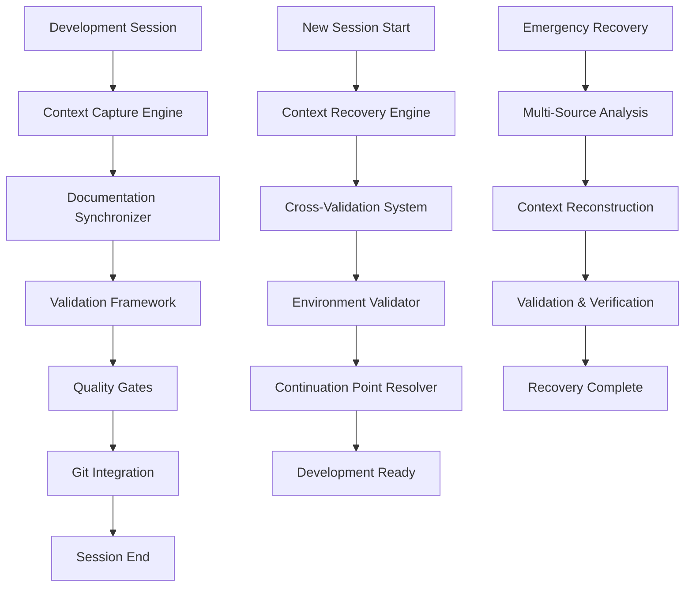
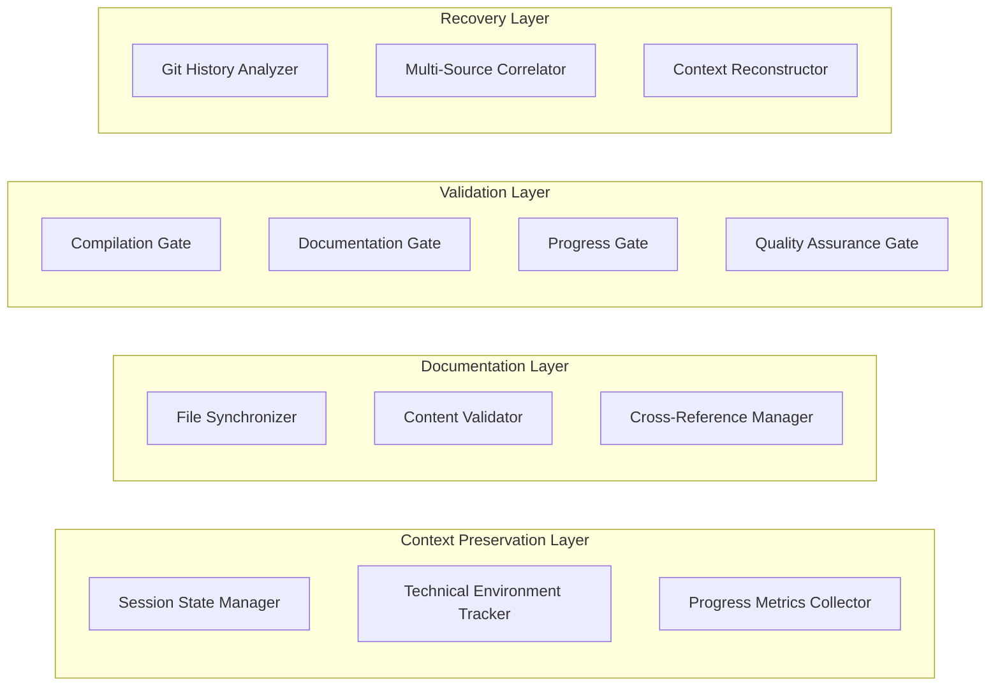
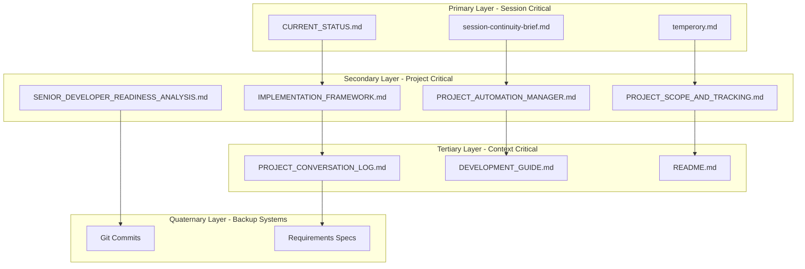

# Session Continuity & Context Preservation Design

## Overview

The Session Continuity & Context Preservation System is a comprehensive automation framework that ensures bulletproof zero context loss between development sessions while providing streamlined implementation protocols. The system implements multiple layers of redundancy, automated validation, and intelligent recovery mechanisms to guarantee seamless development continuation.

## Architecture

### High-Level Architecture



### Component Architecture



## Components and Interfaces

### 1. Context Capture Engine

**Purpose**: Captures complete project state at session end with multiple redundancy layers.

**Key Interfaces**:
```typescript
interface ContextCaptureEngine {
  captureSessionState(): SessionState;
  validateCapture(): ValidationResult;
  storeRedundantCopies(state: SessionState): void;
  generateContinuationPoint(): ContinuationPoint;
}

interface SessionState {
  timestamp: string;
  lastCompletedPhase: string;
  progressPercentage: number;
  compilationStatus: CompilationStatus;
  technicalEnvironment: TechnicalEnvironment;
  filesModified: FileModification[];
  nextActions: NextAction[];
  knownIssues: Issue[];
}
```

### 2. Documentation Synchronizer

**Purpose**: Ensures all 9 documentation files are updated consistently with accurate information.

**Key Interfaces**:
```typescript
interface DocumentationSynchronizer {
  updateAllFiles(sessionState: SessionState): UpdateResult[];
  validateConsistency(): ConsistencyReport;
  resolveConflicts(): ConflictResolution[];
  generateUpdateSummary(): UpdateSummary;
}

interface UpdateResult {
  fileName: string;
  success: boolean;
  linesModified: number;
  contentSections: string[];
  errors: string[];
}
```

### 3. Validation Framework

**Purpose**: Implements automated quality gates and validation checkpoints.

**Key Interfaces**:
```typescript
interface ValidationFramework {
  runCompilationGate(): GateResult;
  runDocumentationGate(): GateResult;
  runProgressGate(): GateResult;
  runQualityGate(): GateResult;
  generateValidationReport(): ValidationReport;
}

interface GateResult {
  gateName: string;
  passed: boolean;
  score: number;
  issues: Issue[];
  recommendations: string[];
}
```

### 4. Context Recovery Engine

**Purpose**: Intelligently reconstructs missing context from available sources.

**Key Interfaces**:
```typescript
interface ContextRecoveryEngine {
  analyzeAvailableSources(): SourceAnalysis[];
  reconstructContext(): ReconstructedContext;
  validateReconstruction(): ValidationResult;
  generateRecoveryReport(): RecoveryReport;
}

interface ReconstructedContext {
  confidence: number;
  reconstructedElements: ContextElement[];
  missingElements: string[];
  recommendedActions: string[];
}
```

## Enhanced Multi-Layer Redundancy Architecture

### Redundancy Layer Structure



### Information Distribution Matrix

| Information Type | Primary Storage | Secondary Storage | Tertiary Storage | Quaternary Storage |
|------------------|----------------|-------------------|------------------|-------------------|
| Current Session State | CURRENT_STATUS.md | session-continuity-brief.md | temperory.md | Git commits |
| Project Methodology | IMPLEMENTATION_FRAMEWORK.md | PROJECT_AUTOMATION_MANAGER.md | DEVELOPMENT_GUIDE.md | Requirements specs |
| Progress Tracking | PROJECT_SCOPE_AND_TRACKING.md | CURRENT_STATUS.md | PROJECT_CONVERSATION_LOG.md | Git history |
| Technical Implementation | DEVELOPMENT_GUIDE.md | temperory.md | PROJECT_CONVERSATION_LOG.md | Code comments |
| FAANG Readiness | SENIOR_DEVELOPER_READINESS_ANALYSIS.md | PROJECT_SCOPE_AND_TRACKING.md | README.md | Git commits |
| Automation Status | PROJECT_AUTOMATION_MANAGER.md | CURRENT_STATUS.md | IMPLEMENTATION_FRAMEWORK.md | Git commits |
| Conversation History | PROJECT_CONVERSATION_LOG.md | temperory.md | CURRENT_STATUS.md | Git commits |
| Project Overview | README.md | PROJECT_SCOPE_AND_TRACKING.md | CURRENT_STATUS.md | Requirements specs |

### Cross-Validation Protocol

```typescript
interface RedundancyValidator {
  validatePrimaryLayer(): LayerValidationResult;
  validateSecondaryLayer(): LayerValidationResult;
  validateTertiaryLayer(): LayerValidationResult;
  validateQuaternaryLayer(): LayerValidationResult;
  crossValidateAllLayers(): CrossValidationResult;
  resolveInconsistencies(): ResolutionResult[];
}

interface LayerValidationResult {
  layerName: string;
  filesValidated: string[];
  consistencyScore: number;
  missingInformation: string[];
  inconsistencies: Inconsistency[];
}
```

## Data Models

### Session State Model

```typescript
interface SessionState {
  // Basic session information
  sessionId: string;
  timestamp: string;
  duration: number;
  
  // Progress tracking
  lastCompletedPhase: string;
  progressPercentage: number;
  completedTasks: Task[];
  inProgressTasks: Task[];
  
  // Technical environment
  javaVersion: string;
  mavenStatus: string;
  compilationStatus: CompilationStatus;
  databaseStatus: DatabaseStatus;
  knownIssues: Issue[];
  
  // File modifications
  filesModified: FileModification[];
  linesChanged: number;
  
  // Continuation planning
  nextActions: NextAction[];
  dependencies: string[];
  estimatedTime: number;
  successCriteria: string[];
}
```

### Documentation State Model

```typescript
interface DocumentationState {
  files: DocumentationFile[];
  lastUpdateTimestamp: string;
  consistencyScore: number;
  crossReferences: CrossReference[];
  validationResults: ValidationResult[];
}

interface DocumentationFile {
  fileName: string;
  lastModified: string;
  lineCount: number;
  sections: Section[];
  updateStatus: UpdateStatus;
}
```

## Error Handling

### Error Categories

1. **Context Capture Errors**
   - Incomplete session state capture
   - File access permissions issues
   - Validation failures

2. **Documentation Synchronization Errors**
   - File update failures
   - Consistency conflicts
   - Cross-reference validation errors

3. **Validation Framework Errors**
   - Quality gate failures
   - Compilation errors
   - Progress tracking inconsistencies

4. **Recovery Engine Errors**
   - Insufficient source information
   - Context reconstruction failures
   - Validation of recovered context

### Error Handling Strategy

```typescript
interface ErrorHandler {
  handleContextCaptureError(error: ContextCaptureError): RecoveryAction;
  handleDocumentationError(error: DocumentationError): RecoveryAction;
  handleValidationError(error: ValidationError): RecoveryAction;
  handleRecoveryError(error: RecoveryError): FallbackAction;
}

enum RecoveryAction {
  RETRY_WITH_FALLBACK,
  MANUAL_INTERVENTION_REQUIRED,
  EMERGENCY_RECOVERY_PROTOCOL,
  GRACEFUL_DEGRADATION
}
```

## Testing Strategy

### Unit Testing

1. **Context Capture Engine Tests**
   - Session state capture completeness
   - Redundancy storage validation
   - Continuation point generation accuracy

2. **Documentation Synchronizer Tests**
   - File update success rates
   - Consistency validation accuracy
   - Conflict resolution effectiveness

3. **Validation Framework Tests**
   - Quality gate accuracy
   - Error detection sensitivity
   - Performance benchmarks

4. **Recovery Engine Tests**
   - Context reconstruction accuracy
   - Multi-source correlation effectiveness
   - Recovery confidence scoring

### Integration Testing

1. **End-to-End Session Continuity**
   - Complete session capture and recovery cycle
   - Cross-component data flow validation
   - Error propagation and handling

2. **Documentation Consistency**
   - Multi-file synchronization accuracy
   - Cross-reference validation
   - Update ordering compliance

3. **Quality Gate Integration**
   - Gate sequence execution
   - Failure cascade handling
   - Recovery protocol activation

### Performance Testing

1. **Capture Performance**
   - Session state capture time < 5 seconds
   - Documentation update time < 10 seconds
   - Validation execution time < 15 seconds

2. **Recovery Performance**
   - Context recovery time < 30 seconds
   - Multi-source analysis time < 20 seconds
   - Validation completion time < 10 seconds

### Reliability Testing

1. **Context Loss Simulation**
   - Partial file corruption scenarios
   - Missing documentation files
   - Git history corruption

2. **Recovery Accuracy Testing**
   - Context reconstruction accuracy > 95%
   - Missing information identification > 99%
   - False positive rate < 1%

## Implementation Phases

### Phase 1: Core Context Capture (Week 1)
- Implement Session State Manager
- Create basic Documentation Synchronizer
- Develop Compilation Quality Gate
- Basic Git integration

### Phase 2: Advanced Validation (Week 2)
- Implement all Quality Gates
- Create Cross-Validation System
- Develop Progress Tracking
- Enhanced error handling

### Phase 3: Recovery Engine (Week 3)
- Implement Context Recovery Engine
- Create Multi-Source Analysis
- Develop Context Reconstruction
- Recovery validation system

### Phase 4: Integration & Testing (Week 4)
- End-to-end integration testing
- Performance optimization
- Reliability testing
- Documentation completion

## Success Metrics

### Context Preservation Metrics
- **Zero Context Loss Rate**: 100% (no sessions with missing critical information)
- **Recovery Success Rate**: 95%+ (successful context reconstruction from available sources)
- **Documentation Consistency**: 100% (all files synchronized and consistent)

### Performance Metrics
- **Session Capture Time**: < 5 seconds
- **Documentation Update Time**: < 10 seconds
- **Context Recovery Time**: < 30 seconds
- **Validation Execution Time**: < 15 seconds

### Quality Metrics
- **Compilation Success Rate**: 100% (no progression with compilation errors)
- **Documentation Completeness**: 100% (all required files updated)
- **Progress Tracking Accuracy**: 100% (accurate metrics across all files)

### User Experience Metrics
- **Session Startup Time**: < 60 seconds (from context loading to development ready)
- **Manual Intervention Rate**: < 5% (sessions requiring manual context reconstruction)
- **Developer Confidence Score**: 9/10+ (confidence in context preservation system)