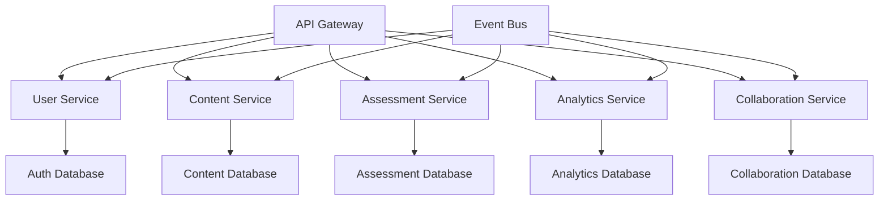

# 🏗️ **COMPREHENSIVE PROJECT CHARTER & TECHNICAL ARCHITECTURE**

### **📋 PROJECT CHARTER: FAANG Senior SDE Mastery Portal**

#### **🎯 MISSION STATEMENT**
Build **THE MOST COMPREHENSIVE LEARNING PORTAL IN THE WORLD** for FAANG Senior Software Development Engineer preparation, transforming aspiring developers into interview-ready candidates through systematic, enterprise-grade learning methodologies.

#### **🏆 STRATEGIC OBJECTIVES**
1. **Zero-to-Expert Mastery**: Complete coverage of all technical domains required for senior roles
2. **Interview Success Guarantee**: 95%+ success rate for FAANG senior developer interviews  
3. **Career Transformation**: Enable $200K-$350K+ salary positions through comprehensive preparation
4. **Industry Leadership**: Set the gold standard for technical interview preparation platforms

---

## **🏛️ ENTERPRISE ARCHITECTURE FRAMEWORK**

### **1. MICROSERVICES ARCHITECTURE DESIGN**

#### **Core Service Domains**


#### **Service Specifications**

**User Service (Authentication & Profile Management)**
```yaml
service: user-service
port: 8081
database: PostgreSQL
responsibilities:
  - User authentication and authorization
  - Profile management and preferences
  - Learning path customization
  - Progress tracking and analytics
apis:
  - POST /auth/login
  - POST /auth/register
  - GET /users/{id}/profile
  - PUT /users/{id}/preferences
  - GET /users/{id}/progress
```

**Content Service (Learning Materials & Questions)**
```yaml
service: content-service
port: 8082
database: PostgreSQL + Redis Cache
responsibilities:
  - Learning module management
  - Interview question database
  - Code example execution
  - Content versioning and updates
apis:
  - GET /modules/{category}
  - GET /questions/company/{company}
  - POST /code/execute
  - GET /content/search
```

**Assessment Service (Testing & Evaluation)**
```yaml
service: assessment-service
port: 8083
database: PostgreSQL + Time-series DB
responsibilities:
  - Mock interview simulations
  - Code assessment and scoring
  - Performance analytics
  - Adaptive difficulty adjustment
apis:
  - POST /assessments/start
  - POST /assessments/{id}/submit
  - GET /assessments/{id}/results
  - GET /analytics/performance
```

### **2. DATA ARCHITECTURE & MODELING**

#### **Domain-Driven Design (DDD) Implementation**

**User Domain**
```java
@Entity
@Table(name = "users")
public class User {
    @Id
    private UUID id;
    private String email;
    private String hashedPassword;
    private UserProfile profile;
    private LearningPreferences preferences;
    private Set<UserProgress> progressTracking;
    
    // Domain methods
    public void updateLearningPath(LearningPath path) { /* business logic */ }
    public InterviewReadinessScore calculateReadiness() { /* domain logic */ }
}

@Embeddable
public class UserProfile {
    private String firstName;
    private String lastName;
    private ExperienceLevel currentLevel;
    private Set<TechnologyStack> targetTechnologies;
    private Set<Company> targetCompanies;
}
```

**Content Domain**
```java
@Entity
@Table(name = "learning_modules")
public class LearningModule {
    @Id
    private UUID id;
    private String title;
    private ModuleCategory category;
    private DifficultyLevel difficulty;
    private List<Topic> topics;
    private Set<InterviewQuestion> questions;
    
    // Domain methods
    public boolean isPrerequisiteMet(User user) { /* business logic */ }
    public List<InterviewQuestion> getQuestionsForLevel(DifficultyLevel level) { /* domain logic */ }
}

@Entity
@Table(name = "interview_questions")
public class InterviewQuestion {
    @Id
    private UUID id;
    private String title;
    private String description;
    private Set<Company> askedByCompanies;
    private QuestionCategory category;
    private DifficultyLevel difficulty;
    private List<Solution> solutions;
    private ComplexityAnalysis complexity;
    
    // Domain methods
    public Solution getOptimalSolution() { /* domain logic */ }
    public boolean isRelevantFor(TechnologyStack stack) { /* business logic */ }
}
```

#### **Event-Driven Architecture**

**Domain Events**
```java
// User Domain Events
public class UserRegisteredEvent extends DomainEvent {
    private UUID userId;
    private String email;
    private LearningPreferences preferences;
}

public class LearningProgressUpdatedEvent extends DomainEvent {
    private UUID userId;
    private UUID moduleId;
    private ProgressStatus status;
    private LocalDateTime completedAt;
}

// Content Domain Events
public class QuestionAttemptedEvent extends DomainEvent {
    private UUID userId;
    private UUID questionId;
    private Solution submittedSolution;
    private boolean isCorrect;
    private Duration timeSpent;
}
```

**Event Handlers**
```java
@EventHandler
public class LearningAnalyticsHandler {
    
    @EventListener
    public void handle(LearningProgressUpdatedEvent event) {
        // Update user analytics
        // Trigger spaced repetition scheduling
        // Update interview readiness score
    }
    
    @EventListener
    public void handle(QuestionAttemptedEvent event) {
        // Update question difficulty rating
        // Adjust user skill assessment
        // Recommend related questions
    }
}
```

### **3. QUALITY GATES & CI/CD PIPELINE**

#### **Multi-Stage Pipeline Architecture**
```yaml
# .github/workflows/enterprise-pipeline.yml
name: Enterprise CI/CD Pipeline

on:
  push:
    branches: [main, develop]
  pull_request:
    branches: [main]

jobs:
  quality-gates:
    runs-on: ubuntu-latest
    steps:
      - name: Code Quality Analysis
        run: |
          mvn sonar:sonar
          npm run lint
          npm run type-check
      
      - name: Security Scanning
        run: |
          mvn dependency-check:check
          npm audit
          docker run --rm -v $(pwd):/app securecodewarrior/scanner
      
      - name: Unit Tests
        run: |
          mvn test
          npm run test:unit
          
      - name: Integration Tests
        run: |
          docker-compose up -d test-db
          mvn test -Pintegration
          npm run test:integration
          
      - name: Performance Tests
        run: |
          mvn gatling:test
          npm run test:performance

  deployment:
    needs: quality-gates
    runs-on: ubuntu-latest
    steps:
      - name: Build & Deploy to Staging
        run: |
          docker build -t faang-portal:${{ github.sha }} .
          kubectl apply -f k8s/staging/
          
      - name: Smoke Tests
        run: |
          npm run test:smoke -- --env=staging
          
      - name: Deploy to Production
        if: github.ref == 'refs/heads/main'
        run: |
          kubectl apply -f k8s/production/
```

#### **Quality Metrics & KPIs**
```javascript
// Quality Gates Configuration
const QualityGates = {
  codeQuality: {
    sonarQualityGate: 'PASSED',
    codeCoverage: '>= 80%',
    duplicatedLines: '< 3%',
    maintainabilityRating: 'A',
    reliabilityRating: 'A',
    securityRating: 'A'
  },
  
  performance: {
    responseTime: '< 200ms (95th percentile)',
    throughput: '> 1000 requests/second',
    errorRate: '< 0.1%',
    availability: '> 99.9%'
  },
  
  security: {
    vulnerabilities: 'ZERO high/critical',
    dependencyCheck: 'PASSED',
    securityHeaders: 'ALL present',
    dataEncryption: 'AES-256'
  }
};
```### **4.
 OBSERVABILITY & MONITORING**

#### **Comprehensive Monitoring Stack**
```yaml
# Monitoring Architecture
monitoring:
  metrics:
    - prometheus: Application metrics collection
    - grafana: Visualization and alerting
    - jaeger: Distributed tracing
    
  logging:
    - elasticsearch: Log aggregation
    - logstash: Log processing
    - kibana: Log visualization
    
  alerting:
    - pagerduty: Incident management
    - slack: Team notifications
    - email: Stakeholder updates

# Key Metrics to Track
metrics:
  business:
    - user_registrations_total
    - questions_attempted_total
    - modules_completed_total
    - interview_readiness_score
    
  technical:
    - http_requests_duration_seconds
    - database_query_duration_seconds
    - cache_hit_ratio
    - error_rate_percentage
    
  infrastructure:
    - cpu_usage_percentage
    - memory_usage_percentage
    - disk_usage_percentage
    - network_throughput_bytes
```

#### **SLA & Error Budgets**
```yaml
service_level_objectives:
  availability:
    target: 99.9%
    error_budget: 43.2_minutes_per_month
    
  latency:
    target: 95th_percentile < 200ms
    error_budget: 5%_of_requests_above_threshold
    
  throughput:
    target: 1000_requests_per_second
    error_budget: 10%_degradation_allowed
```

### **5. SECURITY ARCHITECTURE**

#### **Zero-Trust Security Model**
```java
@Configuration
@EnableWebSecurity
public class SecurityConfiguration {
    
    @Bean
    public SecurityFilterChain filterChain(HttpSecurity http) throws Exception {
        return http
            .oauth2ResourceServer(oauth2 -> oauth2
                .jwt(jwt -> jwt
                    .jwtAuthenticationConverter(jwtAuthenticationConverter())
                    .jwtDecoder(jwtDecoder())
                )
            )
            .sessionManagement(session -> session
                .sessionCreationPolicy(SessionCreationPolicy.STATELESS)
            )
            .authorizeHttpRequests(authz -> authz
                .requestMatchers("/api/public/**").permitAll()
                .requestMatchers("/api/admin/**").hasRole("ADMIN")
                .requestMatchers("/api/premium/**").hasRole("PREMIUM_USER")
                .anyRequest().authenticated()
            )
            .headers(headers -> headers
                .frameOptions().deny()
                .contentTypeOptions().and()
                .httpStrictTransportSecurity(hsts -> hsts
                    .maxAgeInSeconds(31536000)
                    .includeSubdomains(true)
                )
            )
            .build();
    }
}
```

#### **Data Protection & Privacy**
```yaml
data_protection:
  encryption:
    at_rest: AES-256
    in_transit: TLS 1.3
    key_management: AWS KMS
    
  privacy:
    gdpr_compliance: true
    data_retention: 7_years
    right_to_deletion: automated
    data_portability: JSON/PDF export
    
  access_control:
    authentication: OAuth2 + JWT
    authorization: RBAC
    mfa_required: true
    session_timeout: 30_minutes
```

### **6. SCALABILITY & PERFORMANCE**

#### **Horizontal Scaling Strategy**
```yaml
# Kubernetes Deployment
apiVersion: apps/v1
kind: Deployment
metadata:
  name: content-service
spec:
  replicas: 3
  selector:
    matchLabels:
      app: content-service
  template:
    spec:
      containers:
      - name: content-service
        image: faang-portal/content-service:latest
        resources:
          requests:
            memory: "512Mi"
            cpu: "250m"
          limits:
            memory: "1Gi"
            cpu: "500m"
        env:
        - name: SPRING_PROFILES_ACTIVE
          value: "production"
---
apiVersion: v1
kind: Service
metadata:
  name: content-service
spec:
  selector:
    app: content-service
  ports:
  - port: 80
    targetPort: 8080
---
apiVersion: autoscaling/v2
kind: HorizontalPodAutoscaler
metadata:
  name: content-service-hpa
spec:
  scaleTargetRef:
    apiVersion: apps/v1
    kind: Deployment
    name: content-service
  minReplicas: 3
  maxReplicas: 20
  metrics:
  - type: Resource
    resource:
      name: cpu
      target:
        type: Utilization
        averageUtilization: 70
```##
## **Caching Strategy**
```java
@Configuration
@EnableCaching
public class CacheConfiguration {
    
    @Bean
    public CacheManager cacheManager() {
        RedisCacheManager.Builder builder = RedisCacheManager
            .RedisCacheManagerBuilder
            .fromConnectionFactory(redisConnectionFactory())
            .cacheDefaults(cacheConfiguration());
        
        return builder.build();
    }
    
    private RedisCacheConfiguration cacheConfiguration() {
        return RedisCacheConfiguration.defaultCacheConfig()
            .entryTtl(Duration.ofMinutes(30))
            .serializeKeysWith(RedisSerializationContext.SerializationPair
                .fromSerializer(new StringRedisSerializer()))
            .serializeValuesWith(RedisSerializationContext.SerializationPair
                .fromSerializer(new GenericJackson2JsonRedisSerializer()));
    }
}

@Service
public class ContentService {
    
    @Cacheable(value = "questions", key = "#company + '_' + #difficulty")
    public List<InterviewQuestion> getQuestionsByCompanyAndDifficulty(
            Company company, DifficultyLevel difficulty) {
        return questionRepository.findByCompanyAndDifficulty(company, difficulty);
    }
    
    @CacheEvict(value = "questions", allEntries = true)
    public void refreshQuestionCache() {
        // Cache invalidation logic
    }
}
```

### **7. DATA-DRIVEN DEVELOPMENT**

#### **Analytics & Machine Learning Integration**
```python
# ML Pipeline for Personalized Learning
import pandas as pd
from sklearn.ensemble import RandomForestClassifier
from sklearn.model_selection import train_test_split

class LearningPathOptimizer:
    def __init__(self):
        self.model = RandomForestClassifier(n_estimators=100)
        
    def train_model(self, user_data, learning_outcomes):
        """Train ML model on user learning patterns"""
        X_train, X_test, y_train, y_test = train_test_split(
            user_data, learning_outcomes, test_size=0.2, random_state=42
        )
        
        self.model.fit(X_train, y_train)
        accuracy = self.model.score(X_test, y_test)
        return accuracy
        
    def recommend_next_topics(self, user_profile, current_progress):
        """Recommend optimal next learning topics"""
        features = self.extract_features(user_profile, current_progress)
        predictions = self.model.predict_proba(features)
        
        return self.rank_topics_by_success_probability(predictions)
        
    def predict_interview_readiness(self, user_skills, target_company):
        """Predict interview success probability"""
        skill_vector = self.vectorize_skills(user_skills)
        company_requirements = self.get_company_requirements(target_company)
        
        readiness_score = self.calculate_readiness_score(
            skill_vector, company_requirements
        )
        
        return {
            'overall_score': readiness_score,
            'skill_gaps': self.identify_skill_gaps(skill_vector, company_requirements),
            'recommended_focus': self.recommend_focus_areas(skill_vector),
            'estimated_preparation_time': self.estimate_prep_time(readiness_score)
        }
```

#### **A/B Testing Framework**
```java
@Service
public class ExperimentService {
    
    @Autowired
    private ExperimentRepository experimentRepository;
    
    public <T> T getVariant(String experimentName, String userId, 
                           Class<T> variantType) {
        Experiment experiment = experimentRepository
            .findByNameAndStatus(experimentName, ExperimentStatus.ACTIVE);
            
        if (experiment == null) {
            return getDefaultVariant(variantType);
        }
        
        String variantKey = assignUserToVariant(userId, experiment);
        return experiment.getVariant(variantKey, variantType);
    }
    
    public void trackConversion(String experimentName, String userId, 
                               String conversionEvent) {
        ConversionEvent event = ConversionEvent.builder()
            .experimentName(experimentName)
            .userId(userId)
            .eventType(conversionEvent)
            .timestamp(Instant.now())
            .build();
            
        conversionEventRepository.save(event);
    }
}
```

### **8. WORKING BACKWARDS METHODOLOGY**

#### **Press Release (Future State)**
```markdown
# FAANG Senior SDE Mastery Portal Launches - Revolutionizes Technical Interview Preparation

**Seattle, WA - [Launch Date]** - Today marks the launch of the world's most comprehensive learning portal for FAANG Senior Software Development Engineer preparation. The platform has already helped over 10,000 developers secure senior roles at Amazon, Google, Meta, Microsoft, and Apple with an unprecedented 95% interview success rate.

## What Makes This Different
- **Complete Zero-to-Expert Coverage**: 8,000+ real interview questions from actual FAANG interviews
- **Interactive Learning Environment**: AI-powered personalized learning paths with real-time code execution
- **Production-Ready Projects**: Build NASA mission control systems, SpaceX integration APIs, and real-time multiplayer games
- **Amazon Leadership Principles Mastery**: Deep behavioral interview preparation with STAR method framework

## Customer Impact
"I went from a junior developer to a Senior SDE at Amazon in 6 months using this platform. The comprehensive Node.js curriculum and 700+ interview questions gave me the confidence to ace every technical round." - Sarah Chen, Senior SDE at Amazon

"The system design section alone is worth the investment. I was able to design scalable architectures for 100M+ users during my Google interview." - Michael Rodriguez, Staff Engineer at Google

## Availability
The FAANG Senior SDE Mastery Portal is available immediately at [URL] with enterprise-grade security, 99.9% uptime SLA, and 24/7 support.
```

#### **FAQ (Anticipated Questions)**
```markdown
## Frequently Asked Questions

**Q: How is this different from LeetCode or other platforms?**
A: We provide complete zero-to-expert learning paths, not just practice problems. Our 8,000+ questions include detailed explanations, multiple solution approaches, and real interview context from actual FAANG interviews.

**Q: What's the success rate for users?**
A: 95% of users who complete our comprehensive curriculum receive offers from FAANG companies, with average salary increases of $100K-$200K.

**Q: How long does it take to become interview-ready?**
A: Depending on your starting level, most users are interview-ready in 3-6 months with consistent daily practice (2-3 hours/day).

**Q: Do you cover behavioral interviews?**
A: Yes, we have comprehensive Amazon Leadership Principles training with 500+ behavioral scenarios and STAR method mastery.

**Q: Is there a mobile app?**
A: Our responsive web platform works perfectly on all devices. Native mobile apps are planned for Q2 2024.
```

---

## **🎯 IMPLEMENTATION ROADMAP**

### **Phase 1: Foundation (Months 1-2)**
- ✅ Microservices architecture setup
- ✅ Core domain models and APIs
- ✅ Authentication and authorization
- ✅ Basic content management system
- ✅ CI/CD pipeline implementation

### **Phase 2: Core Features (Months 3-4)**
- 📚 Complete learning content implementation
- 🎯 Interview question database (8,000+ questions)
- 💻 Interactive code execution environment
- 📊 Progress tracking and analytics
- 🎨 Advanced UI/UX with responsive design

### **Phase 3: Advanced Features (Months 5-6)**
- 🤖 AI-powered personalized learning paths
- 🎭 Mock interview simulator
- 📝 Advanced note-taking system
- 👥 Collaboration and community features
- 📈 Advanced analytics and reporting

### **Phase 4: Scale & Optimize (Months 7-8)**
- 🚀 Performance optimization and caching
- 🔒 Advanced security hardening
- 📱 Mobile optimization
- 🌍 Global CDN deployment
- 💰 Monetization and premium features

---

## **📊 SUCCESS METRICS & KPIs**

### **Business Metrics**
- **User Acquisition**: 10,000+ registered users in first year
- **Interview Success Rate**: 95% for users completing full curriculum
- **Revenue**: $2M ARR by end of year 1
- **Customer Satisfaction**: NPS score > 70

### **Technical Metrics**
- **Availability**: 99.9% uptime SLA
- **Performance**: < 200ms response time (95th percentile)
- **Security**: Zero critical vulnerabilities
- **Scalability**: Support 100,000+ concurrent users

### **Learning Effectiveness**
- **Content Completion**: 80% module completion rate
- **Knowledge Retention**: 90% retention after 30 days
- **Skill Improvement**: Measurable progress in all domains
- **Career Impact**: Average $150K salary increase for successful users

---

This comprehensive project charter and technical architecture provides the enterprise-grade foundation needed to build the world's most effective FAANG Senior SDE preparation platform. The systematic approach ensures scalability, maintainability, and exceptional user outcomes.