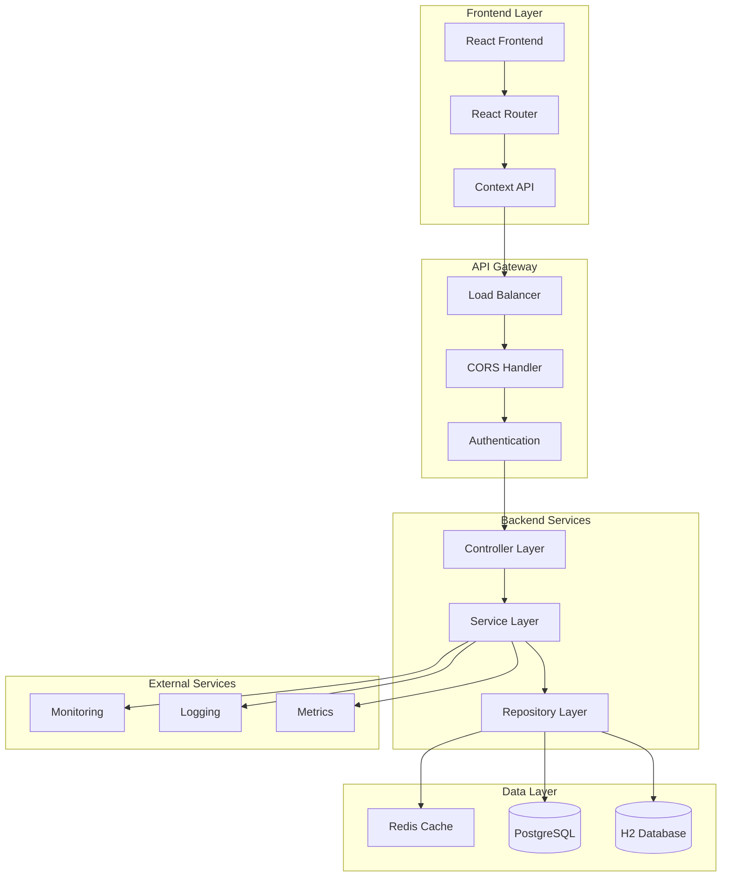
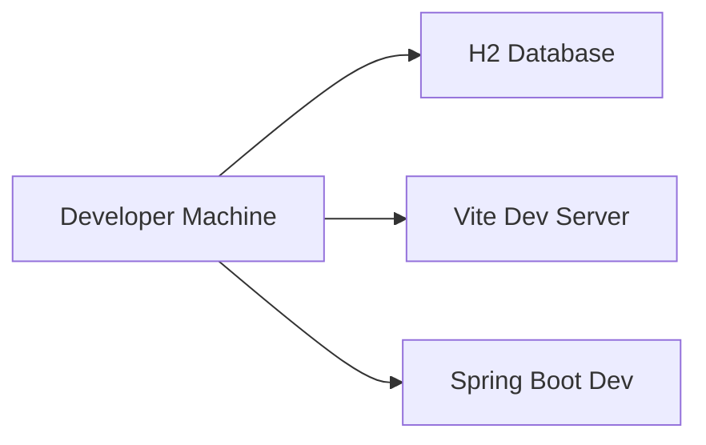
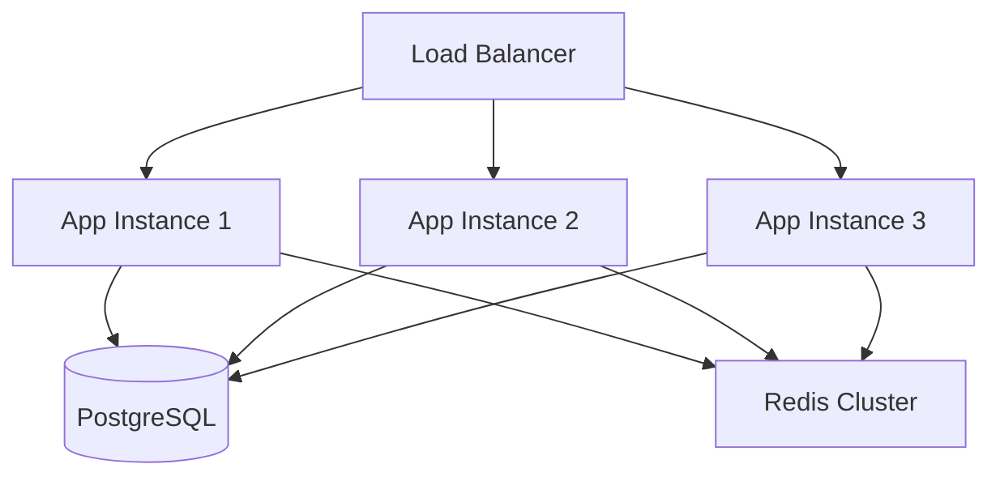

# System Architecture Overview

## Executive Summary

The Comprehensive Learning Portal is a full-stack web application designed to provide the world's most complete FAANG preparation platform. The system follows a layered architecture pattern with clear separation of concerns, built using Spring Boot for the backend and React for the frontend.

## High-Level Architecture



## Core Components

### 1. Frontend Layer (React)

**Technology Stack:**
- React 18 with functional components and hooks
- React Router for client-side routing
- Context API for state management
- Vite for build tooling and development server

**Key Features:**
- Responsive design with mobile-first approach
- Interactive code editor with Monaco Editor
- Real-time progress tracking
- Comprehensive learning modules and interview questions

**File Structure:**
```
frontend/src/
├── components/          # Reusable UI components
├── pages/              # Page-level components
├── context/            # React Context providers
├── styles/             # CSS and design system
└── utils/              # Utility functions
```

### 2. Backend Layer (Spring Boot)

**Technology Stack:**
- Spring Boot 3.2.0 with Java 21
- Spring Data JPA for data access
- Spring Security for authentication
- Spring Boot Actuator for monitoring

**Architecture Layers:**

#### Controller Layer
- **Responsibility**: HTTP request handling, input validation, response formatting
- **Pattern**: RESTful API design with proper HTTP status codes
- **Features**: Swagger/OpenAPI documentation, CORS configuration, error handling

#### Service Layer
- **Responsibility**: Business logic, transaction management, orchestration
- **Pattern**: Service-oriented architecture with clear interfaces
- **Features**: Caching, performance monitoring, async processing

#### Repository Layer
- **Responsibility**: Data access, query optimization, entity management
- **Pattern**: Repository pattern with Spring Data JPA
- **Features**: Custom queries, pagination, transaction management

### 3. Data Layer

#### Primary Database (PostgreSQL)
- **Usage**: Production environment data storage
- **Features**: ACID compliance, advanced indexing, full-text search
- **Configuration**: Connection pooling, query optimization, backup strategies

#### Development Database (H2)
- **Usage**: Development and testing environments
- **Features**: In-memory operation, fast startup, easy configuration
- **Configuration**: Automatic schema creation, test data initialization

#### Caching Layer (Redis)
- **Usage**: Frequently accessed data caching
- **Features**: TTL-based expiration, distributed caching, session storage
- **Configuration**: Cluster support, persistence, monitoring

## System Characteristics

### Performance Requirements
- **Response Time**: < 200ms for API endpoints
- **Throughput**: 1000+ concurrent users
- **Availability**: 99.9% uptime
- **Scalability**: Horizontal scaling support

### Security Requirements
- **Authentication**: JWT-based authentication
- **Authorization**: Role-based access control
- **Data Protection**: Encryption at rest and in transit
- **Input Validation**: Comprehensive input sanitization

### Monitoring and Observability
- **Health Checks**: Comprehensive health monitoring endpoints
- **Metrics**: Performance metrics collection and reporting
- **Logging**: Structured logging with correlation IDs
- **Alerting**: Proactive alerting for system issues

## Integration Points

### External APIs
- **Authentication Services**: OAuth2 integration for social login
- **Content Delivery**: CDN integration for static assets
- **Monitoring Services**: Integration with monitoring platforms

### Internal Services
- **Database Services**: Multi-database support with connection pooling
- **Caching Services**: Distributed caching with Redis
- **File Storage**: Local and cloud storage integration

## Deployment Architecture

### Development Environment


### Production Environment


## Technology Decisions

### Framework Selection
- **Spring Boot**: Chosen for enterprise-grade features, extensive ecosystem, and production readiness
- **React**: Selected for component-based architecture, large community, and modern development practices
- **PostgreSQL**: Preferred for ACID compliance, advanced features, and scalability

### Architecture Patterns
- **Layered Architecture**: Clear separation of concerns and maintainability
- **Repository Pattern**: Abstraction of data access logic
- **Dependency Injection**: Loose coupling and testability
- **RESTful APIs**: Standard HTTP-based communication

## Quality Attributes

### Maintainability
- **Code Organization**: Clear package structure and naming conventions
- **Documentation**: Comprehensive code and API documentation
- **Testing**: Unit, integration, and end-to-end testing
- **Code Quality**: Static analysis and quality gates

### Reliability
- **Error Handling**: Comprehensive error handling and recovery
- **Transaction Management**: ACID compliance and rollback capabilities
- **Health Monitoring**: Proactive health checks and alerting
- **Backup and Recovery**: Regular backups and disaster recovery procedures

### Performance
- **Caching Strategy**: Multi-level caching for optimal performance
- **Database Optimization**: Query optimization and indexing
- **Connection Pooling**: Efficient resource utilization
- **Asynchronous Processing**: Non-blocking operations for better throughput

### Security
- **Authentication**: Secure user authentication and session management
- **Authorization**: Fine-grained access control
- **Input Validation**: Comprehensive input sanitization and validation
- **Security Headers**: Proper security headers and CORS configuration

## Future Considerations

### Scalability Enhancements
- **Microservices Migration**: Potential migration to microservices architecture
- **Container Orchestration**: Kubernetes deployment for better scalability
- **Database Sharding**: Horizontal database scaling strategies
- **CDN Integration**: Global content delivery optimization

### Feature Enhancements
- **Real-time Features**: WebSocket integration for real-time collaboration
- **Mobile Applications**: Native mobile app development
- **AI Integration**: Machine learning for personalized learning paths
- **Analytics Platform**: Advanced analytics and reporting capabilities

This architecture provides a solid foundation for the comprehensive learning portal while maintaining flexibility for future enhancements and scaling requirements.