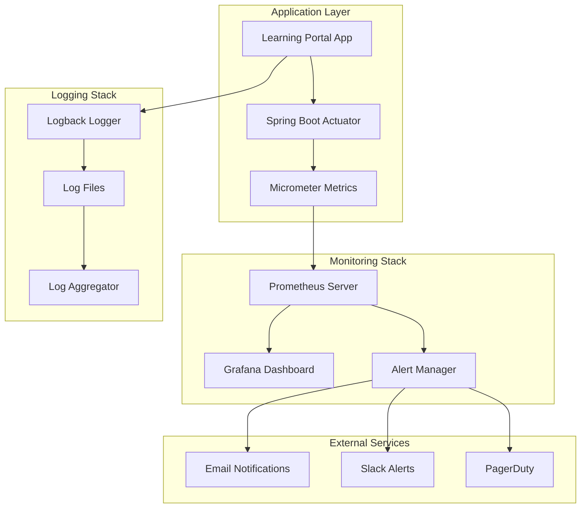

# Monitoring and Alerting Setup Guide

## Overview

This guide provides comprehensive instructions for setting up monitoring, alerting, and observability for the Learning Portal system in production environments.

## Table of Contents

1. [Monitoring Architecture](#monitoring-architecture)
2. [Application Metrics](#application-metrics)
3. [Health Checks](#health-checks)
4. [Logging Configuration](#logging-configuration)
5. [Performance Monitoring](#performance-monitoring)
6. [Database Monitoring](#database-monitoring)
7. [Alerting Setup](#alerting-setup)
8. [Dashboard Configuration](#dashboard-configuration)
9. [Troubleshooting Monitoring](#troubleshooting-monitoring)

---

## Monitoring Architecture

### Components Overview



### Technology Stack

- **Metrics Collection**: Spring Boot Actuator + Micrometer
- **Metrics Storage**: Prometheus
- **Visualization**: Grafana
- **Alerting**: Prometheus AlertManager
- **Log Aggregation**: ELK Stack (Elasticsearch, Logstash, Kibana)
- **APM**: Application Performance Monitoring tools

---

## Application Metrics

### Spring Boot Actuator Configuration

#### 1. Enable Actuator Endpoints

```yaml
# application-production.yml
management:
  endpoints:
    web:
      exposure:
        include: health,info,metrics,prometheus,env,configprops
      base-path: /actuator
  endpoint:
    health:
      show-details: when-authorized
      show-components: always
    metrics:
      enabled: true
    prometheus:
      enabled: true
  metrics:
    export:
      prometheus:
        enabled: true
    distribution:
      percentiles-histogram:
        http.server.requests: true
      percentiles:
        http.server.requests: 0.5, 0.95, 0.99
    tags:
      application: learning-portal
      environment: ${ENVIRONMENT:production}
```

#### 2. Custom Metrics Configuration

```java
@Configuration
public class MetricsConfig {
    
    @Bean
    public TimedAspect timedAspect(MeterRegistry registry) {
        return new TimedAspect(registry);
    }
    
    @Bean
    public CountedAspect countedAspect(MeterRegistry registry) {
        return new CountedAspect(registry);
    }
    
    @Bean
    @ConditionalOnMissingBean
    public MeterRegistryCustomizer<MeterRegistry> metricsCommonTags() {
        return registry -> registry.config()
                .commonTags("application", "learning-portal")
                .commonTags("version", getClass().getPackage().getImplementationVersion());
    }
}
```

#### 3. Business Metrics Implementation

```java
@Service
public class MetricsService {
    
    private final MeterRegistry meterRegistry;
    private final Counter userRegistrations;
    private final Counter moduleCompletions;
    private final Timer moduleLoadTime;
    private final Gauge activeUsers;
    
    public MetricsService(MeterRegistry meterRegistry) {
        this.meterRegistry = meterRegistry;
        this.userRegistrations = Counter.builder("user.registrations")
                .description("Number of user registrations")
                .register(meterRegistry);
        this.moduleCompletions = Counter.builder("module.completions")
                .description("Number of module completions")
                .register(meterRegistry);
        this.moduleLoadTime = Timer.builder("module.load.time")
                .description("Time to load learning modules")
                .register(meterRegistry);
        this.activeUsers = Gauge.builder("users.active")
                .description("Number of active users")
                .register(meterRegistry, this, MetricsService::getActiveUserCount);
    }
    
    public void recordUserRegistration() {
        userRegistrations.increment();
    }
    
    public void recordModuleCompletion(String moduleType) {
        moduleCompletions.increment(Tags.of("type", moduleType));
    }
    
    public Timer.Sample startModuleLoadTimer() {
        return Timer.start(meterRegistry);
    }
    
    public void recordModuleLoadTime(Timer.Sample sample) {
        sample.stop(moduleLoadTime);
    }
    
    private double getActiveUserCount() {
        // Implementation to count active users
        return 0.0; // Placeholder
    }
}
```

---

## Health Checks

### Comprehensive Health Indicators

#### 1. Database Health Check

```java
@Component
public class DatabaseHealthIndicator implements HealthIndicator {
    
    private final DataSource dataSource;
    
    public DatabaseHealthIndicator(DataSource dataSource) {
        this.dataSource = dataSource;
    }
    
    @Override
    public Health health() {
        try (Connection connection = dataSource.getConnection()) {
            long startTime = System.currentTimeMillis();
            
            // Test database connectivity
            try (PreparedStatement statement = connection.prepareStatement("SELECT 1")) {
                ResultSet resultSet = statement.executeQuery();
                if (resultSet.next()) {
                    long responseTime = System.currentTimeMillis() - startTime;
                    
                    return Health.up()
                            .withDetail("database", "PostgreSQL")
                            .withDetail("responseTime", responseTime + "ms")
                            .withDetail("status", "Connected")
                            .build();
                }
            }
            
            return Health.down()
                    .withDetail("database", "PostgreSQL")
                    .withDetail("status", "Query failed")
                    .build();
                    
        } catch (SQLException e) {
            return Health.down()
                    .withDetail("database", "PostgreSQL")
                    .withDetail("error", e.getMessage())
                    .withDetail("status", "Connection failed")
                    .build();
        }
    }
}
```

#### 2. Cache Health Check

```java
@Component
public class CacheHealthIndicator implements HealthIndicator {
    
    private final CacheManager cacheManager;
    
    public CacheHealthIndicator(CacheManager cacheManager) {
        this.cacheManager = cacheManager;
    }
    
    @Override
    public Health health() {
        try {
            Collection<String> cacheNames = cacheManager.getCacheNames();
            Map<String, Object> details = new HashMap<>();
            
            for (String cacheName : cacheNames) {
                Cache cache = cacheManager.getCache(cacheName);
                if (cache != null) {
                    // Test cache operations
                    String testKey = "health-check-" + System.currentTimeMillis();
                    cache.put(testKey, "test-value");
                    String value = cache.get(testKey, String.class);
                    cache.evict(testKey);
                    
                    details.put(cacheName, value != null ? "UP" : "DOWN");
                } else {
                    details.put(cacheName, "NOT_FOUND");
                }
            }
            
            boolean allHealthy = details.values().stream()
                    .allMatch(status -> "UP".equals(status));
            
            return allHealthy ? 
                    Health.up().withDetails(details).build() :
                    Health.down().withDetails(details).build();
                    
        } catch (Exception e) {
            return Health.down()
                    .withDetail("error", e.getMessage())
                    .build();
        }
    }
}
```

#### 3. External Service Health Check

```java
@Component
public class ExternalServiceHealthIndicator implements HealthIndicator {
    
    private final RestTemplate restTemplate;
    
    @Value("${external.service.url:http://localhost:8080}")
    private String externalServiceUrl;
    
    public ExternalServiceHealthIndicator(RestTemplate restTemplate) {
        this.restTemplate = restTemplate;
    }
    
    @Override
    public Health health() {
        try {
            long startTime = System.currentTimeMillis();
            
            ResponseEntity<String> response = restTemplate.getForEntity(
                    externalServiceUrl + "/actuator/health", 
                    String.class
            );
            
            long responseTime = System.currentTimeMillis() - startTime;
            
            if (response.getStatusCode().is2xxSuccessful()) {
                return Health.up()
                        .withDetail("service", "External API")
                        .withDetail("responseTime", responseTime + "ms")
                        .withDetail("status", response.getStatusCode())
                        .build();
            } else {
                return Health.down()
                        .withDetail("service", "External API")
                        .withDetail("status", response.getStatusCode())
                        .build();
            }
            
        } catch (Exception e) {
            return Health.down()
                    .withDetail("service", "External API")
                    .withDetail("error", e.getMessage())
                    .build();
        }
    }
}
```

---

## Logging Configuration

### Structured Logging for Production

#### 1. JSON Logging Configuration

```xml
<!-- logback-spring.xml - Production JSON logging -->
<springProfile name="production">
    <appender name="JSON_FILE" class="ch.qos.logback.core.rolling.RollingFileAppender">
        <file>/var/log/learning-portal/application.json</file>
        <encoder class="net.logstash.logback.encoder.LoggingEventCompositeJsonEncoder">
            <providers>
                <timestamp>
                    <timeZone>UTC</timeZone>
                </timestamp>
                <version/>
                <logLevel/>
                <message/>
                <mdc/>
                <arguments/>
                <stackTrace/>
                <pattern>
                    <pattern>
                        {
                            "application": "learning-portal",
                            "environment": "production",
                            "instance": "${HOSTNAME:-unknown}",
                            "version": "${APP_VERSION:-unknown}"
                        }
                    </pattern>
                </pattern>
            </providers>
        </encoder>
        <rollingPolicy class="ch.qos.logback.core.rolling.TimeBasedRollingPolicy">
            <fileNamePattern>/var/log/learning-portal/application.json.%d{yyyy-MM-dd}.%i.gz</fileNamePattern>
            <maxFileSize>200MB</maxFileSize>
            <maxHistory>30</maxHistory>
            <totalSizeCap>5GB</totalSizeCap>
        </rollingPolicy>
    </appender>
</springProfile>
```

#### 2. Request Correlation ID

```java
@Component
public class CorrelationIdFilter implements Filter {
    
    private static final String CORRELATION_ID_HEADER = "X-Correlation-ID";
    private static final String CORRELATION_ID_MDC_KEY = "correlationId";
    
    @Override
    public void doFilter(ServletRequest request, ServletResponse response, FilterChain chain)
            throws IOException, ServletException {
        
        HttpServletRequest httpRequest = (HttpServletRequest) request;
        HttpServletResponse httpResponse = (HttpServletResponse) response;
        
        String correlationId = httpRequest.getHeader(CORRELATION_ID_HEADER);
        if (correlationId == null || correlationId.isEmpty()) {
            correlationId = UUID.randomUUID().toString();
        }
        
        MDC.put(CORRELATION_ID_MDC_KEY, correlationId);
        httpResponse.setHeader(CORRELATION_ID_HEADER, correlationId);
        
        try {
            chain.doFilter(request, response);
        } finally {
            MDC.remove(CORRELATION_ID_MDC_KEY);
        }
    }
}
```

---

## Performance Monitoring

### Application Performance Metrics

#### 1. Response Time Monitoring

```java
@RestController
@Timed(name = "http.requests", description = "HTTP request duration")
public class MonitoredController {
    
    @GetMapping("/modules")
    @Timed(name = "modules.list", description = "Time to list modules")
    public ResponseEntity<List<Module>> getModules() {
        // Controller implementation
    }
    
    @PostMapping("/modules")
    @Counted(name = "modules.created", description = "Number of modules created")
    public ResponseEntity<Module> createModule(@RequestBody ModuleDto dto) {
        // Controller implementation
    }
}
```

#### 2. JVM Metrics

```java
@Configuration
public class JvmMetricsConfig {
    
    @Bean
    public JvmGcMetrics jvmGcMetrics() {
        return new JvmGcMetrics();
    }
    
    @Bean
    public JvmMemoryMetrics jvmMemoryMetrics() {
        return new JvmMemoryMetrics();
    }
    
    @Bean
    public JvmThreadMetrics jvmThreadMetrics() {
        return new JvmThreadMetrics();
    }
    
    @Bean
    public ProcessorMetrics processorMetrics() {
        return new ProcessorMetrics();
    }
}
```

#### 3. Database Performance Monitoring

```java
@Component
public class DatabaseMetrics {
    
    private final MeterRegistry meterRegistry;
    private final DataSource dataSource;
    
    public DatabaseMetrics(MeterRegistry meterRegistry, DataSource dataSource) {
        this.meterRegistry = meterRegistry;
        this.dataSource = dataSource;
        
        // Register connection pool metrics
        if (dataSource instanceof HikariDataSource) {
            HikariDataSource hikariDataSource = (HikariDataSource) dataSource;
            new HikariCPMetrics(hikariDataSource.getHikariPoolMXBean())
                    .bindTo(meterRegistry);
        }
    }
    
    @EventListener
    public void handleQueryExecution(QueryExecutionEvent event) {
        Timer.Sample sample = Timer.start(meterRegistry);
        sample.stop(Timer.builder("database.query.time")
                .description("Database query execution time")
                .tag("query.type", event.getQueryType())
                .register(meterRegistry));
    }
}
```

---

## Database Monitoring

### PostgreSQL Monitoring Setup

#### 1. Database Metrics Collection

```sql
-- Create monitoring user
CREATE USER monitoring_user WITH PASSWORD 'secure_password';
GRANT CONNECT ON DATABASE learning_portal TO monitoring_user;
GRANT USAGE ON SCHEMA public TO monitoring_user;
GRANT SELECT ON ALL TABLES IN SCHEMA public TO monitoring_user;
GRANT SELECT ON ALL SEQUENCES IN SCHEMA public TO monitoring_user;

-- Grant access to system views
GRANT SELECT ON pg_stat_database TO monitoring_user;
GRANT SELECT ON pg_stat_user_tables TO monitoring_user;
GRANT SELECT ON pg_stat_user_indexes TO monitoring_user;
GRANT SELECT ON pg_statio_user_tables TO monitoring_user;
```

#### 2. Key Database Queries for Monitoring

```sql
-- Connection count
SELECT count(*) as active_connections 
FROM pg_stat_activity 
WHERE state = 'active';

-- Database size
SELECT pg_size_pretty(pg_database_size('learning_portal')) as database_size;

-- Table sizes
SELECT 
    schemaname,
    tablename,
    pg_size_pretty(pg_total_relation_size(schemaname||'.'||tablename)) as size
FROM pg_tables 
WHERE schemaname = 'public'
ORDER BY pg_total_relation_size(schemaname||'.'||tablename) DESC;

-- Slow queries
SELECT 
    query,
    calls,
    total_time,
    mean_time,
    rows
FROM pg_stat_statements 
ORDER BY mean_time DESC 
LIMIT 10;

-- Index usage
SELECT 
    schemaname,
    tablename,
    indexname,
    idx_tup_read,
    idx_tup_fetch
FROM pg_stat_user_indexes
ORDER BY idx_tup_read DESC;
```

---

## Alerting Setup

### Prometheus AlertManager Configuration

#### 1. Alert Rules Configuration

```yaml
# prometheus-alerts.yml
groups:
  - name: learning-portal-alerts
    rules:
      # Application availability
      - alert: ApplicationDown
        expr: up{job="learning-portal"} == 0
        for: 1m
        labels:
          severity: critical
        annotations:
          summary: "Learning Portal application is down"
          description: "Learning Portal has been down for more than 1 minute"
      
      # High response time
      - alert: HighResponseTime
        expr: http_request_duration_seconds{quantile="0.95"} > 2
        for: 5m
        labels:
          severity: warning
        annotations:
          summary: "High response time detected"
          description: "95th percentile response time is {{ $value }}s"
      
      # High error rate
      - alert: HighErrorRate
        expr: rate(http_requests_total{status=~"5.."}[5m]) > 0.1
        for: 2m
        labels:
          severity: critical
        annotations:
          summary: "High error rate detected"
          description: "Error rate is {{ $value }} errors per second"
      
      # Database connection issues
      - alert: DatabaseConnectionHigh
        expr: hikaricp_connections_active / hikaricp_connections_max > 0.8
        for: 5m
        labels:
          severity: warning
        annotations:
          summary: "Database connection pool usage high"
          description: "Connection pool usage is {{ $value }}%"
      
      # Memory usage
      - alert: HighMemoryUsage
        expr: jvm_memory_used_bytes / jvm_memory_max_bytes > 0.9
        for: 5m
        labels:
          severity: warning
        annotations:
          summary: "High memory usage"
          description: "Memory usage is {{ $value }}%"
      
      # Disk space
      - alert: LowDiskSpace
        expr: (node_filesystem_avail_bytes / node_filesystem_size_bytes) < 0.1
        for: 5m
        labels:
          severity: critical
        annotations:
          summary: "Low disk space"
          description: "Disk space is {{ $value }}% full"
```

#### 2. AlertManager Configuration

```yaml
# alertmanager.yml
global:
  smtp_smarthost: 'smtp.gmail.com:587'
  smtp_from: 'alerts@learningportal.com'
  smtp_auth_username: 'alerts@learningportal.com'
  smtp_auth_password: 'app_password'

route:
  group_by: ['alertname']
  group_wait: 10s
  group_interval: 10s
  repeat_interval: 1h
  receiver: 'web.hook'
  routes:
    - match:
        severity: critical
      receiver: 'critical-alerts'
    - match:
        severity: warning
      receiver: 'warning-alerts'

receivers:
  - name: 'web.hook'
    webhook_configs:
      - url: 'http://localhost:5001/'
  
  - name: 'critical-alerts'
    email_configs:
      - to: 'oncall@learningportal.com'
        subject: 'CRITICAL: {{ .GroupLabels.alertname }}'
        body: |
          {{ range .Alerts }}
          Alert: {{ .Annotations.summary }}
          Description: {{ .Annotations.description }}
          {{ end }}
    slack_configs:
      - api_url: 'https://hooks.slack.com/services/YOUR/SLACK/WEBHOOK'
        channel: '#alerts-critical'
        title: 'Critical Alert: {{ .GroupLabels.alertname }}'
        text: '{{ range .Alerts }}{{ .Annotations.description }}{{ end }}'
  
  - name: 'warning-alerts'
    email_configs:
      - to: 'team@learningportal.com'
        subject: 'WARNING: {{ .GroupLabels.alertname }}'
        body: |
          {{ range .Alerts }}
          Alert: {{ .Annotations.summary }}
          Description: {{ .Annotations.description }}
          {{ end }}

inhibit_rules:
  - source_match:
      severity: 'critical'
    target_match:
      severity: 'warning'
    equal: ['alertname', 'instance']
```

---

## Dashboard Configuration

### Grafana Dashboard Setup

#### 1. Application Overview Dashboard

```json
{
  "dashboard": {
    "title": "Learning Portal - Application Overview",
    "panels": [
      {
        "title": "Application Status",
        "type": "stat",
        "targets": [
          {
            "expr": "up{job=\"learning-portal\"}",
            "legendFormat": "Application Status"
          }
        ]
      },
      {
        "title": "Request Rate",
        "type": "graph",
        "targets": [
          {
            "expr": "rate(http_requests_total[5m])",
            "legendFormat": "Requests/sec"
          }
        ]
      },
      {
        "title": "Response Time",
        "type": "graph",
        "targets": [
          {
            "expr": "http_request_duration_seconds{quantile=\"0.95\"}",
            "legendFormat": "95th percentile"
          },
          {
            "expr": "http_request_duration_seconds{quantile=\"0.50\"}",
            "legendFormat": "50th percentile"
          }
        ]
      },
      {
        "title": "Error Rate",
        "type": "graph",
        "targets": [
          {
            "expr": "rate(http_requests_total{status=~\"5..\"}[5m])",
            "legendFormat": "5xx errors/sec"
          },
          {
            "expr": "rate(http_requests_total{status=~\"4..\"}[5m])",
            "legendFormat": "4xx errors/sec"
          }
        ]
      }
    ]
  }
}
```

#### 2. JVM Metrics Dashboard

```json
{
  "dashboard": {
    "title": "Learning Portal - JVM Metrics",
    "panels": [
      {
        "title": "Heap Memory Usage",
        "type": "graph",
        "targets": [
          {
            "expr": "jvm_memory_used_bytes{area=\"heap\"}",
            "legendFormat": "Used"
          },
          {
            "expr": "jvm_memory_max_bytes{area=\"heap\"}",
            "legendFormat": "Max"
          }
        ]
      },
      {
        "title": "Garbage Collection",
        "type": "graph",
        "targets": [
          {
            "expr": "rate(jvm_gc_collection_seconds_sum[5m])",
            "legendFormat": "GC Time/sec"
          }
        ]
      },
      {
        "title": "Thread Count",
        "type": "graph",
        "targets": [
          {
            "expr": "jvm_threads_current",
            "legendFormat": "Current Threads"
          }
        ]
      }
    ]
  }
}
```

---

## Troubleshooting Monitoring

### Common Monitoring Issues

#### 1. Metrics Not Appearing

**Symptoms:**
- Prometheus not scraping metrics
- Grafana showing "No data"
- Missing application metrics

**Resolution:**
```bash
# Check Prometheus targets
curl http://prometheus:9090/api/v1/targets

# Verify application metrics endpoint
curl http://localhost:8080/actuator/prometheus

# Check Prometheus configuration
docker logs prometheus-container

# Restart Prometheus if needed
docker restart prometheus-container
```

#### 2. Alerts Not Firing

**Symptoms:**
- No alert notifications received
- AlertManager not processing alerts
- SMTP/Slack integration not working

**Resolution:**
```bash
# Check AlertManager status
curl http://alertmanager:9093/api/v1/status

# Test alert rules
curl http://prometheus:9090/api/v1/rules

# Check AlertManager logs
docker logs alertmanager-container

# Test notification channels
curl -X POST http://alertmanager:9093/api/v1/alerts \
  -H "Content-Type: application/json" \
  -d '[{"labels":{"alertname":"test"}}]'
```

#### 3. Dashboard Not Loading

**Symptoms:**
- Grafana dashboard shows errors
- Data source connection issues
- Query errors in panels

**Resolution:**
```bash
# Check Grafana logs
docker logs grafana-container

# Test data source connection
curl -H "Authorization: Bearer <token>" \
  http://grafana:3000/api/datasources/proxy/1/api/v1/query?query=up

# Verify Prometheus connectivity
curl http://prometheus:9090/api/v1/query?query=up

# Restart Grafana if needed
docker restart grafana-container
```

### Monitoring Best Practices

1. **Set Appropriate Alert Thresholds**
   - Avoid alert fatigue with too many notifications
   - Set thresholds based on historical data
   - Use different severity levels appropriately

2. **Monitor Key Business Metrics**
   - User registration rates
   - Module completion rates
   - Learning progress metrics
   - Revenue-impacting metrics

3. **Implement Proper Retention Policies**
   - Configure appropriate data retention for metrics
   - Archive old logs to reduce storage costs
   - Balance retention with compliance requirements

4. **Regular Monitoring Health Checks**
   - Monitor the monitoring system itself
   - Ensure backup and recovery procedures
   - Test alert notifications regularly

5. **Documentation and Runbooks**
   - Document all monitoring procedures
   - Create runbooks for common issues
   - Train team members on monitoring tools

This comprehensive monitoring setup ensures complete visibility into the Learning Portal system's health, performance, and business metrics, enabling proactive issue detection and resolution.