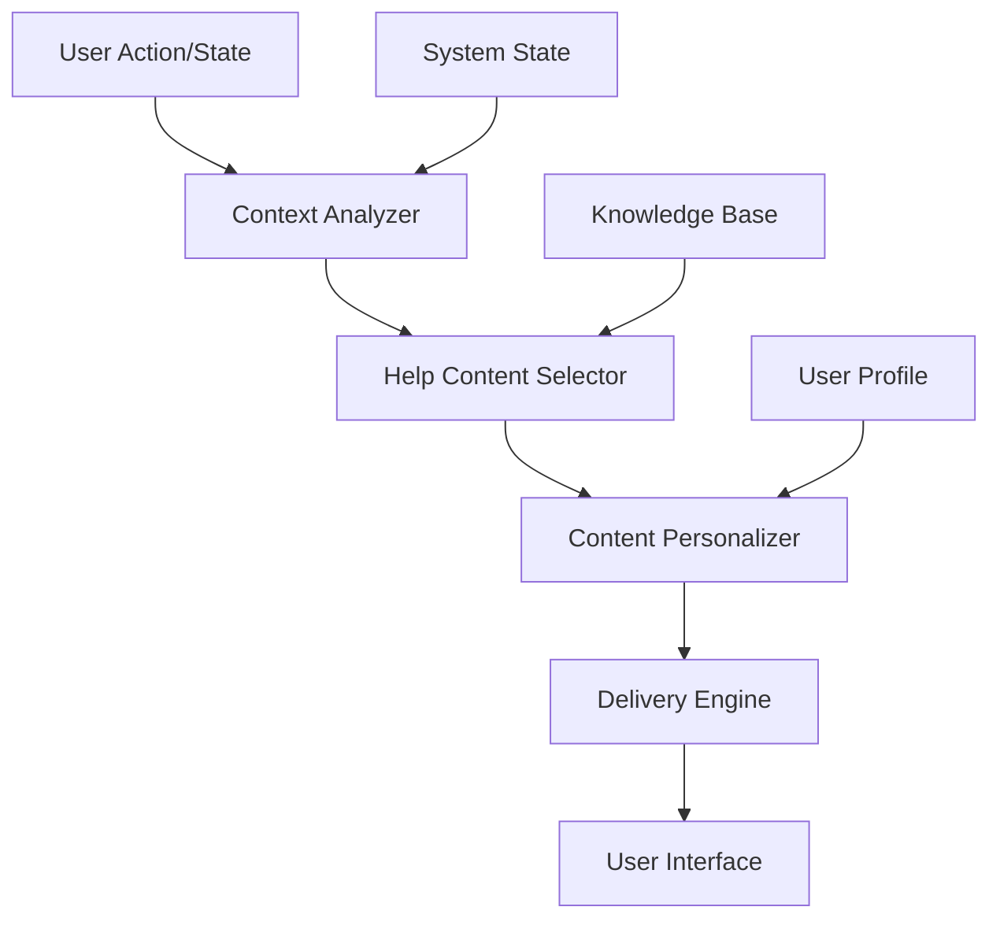

# Session Continuity System - Context-Sensitive Help Integration

## Overview

The Context-Sensitive Help System provides intelligent, contextual assistance based on the current state of the Session Continuity System. It analyzes the user's current situation and provides relevant guidance, troubleshooting steps, and best practices.

## Table of Contents

1. [Help System Architecture](#help-system-architecture)
2. [Context Detection](#context-detection)
3. [Help Content Delivery](#help-content-delivery)
4. [Integration Points](#integration-points)
5. [Customization](#customization)
6. [API Reference](#api-reference)

## Help System Architecture

### Components



### Context Analysis Engine

The system continuously analyzes:
- Current session state
- Recent user actions
- System performance metrics
- Error conditions
- User experience level

### Help Content Database

Structured help content organized by:
- Context categories
- User skill levels
- Problem severity
- Solution complexity

## Context Detection

### Automatic Context Detection

The system automatically detects various contexts:

#### Session States
```java
public enum SessionContext {
    SESSION_STARTUP,
    ACTIVE_DEVELOPMENT,
    CONTEXT_CAPTURE,
    QUALITY_GATE_VALIDATION,
    SESSION_COMPLETION,
    ERROR_RECOVERY,
    PERFORMANCE_ISSUES
}
```

#### User Actions
```java
public enum UserAction {
    FIRST_TIME_SETUP,
    ROUTINE_DEVELOPMENT,
    TROUBLESHOOTING,
    CONFIGURATION_CHANGE,
    EMERGENCY_RECOVERY,
    PERFORMANCE_OPTIMIZATION
}
```

#### System Conditions
```java
public enum SystemCondition {
    HEALTHY,
    DEGRADED_PERFORMANCE,
    PARTIAL_FAILURE,
    CRITICAL_ERROR,
    MAINTENANCE_MODE,
    RECOVERY_IN_PROGRESS
}
```

### Context Detection API

```bash
# Get current context
GET /api/continuity/help/context/current

# Analyze specific situation
POST /api/continuity/help/context/analyze
{
  "userAction": "troubleshooting",
  "systemState": "error",
  "errorCode": "SC101"
}
```

## Help Content Delivery

### Contextual Help Responses

#### Session Startup Help
```json
{
  "context": "session_startup",
  "helpType": "guided_workflow",
  "content": {
    "title": "Starting Your Development Session",
    "steps": [
      {
        "step": 1,
        "action": "Verify context loading",
        "command": "curl http://localhost:8080/api/continuity/context/validate",
        "expectedResult": "Context validation successful",
        "troubleshooting": "If validation fails, see context recovery guide"
      },
      {
        "step": 2,
        "action": "Check continuation point",
        "file": "CURRENT_STATUS.md",
        "section": "Next Actions",
        "helpText": "Review the next actions section to understand where to continue"
      }
    ],
    "relatedTopics": ["context-validation", "session-recovery"],
    "estimatedTime": "2-5 minutes"
  }
}
```

#### Error-Specific Help
```json
{
  "context": "error_recovery",
  "errorCode": "SC101",
  "helpType": "troubleshooting_guide",
  "content": {
    "title": "Documentation Synchronization Failure",
    "severity": "high",
    "quickFix": {
      "description": "Force synchronization to resolve the issue",
      "command": "curl -X POST http://localhost:8080/api/continuity/docs/sync-force",
      "estimatedTime": "30 seconds"
    },
    "detailedSteps": [
      {
        "step": "Diagnose the issue",
        "actions": ["Check sync status", "Identify failed files", "Review error logs"]
      },
      {
        "step": "Apply resolution",
        "actions": ["Force synchronization", "Resolve conflicts", "Validate results"]
      }
    ],
    "prevention": "Regular file permission checks and disk space monitoring",
    "relatedErrors": ["SC102", "SC103"]
  }
}
```

#### Performance Optimization Help
```json
{
  "context": "performance_optimization",
  "helpType": "optimization_guide",
  "content": {
    "title": "Optimizing Session Continuity Performance",
    "currentMetrics": {
      "captureTime": "7.2s",
      "syncTime": "12.1s",
      "recoveryTime": "35.4s"
    },
    "recommendations": [
      {
        "area": "Capture Performance",
        "issue": "Capture time exceeds 5s target",
        "solution": "Enable parallel processing",
        "configuration": {
          "file": "application.yml",
          "setting": "session-continuity.performance.capture-parallel: true"
        },
        "expectedImprovement": "40-60% faster capture"
      }
    ],
    "monitoring": {
      "command": "curl http://localhost:8080/api/continuity/performance/monitor",
      "frequency": "Every 5 minutes during optimization"
    }
  }
}
```

### Help Delivery Modes

#### Inline Help
Contextual help displayed directly in the user interface:
```html
<!-- Example inline help integration -->
<div class="session-status">
  <span class="status-indicator">Context Loading...</span>
  <button class="help-button" onclick="showContextualHelp('session_startup')">
    <i class="help-icon"></i>
  </button>
</div>
```

#### Modal Help
Detailed help in overlay windows:
```javascript
// Show detailed help modal
function showDetailedHelp(context, errorCode) {
  fetch(`/api/continuity/help/content/${context}?errorCode=${errorCode}`)
    .then(response => response.json())
    .then(helpContent => {
      displayHelpModal(helpContent);
    });
}
```

#### Progressive Disclosure
Layered help information:
```javascript
// Progressive help disclosure
const helpLevels = {
  quick: "One-line solution",
  detailed: "Step-by-step guide", 
  expert: "Advanced troubleshooting"
};
```

## Integration Points

### Command Line Integration

#### Help Commands
```bash
# Get help for current context
mvn session-continuity:help

# Get help for specific topic
mvn session-continuity:help -Dtopic=context-recovery

# Get help for error code
mvn session-continuity:help -Derror=SC101
```

#### Interactive Help
```bash
# Start interactive help session
mvn session-continuity:help-interactive

# Example interactive session:
# > What would you like help with?
# > 1. Session startup issues
# > 2. Documentation synchronization
# > 3. Performance optimization
# > 4. Error recovery
```

### IDE Integration

#### VS Code Extension
```json
{
  "contributes": {
    "commands": [
      {
        "command": "sessionContinuity.help.contextual",
        "title": "Get Contextual Help",
        "category": "Session Continuity"
      }
    ],
    "keybindings": [
      {
        "command": "sessionContinuity.help.contextual",
        "key": "ctrl+shift+h",
        "when": "editorTextFocus"
      }
    ]
  }
}
```

#### IntelliJ Plugin
```xml
<actions>
  <action id="SessionContinuity.Help.Contextual" 
          class="com.learningportal.ide.ContextualHelpAction"
          text="Session Continuity Help"
          description="Get contextual help for session continuity">
    <keyboard-shortcut keymap="$default" first-keystroke="ctrl shift H"/>
  </action>
</actions>
```

### Web Interface Integration

#### Help Widget
```javascript
class SessionContinuityHelpWidget {
  constructor(containerId) {
    this.container = document.getElementById(containerId);
    this.contextAnalyzer = new ContextAnalyzer();
    this.helpProvider = new HelpProvider();
  }
  
  async showContextualHelp() {
    const context = await this.contextAnalyzer.getCurrentContext();
    const helpContent = await this.helpProvider.getHelp(context);
    this.displayHelp(helpContent);
  }
  
  displayHelp(content) {
    // Render help content in widget
    this.container.innerHTML = this.renderHelpContent(content);
  }
}
```

#### Smart Help Button
```javascript
// Smart help button that changes based on context
class SmartHelpButton {
  updateForContext(context) {
    const button = document.getElementById('help-button');
    const helpText = this.getContextualHelpText(context);
    
    button.textContent = helpText.buttonLabel;
    button.onclick = () => this.showHelp(context);
    
    // Visual indicators for urgency
    if (context.severity === 'critical') {
      button.classList.add('help-urgent');
    }
  }
}
```

## Customization

### User Preferences

#### Help Level Configuration
```yaml
# User preferences for help system
session-continuity:
  help:
    user-level: intermediate  # beginner, intermediate, expert
    detail-level: detailed    # quick, detailed, comprehensive
    delivery-mode: modal      # inline, modal, sidebar
    auto-show: true          # Show help automatically for errors
```

#### Content Filtering
```yaml
session-continuity:
  help:
    content-filters:
      show-commands: true
      show-examples: true
      show-troubleshooting: true
      show-best-practices: false
```

### Custom Help Content

#### Adding Custom Help Topics
```java
@Component
public class CustomHelpProvider implements HelpContentProvider {
  
  @Override
  public HelpContent getHelpContent(String topic, Map<String, Object> context) {
    // Custom help content logic
    return HelpContent.builder()
      .title("Custom Help Topic")
      .content(generateCustomContent(topic, context))
      .build();
  }
}
```

#### Help Content Templates
```yaml
# Custom help template
help-templates:
  error-resolution:
    structure:
      - problem-description
      - quick-fix
      - detailed-steps
      - prevention-tips
      - related-topics
    
  workflow-guide:
    structure:
      - overview
      - prerequisites
      - step-by-step
      - validation
      - next-steps
```

### Localization

#### Multi-language Support
```properties
# help_en.properties
help.session.startup.title=Starting Your Development Session
help.session.startup.step1=Verify context loading

# help_es.properties
help.session.startup.title=Iniciando Tu Sesión de Desarrollo
help.session.startup.step1=Verificar carga de contexto
```

## API Reference

### Help Content API

#### Get Contextual Help
```bash
GET /api/continuity/help/contextual
GET /api/continuity/help/contextual?context=session_startup
GET /api/continuity/help/contextual?error=SC101
```

#### Search Help Content
```bash
GET /api/continuity/help/search?q=documentation+sync
GET /api/continuity/help/search?category=troubleshooting
```

#### Get Help Topics
```bash
GET /api/continuity/help/topics
GET /api/continuity/help/topics/category/{category}
```

### Context Analysis API

#### Analyze Current Context
```bash
GET /api/continuity/help/context/analyze
POST /api/continuity/help/context/analyze
{
  "userAction": "troubleshooting",
  "systemState": "error",
  "additionalContext": {
    "errorCode": "SC101",
    "userLevel": "intermediate"
  }
}
```

#### Context History
```bash
GET /api/continuity/help/context/history
GET /api/continuity/help/context/history?limit=10
```

### User Preferences API

#### Get User Preferences
```bash
GET /api/continuity/help/preferences
```

#### Update User Preferences
```bash
PUT /api/continuity/help/preferences
{
  "userLevel": "expert",
  "detailLevel": "comprehensive",
  "deliveryMode": "sidebar",
  "autoShow": false
}
```

### Help Analytics API

#### Help Usage Statistics
```bash
GET /api/continuity/help/analytics/usage
GET /api/continuity/help/analytics/popular-topics
GET /api/continuity/help/analytics/user-satisfaction
```

## Implementation Examples

### React Component Integration
```jsx
import React, { useState, useEffect } from 'react';
import { SessionContinuityHelpProvider } from './help-provider';

const ContextualHelpButton = ({ context }) => {
  const [helpContent, setHelpContent] = useState(null);
  const [showHelp, setShowHelp] = useState(false);
  
  useEffect(() => {
    const loadHelp = async () => {
      const content = await SessionContinuityHelpProvider.getContextualHelp(context);
      setHelpContent(content);
    };
    
    if (context) {
      loadHelp();
    }
  }, [context]);
  
  return (
    <div className="contextual-help">
      <button 
        className="help-button"
        onClick={() => setShowHelp(true)}
        title={helpContent?.quickHelp}
      >
        <HelpIcon />
      </button>
      
      {showHelp && helpContent && (
        <HelpModal 
          content={helpContent}
          onClose={() => setShowHelp(false)}
        />
      )}
    </div>
  );
};
```

### Spring Boot Service Integration
```java
@Service
public class ContextualHelpService {
  
  @Autowired
  private SessionStateManager sessionStateManager;
  
  @Autowired
  private HelpContentRepository helpContentRepository;
  
  public HelpContent getContextualHelp(String userId) {
    SessionState currentState = sessionStateManager.getCurrentState();
    UserContext context = analyzeUserContext(currentState, userId);
    
    return helpContentRepository.findByContext(context)
      .orElse(getDefaultHelp(context));
  }
  
  private UserContext analyzeUserContext(SessionState state, String userId) {
    // Context analysis logic
    return UserContext.builder()
      .sessionPhase(state.getCurrentPhase())
      .userLevel(getUserLevel(userId))
      .systemHealth(getSystemHealth())
      .recentErrors(getRecentErrors())
      .build();
  }
}
```

---

*This context-sensitive help system provides intelligent, contextual assistance to users of the Session Continuity System, improving user experience and reducing support overhead.*